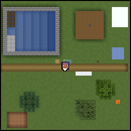

# heroic-map-renderer-mod

Ein Fabric-Mod für Minecraft mit Minimap und Vollbildkarte, für Server mit
dem Plugin von [heroic-map-renderer](https://github.com/VonNekyia/heroic-map-renderer).

- **Minimap:** zeichnet der Mod selbst, aus den Chunks, die der Client geladen hat.
- **Vollbildkarte:** lädt der Mod vom Server, mit 1, 2 oder 4 Pixeln je Block,
  oder zeichnet sie mit der Wahl „Selbst“ aus den Chunks, die der Spieler lädt.

## Gegen andere Karten

Die Vollbildkarte vom Server zeichnet der Renderer: je Million Pixel rund
6- bis 12-mal schneller als Pl3xMap, Dynmap `flat` und squaremap, mit 1,3
bis 1,5 statt 3,0 bis 6,4 GiB RAM, dafür mit mehr Platz. Bei gleicher
Fläche sind squaremap und Pl3xMap schneller, denn sie zeichnen ein Pixel
je Block statt sechzehn.[^benchmark]

[^benchmark]: Gemessen am 10.10.2026 mit Heroic v0.3.0 als CLI und als
    Plugin 0.1.0, spätere Fassungen nicht. Aufbau, Messrechner und alle
    Zahlen in
    [Benchmark gegen andere Karten](https://github.com/VonNekyia/heroic-map-renderer/blob/master/docs/messungen/2026-10-10-benchmark-karten.md).

## Stand

Im Aufbau: Minimap und Vollbildkarte laufen. Der
Download ist gebaut und gegen einen kleinen Testserver geprüft; gegen einen
echten Server geht er erst mit
[heroic-map-renderer#151](https://github.com/VonNekyia/heroic-map-renderer/issues/151).
Der Plan steht in
[heroic-map-renderer#155](https://github.com/VonNekyia/heroic-map-renderer/issues/155).

Bauen und testen: [docs/entwicklung.md](docs/entwicklung.md), die ganze Doku
in [docs/](docs/index.md).

## Herausgeber und Kontakt

Herausgeber und verantwortlich: VonNekyia. Kontakt: contact@mcterranova.com.

## Lizenz

[Apache-2.0](LICENSE), Hinweise in [NOTICE](NOTICE).

NOT AN OFFICIAL MINECRAFT PRODUCT. NOT APPROVED BY OR ASSOCIATED WITH MOJANG OR MICROSOFT.
