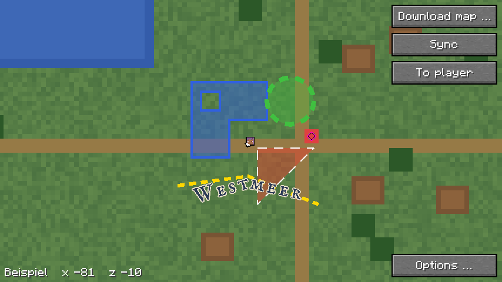

# Ebenen

Ein Plugin auf dem Server legt Ebenen über die Karte, etwa die Städte einer
Nation (#35). Der Mod empfängt sie über den Kanal und zeichnet ihre Nadeln,
Flächen, Kreise, Linien und Kartenschrift auf Minimap und Vollbildkarte. Das Format beschreibt der
Renderer:
[Ebenen](https://github.com/VonNekyia/heroic-map-renderer/blob/master/docs/benutzung/ebenen.md);
die Nachrichten das Plugin:
[Ebenen](https://github.com/VonNekyia/heroic-map-renderer-plugin/blob/main/docs/ebenen.md),
„Mod“.

## Empfang

- **`ebenen`:** die Liste, je Ebene `id`, `name`, `visible`, `order` und
  `version` (`Ebenen.liste`). Was nicht mehr darin steht, ist weg, mit
  seinen Nadeln, Formen und halben Teilen. Steht eine Kennung zweimal darin, gilt
  der erste Eintrag.
- **`ebene`:** ein Teil einer Ebene, `teil` von `teile`, mit seiner
  `version` (`Ebenen.teil`).
  - Gelesen schon auf dem Thread des Netzes (`Kanal.lies`,
    `Ebenen.Teil.lies`): Bis 1 MiB JSON parst nicht der Render-Thread.
    Er bekommt nur Nadeln und Formen des Teils, die Füllungen schon
    zerlegt; kein JSON bleibt liegen.
  - Ein Teil gilt nur mit der `version`, die die Liste für seine Ebene
    nennt; das Plugin schickt die Liste vor den Teilen. Welche von zwei
    `version` neuer ist, sagt ein Hash nicht, die Liste schon.
  - Erst wenn alle Teile da sind, ersetzen ihre Nadeln und Formen die der
    Ebene, in der Reihenfolge der Teile. Bis dahin bleibt die alte. Kommt
    ein Teil zweimal, gilt der zweite, auch in den Zählern der Grenzen.
  - Nennt die Liste eine neue `version`, verwirft der Mod die halben
    Teile der alten. Weil die Liste je Kennung genau eine `version` nennt,
    entsteht so nie eine Ebene aus zwei Versionen.
  - Eine Sammlung über einer Grenze ist verworfen; die übrigen Teile
    ihrer `version` übergeht der Mod. So meldet das Log sie einmal, und
    sie zählt nicht weiter in die Punkte über alle Ebenen.
- **Vergessen** beim Trennen und bei jedem neuen Login; das Plugin schickt
  danach alles neu.
- **Kaputt:** Eine Nachricht, die sich nicht lesen lässt, ändert nichts,
  auch nicht an einer halben Sammlung. Ein kaputtes Objekt fehlt, die
  übrigen gelten. Formen, die kaputt sind, eine Grenze verletzen oder
  deren Füllung zu aufwendig ist, zählt der Mod und meldet sie einmal je
  Ebene und `version` im Log, wenn die Sammlung fertig ist.
- **Gross:** Ein Teil hat bis 64 KiB, ein Teil mit einem einzelnen grossen
  Objekt bis 1 MiB. So viel liest der Kanal, siehe [Download](download.md),
  „Kanal“; sonst würde eine Ebene mit einer grossen Region nie ganz.

## Nadeln

- **Nur `pin`:** Andere Objekte und unbekannte Felder übergeht der Mod.
  `y` braucht er nicht, denn seine Karten sind von oben gesehen. Ohne
  `dimension` gilt `minecraft:overworld`; der Mod zeigt nur die Nadeln der
  Dimension des Spielers.
- **Schild und Nadel** dieselben Bilder wie auf der Webkarte, in drei
  Grössen, je ein Feld in Graustufen und ein Rahmen mit Nadel, als Sprites
  im Atlas des GUI unter `textures/gui/sprites/ebenen/`:

  | Grösse | Bild in Einheiten | Fuss |
  |---|---|---|
  | `large` | 23 × 33 | Mitte der Unterkante |
  | `medium` | 15 × 23 | Mitte der Unterkante |
  | `small` | 9 × 15 | Mitte der Unterkante |

  Ohne `size` gilt `medium`.
- **Symbol** über dem gefärbten Feld und unter dem Rahmen, Pixel auf
  Pixel, die linke obere Ecke bei (⌊(Breite − Seite) / 2⌋, 3) im Bild des
  Schilds: `symbol.large` 16 × 16 in `large`, `symbol.medium` 9 × 9 in
  `medium`, `small` ohne. Fehlt es, bleibt das Schild leer. Siehe „Symbole“.
- **Farbe:** Die Grafikkarte multipliziert das Feld mit `color`, ohne
  `color` `#D9443A`; das Alpha wirkt nicht. Sie rundet dabei, statt
  abzuschneiden wie die Webkarte; ein Kanal weicht so um höchstens eine
  Stufe ab, siehe
  [0007](entscheidungen/0007-toenung-auf-der-grafikkarte.md).
- **Name** immer, in der Kartenschrift mit 12 Einheiten je Geviert, also
  Grossbuchstaben rund 8 hoch, wie die Webkarte; so hat es der Reviewer
  entschieden (`Ebenen.name`). Er steht mittig in einem Kasten direkt unter
  dem Fuss, 17 Einheiten hoch (Zeilenhöhe 1,4), mit 3 Einheiten Rand zur
  Seite. Die Grossbuchstaben stehen mittig im Kasten. Farben der UI wie auf
  der Webkarte: Grund weiss mit Alpha 0,8, Schrift schwarz, ohne Kontur.
- **Grösse:** fest, auf jeder Stufe gleich, die Nadel in ihrer `size`, in
  Einheiten der Oberfläche des Mods wie die Wegpunkte, siehe
  [0097](https://github.com/VonNekyia/heroic-map-renderer/blob/master/docs/entscheidungen/0097-banner-feste-groesse-tafel-beim-zeigen.md).
  Bis zur Version 0.2.7 wurde sie beim Hinauszoomen kleiner und fiel
  zuletzt weg.
- **Minimap:** Gezeichnet wird eine Nadel, deren Fuss auf
  der sichtbaren Karte liegt, mit Rahmen innerhalb seiner Bänder, auch
  gedreht (`Minimap.marke`). Die Nadeln kommen nach Karte und Linien und
  vor Ring und Rahmen: Was am Rand über sie ragt, decken diese. Schild und
  Name bleiben im Quadrat der Minimap. Rund steht ein Schild am Rand so
  auch in den Ecken des Quadrats ausserhalb des Kreises; so ist es gewollt,
  sonst verschwände eine Stadt am Rand.
- **Vollbildkarte:** der Fuss auf dem Raster der Kacheln wie die
  Wegpunkte. Gezeichnet wird, was den Schirm berühren kann: 16 Einheiten
  zur Seite und 64 nach oben, so viel wie das grösste Banner, der Name 17
  nach unten und halb so weit zur Seite, wie sein Kasten breit ist.
- **Reihenfolge:** unter Wegpunkten, Mitspielern und dem eigenen Kopf; die
  Ebenen nach `order`, die höhere oben, bei Gleichstand die kleinere `id`
  oben; in einer Ebene in der Reihenfolge der Objekte.
- **An oder aus:** siehe „Umschalten“.
- **Text:** Namen von Ebenen und Nadeln setzt der Mod als schlichten Text;
  Codes mit `§` streicht er.

## Banner

Ein Ort als Bild (`banner`), etwa eine Stadt mit dem Banner ihrer Nation
(`Ebenen.Banner`).

- **Gelesen** wie eine Nadel: `at`, `dimension`, `name` bis 64 Zeichen.
  `image` ist ein Feld wie bei den Symbolen, `images/<Name>.png` oder
  `.webp`; ohne gültiges Feld fällt das Banner weg. `y` braucht der Mod
  nicht.
- **Nadeln und Banner** zählen zusammen, höchstens 1000 je Ebene, wie im
  Format; sie stehen in einer Liste in der Reihenfolge der Objekte
  (`Ebenen.Ort`).
- **Bild** vom Server wie ein Symbol, siehe „Symbole“, aber höchstens
  32 × 64 Pixel statt genau einer Seite (`Symbole.banner`).
- **Gezeichnet** Pixel auf Pixel in der Grösse des Bilds, in Einheiten der
  Oberfläche, nie skaliert, auf jeder Stufe gleich. Der Fuss liegt in der
  Mitte der Unterkante, ⌊Breite / 2⌋ rechts der linken Kante, wie bei der
  Nadel. Darunter der Name wie bei der Nadel. Solange das Bild lädt oder
  wenn es fehlt, fehlt das Banner samt Namen.
- **Minimap, Vollbildkarte, Reihenfolge:** wie die Nadeln, siehe dort.

## Symbole

- **Adresse** aus der Liste `ebenen`, nur wenn die Liste gilt: `url`,
  sonst `port` an der IP der Verbindung zum Spielserver,
  `http://<ip>:<port>/tiles`, IPv6 in eckigen Klammern, wie bei der
  `freigabe` (`Symbole.basis`). Fehlt beides, gibt es keine Symbole.
- **Ein Symbol** liegt unter `<Adresse>/layers/<modname>/<Feld>`,
  `modname` vor dem `:` der Kennung (`Symbole.uri`). Das Feld ist
  `images/<Name>.png` oder `.webp`, ohne Unterordner und ohne Punkt vorn;
  anderes holt der Mod nicht.
- **Geholt** erst, wenn eine Nadel es zeichnet, in einem eigenen Thread,
  einmal je Ebene, Feld, Seite und `version`, höchstens 200 je Ebene wie
  die Bilder im Format; die Bilder der Banner zählen mit. Eine neue `version` gibt alle Symbole der Ebene
  frei und holt neu, denn unter gleichem Namen kann ein Bild neu sein.
- **Geprüft** wie der Download der Karte, siehe [Download](download.md),
  „Sicherheit“: die Adresse gegen das Heimnetz, keine Weiterleitung, kein
  Proxy, ohne Token. Höchstens 256 KiB, Header und Körper zusammen in
  höchstens 10 s, über denselben Weg wie die Kacheln (`Laden.sende`).
  PNG oder WebP nur als einfaches `VP8L`, genau in seiner Grösse, ein
  Banner höchstens 32 × 64, geprüft am Kopf vor dem Dekodieren
  (`Symbole.hole`). Ein Fehler steht im Log, das Schild bleibt leer, das
  Banner fehlt.
- **Freigegeben** wird ein Symbol, wenn seine Ebene eine neue `version`
  bekommt oder aus der Liste fällt, und alle beim Trennen, bei einem neuen
  Login und mit einer neuen Adresse. Danach fragt ein Auftrag für sie, der
  noch wartet, nicht mehr.

## Flächen, Kreise und Linien

Regionen, Kreise und Linien zeichnet der Mod flach, wie das Format es für
die Kameras von oben sagt: Seine Karten sind von oben gesehen, ein Kreis
bleibt rund. Was er zeichnet, kommt aus `Ebenen.formen`, gelesen auf dem
Thread des Netzes wie die Nadeln.

- **Füllung** (`fill`, mit Alpha; `#00000000` heisst ohne): bei einer
  Region als Trapeze in der Welt (`Trapeze.von`).
  - Bänder zwischen den z der Ecken; kreuzen sich zwei Kanten in einem
    Band, wird es dort geteilt. Je Band die Spannen zwischen zwei Kanten
    nach der Regel gerade/ungerade, über alle Ringe.
  - Eine Spanne läuft über die Bänder weiter, solange sie dieselben zwei
    Kanten hat; eine ehrliche Fläche braucht so rund zwei Trapeze je Ecke,
    eine Treppe aus Chunks eins je Stufe.
  - Genau: Die Kanten der Trapeze liegen auf den Kanten der Fläche, auch
    schräg, ohne Treppe. Jedes Stück liegt einmal da, so doppelt sich das
    Alpha nicht, auch nicht an Löchern. Jedes Trapez ist konvex.
  - Gerechnet einmal je `version`, schon auf dem Thread des Netzes. Der
    Speicher wächst mit den Punkten, nicht mit der Fläche.
  - Zu aufwendig ist eine Füllung mit mehr als 3 Trapezen je Punkt oder
    mehr als 256 Kanten je Punkt über alle Bänder, etwa ein Kamm aus
    tausenden Zinken; dann bleibt nur der Rand.
  - Gezeichnet: Erst schneidet der Mod jedes Trapez in Doubles mit dem
    sichtbaren Rechteck der Welt (`Formen.kappe`), dann bildet er es ab.
    Ein Trapez über die halbe Welt hätte als Float am Rand Fehler von
    vielen Pixeln.
  - Beim Kreis ein Vieleck, siehe unten.
- **Rand** (`stroke`): Vorgabe 2 breit, `width` 0 heisst ohne. Die
  Farbe ist ohne Angabe bei Region und Kreis die Füllung ohne Alpha, auch
  bei `#00000000` also Schwarz; sonst `#2B2B2B`. Breite, Strich und Lücke
  stehen in Einheiten der Oberfläche des Mods, wie die Nadeln; das Format
  nennt Pixel des Bildschirms, im Mod sind es diese Einheiten.
- **Ecken** (`Formen.Sammler.zug`): je Strecke ein Viereck, an den Ecken
  mit Gehrung, sodass Nachbarn sich eine Kante teilen. Aussen fehlt
  nichts, innen liegt nichts doppelt. Reicht die Spitze weiter als zwei
  halbe Breiten (Ecken spitzer als 60°) oder ist eine Strecke zu kurz für
  sie, enden beide Strecken gerade und ein Dreieck füllt aussen die Fase;
  innen überlappen sie dann ein wenig. Die Enden einer Linie sind gerade.
  Zwei Punkte näher als 10⁻⁶ Einheiten gelten als einer, und an den Enden
  eines Stücks nimmt der Zug die genauen Punkte; sonst machte die Rundung
  auf der gedrehten Minimap winzige Stücke, und die Gehrung fiele aus.
- **Striche** (`Formen.streifen`): gestrichelt laufen die Striche über
  die Ecken weiter, mit Gehrung wie der durchgezogene Zug. Strich und
  Lücke sind mindestens 1 Einheit. Kämen auf ein sichtbares Stück einer
  Strecke mehr als 1000 Striche, zeichnet der Mod es durchgezogen. Am
  ersten Punkt eines gestrichelten Rings beginnt das Muster; dort stossen
  zwei Striche ohne Gehrung aneinander.
- **Kreis:** ein Vieleck mit so vielen Ecken, dass die Sehne höchstens
  einen halben Pixel vom Kreis abweicht, mindestens 16, höchstens 4096
  (`Formen.ecken`). Gerechnet nur, was im Kasten des Schnitts liegt
  (`Formen.bogen`):
  - Liegt der Kreis ganz neben dem Kasten, fehlt er.
  - Liegt der ganze Kasten im Kreis, füllt der Mod nur den Kasten, ohne
    Rand; so kosten 10 000 grosse Kreise um den Spieler je einen.
  - Liegt die Mitte im Kasten, das ganze Vieleck.
  - Sonst nur der Bogen über den Kasten, mit einer Ecke davor und
    dahinter. Die Füllung ist der Ausschnitt von der Mitte über den Bogen,
    erst in Doubles gekappt, denn die Mitte kann weit draussen liegen.
  - Die Ecken sind stets die des ganzen Vielecks, und das Muster der
    Striche beginnt mit der Länge bis zur ersten: So bleibt es beim
    Verschieben stehen.
- **Linie:** ein Rand ohne Fläche. Zu sehen sind Linien, sobald das
  Plugin sie schickt; laut Format schickt es bisher nur Nadeln, Regionen
  und Kreise.
- **Minimap:** nach Karte und Chunklinien, vor den Nadeln, auch gedreht;
  mit der Form der Minimap geschnitten wie die Karte (`Drehung.schneide`).
- **Vollbildkarte:** auf dem Raster der Kacheln, nach den Chunklinien, vor
  Nadeln und Wegpunkten.
- **Reihenfolge:** Ebenen nach `order`; in einer Ebene erst alle Füllungen,
  dann Ränder und Linien. Nadeln liegen über allen Formen.
- **Nur, was zu sehen ist:**
  - Formen ausserhalb des sichtbaren Teils der Welt zeichnet der Mod
    nicht.
  - Von jeder Strecke nimmt er nur das Stück im Kasten des Schnitts
    (`Formen.imKasten`); davor und dahinter schiebt sich nur das Muster
    der Striche weiter. Eine gestrichelte Weltgrenze von 60 Mio. Blöcken
    kostet so viel wie ihr sichtbares Stück.
  - Ein Stück, das ganz in der Form der Minimap liegt, schneidet er nicht.
  - Jede Füllung und jeder Rand ist ein Element des GUI in einer Farbe.
- **Neu gerechnet** nur, wenn sich die Ansicht, die Dimension oder eine
  Ebene ändert (`Formen.Speicher`): Sonst hängt der Mod die fertigen
  Elemente wieder an. Die Ansicht erkennt er an drei abgebildeten Punkten,
  denn jedes Abbild ist affin, dazu Schnitt, Pose und Grenzen. Im Stand
  kostet das je Frame fast nichts; im Flug und beim Drehen rechnet er neu.
- **Budget an Ecken, nicht an Zeit:** Ein Neubau legt höchstens
  1 000 000 Ecken (`Formen.MAX_ECKEN`); was darüber geht, fehlt, und
  ist das Budget leer, rechnet der Mod auch nicht weiter.
  - Welche fehlen: Die Ebenen kommen nach `order`, die oberste zuletzt,
    also fallen die obersten zuerst weg. Die Ebene an der Grenze verliert
    erst ihre Ränder und Linien, dann ihre Füllungen.
  - Bei ruhender Ansicht fehlt immer dasselbe, also flackert nichts.
    Beim Bewegen kann sich die Grenze von Neubau zu Neubau verschieben.
  - Das Log warnt einmal je Ebene und `version`, deren Formen das Budget
    leeren. Ein Budget
  an Zeit wie beim Neuzeichnen der Karte, siehe [Minimap](minimap.md),
  „Neu zeichnen“, taugt hier nicht: Dort kann ein Abzug auf den nächsten
  Frame warten, eine halb gezeichnete Ebene aber flackerte. Warum so:
  [0009](entscheidungen/0009-formen-als-trapeze.md).

## Kartenschrift

Ein Name entlang einer Linie (`label`), etwa ein Meer oder ein Gebirge,
in der Schrift IM Fell English SC (`Formen.glyphen`, `Formen.texte`).

- **Gelesen** wie die anderen Formen (`Ebenen.schrift`): `text` bis 64
  Zeichen als schlichter Text in NFC, `path` 1 bis 64 Punkte. `size` ist
  die Höhe der Grossbuchstaben in Blöcken, Vorgabe 16. `spacing` ist der
  Abstand zwischen den Zeichen in Anteilen davon, Vorgabe 0, gekappt auf 0
  bis 2. `color` Vorgabe `#2B2B2B`, mit Alpha. `font` übergeht der Mod; es
  gibt nur `map`. `kern` kennt der Mod nicht.
- **Wo das Format schweigt, wie die Webkarte,** so hat es der Reviewer
  entschieden: `size` 0 oder ungültig heisst 16; eine `outline`, die kein
  Objekt ist, fehlt, die Schrift bleibt; `outline: {}` ist ohne Kontur.
  Ein Feld mit falschem Typ nimmt die Vorgabe, die Schrift bleibt: Zahlen
  nur als Zahl, `size: "12"` heisst also 16; Farben nur als Text
  (`Ebenen.zahl`, `Ebenen.farbeMitAlpha`).
- **Kontur** (`outline`): ohne `width` keine; `width` in Einheiten der
  Oberfläche, 0 heisst ohne, höchstens 64 und höchstens 0,12 der Höhe der
  Grossbuchstaben, breiter zerfiele sie in Kopien; `color` Vorgabe
  `#F2E8D0`. Gezeichnet als acht versetzte Kopien je Zeichen, erst alle
  Kopien der ganzen Schrift, dann alle Zeichen; so deckt keine Kontur ein
  Zeichen davor. Mit Alpha liegen die Kopien übereinander, die Kontur wird
  also deckender als ihre Farbe. Eine Farbe mit Alpha 0 zeichnet der Mod
  nicht und zählt sie nicht.
- **Schrift:** die TTF unverändert als Schrift des Spiels,
  `assets/heroicmap/font/karte.json`, 16 Einheiten je Geviert, achtfach
  abgetastet. Zeichen, die sie nicht hat, etwa Kyrillisch oder CJK, nimmt
  das Spiel aus seiner eigenen Schrift und dann aus Unifont; sie stehen
  dann kleiner und schlichter. Die Lizenz (SIL OFL 1.1) liegt als
  `OFL.txt` neben der TTF und steht in `NOTICE`.
- **Grösse** (`Formen.kappe`): `size` Blöcke sind auf dem Schirm
  `size` mal die Länge eines Blocks, in Einheiten des GUI wie die Nadeln
  (0097). Unter 8 Einheiten fehlt die Schrift, über 96 bleibt sie 96 hoch,
  wie im Format. Auf der Minimap ist sie höchstens ein Zehntel ihrer Seite
  hoch, entschieden vom Reviewer: Grösser erschlüge sie die Karte, und die
  Städte einer Nation sind der Hauptfall. Die Höhe der Grossbuchstaben ist
  die Oberkante des H, 1384 von 2048 Einheiten je Geviert, wie bei der
  Webkarte (0096 des Renderers).
- **Entlang des Pfads** (`Formen.anordnung`): jedes Zeichen aufrecht zur
  Linie, seine Mitte auf ihr, die Mitte der Grossbuchstaben auf der Linie,
  die Breiten als Kommazahl (`StringSplitter.stringWidth`). Die Grundlinie
  liegt bei jeder Schrift des Spiels 7 Einheiten unter dem Anfang der
  Zeile (`GlyphBitmap.getTop`, per javap). Der Text steht mittig auf dem
  Pfad. Ist der Pfad kürzer, läuft die Schrift in Richtung des ersten und
  letzten Stücks weiter; ein einzelner Punkt heisst waagrecht.
- **Nie auf dem Kopf:** Läuft der Pfad im Bild nach links, etwa auf der
  gedrehten Minimap, gilt er umgekehrt.
- **Reihenfolge:** je Ebene nach `order` erst die Füllungen, dann Ränder
  und Linien, dann die Schrift, wie im Format; alle Nadeln darüber.
- **Auf der Minimap** fehlt ein Zeichen, dessen Mitte ausserhalb ihrer
  Form liegt; rund ragt die Schrift so nicht über den Ring.
- **Gespeichert** wie die Formen (`Formen.Speicher`): Jede Glyphe ist ein
  fertiger Text des Spiels mit seiner Pose. Bleiben Ansicht und Ebenen
  gleich, hängt der Mod sie nur wieder an. Lädt das Spiel seine
  Ressourcen neu (F3+T, andere Pakete), baut jede Ansicht neu
  (`Formen.neuGeladen`, nach den Schriften des Spiels): Die Texte halten
  Glyphen der alten Schrift. Ebenso, wenn „Unicode-Schrift erzwingen“ oder
  die japanischen Glyphen wechseln: Das Spiel tauscht dann die Schriften in
  `FontManager.updateOptions`, ohne neu zu laden (per javap;
  `FontManagerMixin`).
- **Budget:** Ein Neubau legt höchstens 20 000 Zeichen samt den Kopien
  der Kontur (`Formen.MAX_ZEICHEN`). Eine Schrift geht ganz ab oder gar
  nicht: Passt sie nicht mehr ganz, fehlt sie, und keine Kontur steht
  ohne ihre Zeichen. Eine kleinere danach kann noch passen. Die obersten
  Ebenen fehlen zuerst. Das Log warnt einmal je Ebene und `version`.

## Infotafel

Ruht der Zeiger auf der Vollbildkarte auf einer Nadel, einem Banner,
einer Fläche oder einem Kreis, zeigt der Mod dessen Tafel, wenn es eine
hat. Auf der Minimap gibt es keine Tafel, wie im Format.

- **Geholt** über den Kanal (`Tafeln`, `Kanal.frageTafel`): Der Mod
  schickt `tafel` mit `ebene`, `version` und `id`, das Plugin antwortet
  mit `panel` oder ohne, wenn das Objekt keine Tafel hat oder die
  `version` alt ist. Felder und Rechte stehen beim Plugin,
  [Ebenen](https://github.com/VonNekyia/heroic-map-renderer-plugin/blob/main/docs/ebenen.md),
  „Tafeln“.
  - Der Mod fragt erst, wenn die Tafel aufgehen soll, und je Objekt und
    `version` einmal, auch wenn keine Antwort kommt.
  - Er behält höchstens 256 Tafeln, die zuletzt gezeigten; eine Antwort
    ohne `panel` merkt er sich als „keine Tafel“.
  - Eine neue `version` einer Ebene leert ihre Tafeln.
  - Eine Antwort, um die er nicht bat, gilt nicht.
  - Gelesen auf dem Thread des Netzes wie die Teile (`Tafeln.Antwort`).
- **Ziel** (`Karte.tafelUnter`): oben liegen Nadeln und Banner, die
  spätere über der früheren, gemessen an ihrem Bild über dem Fuss; sonst
  die oberste Fläche nach gerade/ungerade oder der oberste Kreis
  (`Tafeln.trifft`). Ein Objekt braucht eine `id`. Linien und Schrift
  haben keine Tafel.
- **Zeigen** (`Tafeln.Zeigen`): Ruht der Zeiger 150 ms auf dem Ziel, geht
  die Tafel auf, neben der Stelle, ganz auf dem Schirm. Verlässt er Ziel
  und Tafel, geht sie nach 300 ms zu; dazwischen kann er in die Tafel
  wandern. Ein Klick ohne Zug auf das Ziel hält sie offen, bis zum Knopf ×
  oben rechts, Escape oder einem Klick daneben. Escape und ein Klick
  daneben schliessen zuerst nur die Tafel; erst der nächste wirkt auf die
  Karte. Ein Klick in die Tafel wirkt nie auf die Karte.
- **Gelesen** (`Tafel.lies`): die Bausteine des Formats, `title`, `lines`,
  `image`, `section`, `rating` und `columns`; unbekannte fallen weg.
  Höchstens 64 Bausteine, zwei Ebenen tief: `columns` und `section` nur
  oben. Titel und Labels höchstens 64 Zeichen, Zeilen 120, Bilder 512 × 512,
  Wertungen 20 Punkte; dazu eigene Grenzen, 64 Zeilen je Baustein und 20
  Reihen je Wertung. Texte schlicht, Codes mit `§` gestrichen.
- **Gesetzt** (`Tafel.setze`) in Einheiten der Oberfläche, mit der Schrift
  des Spiels in ihrer Grösse: Der Inhalt ist so breit wie sein breitester
  Baustein, höchstens 200 Einheiten; 6 Innenabstand, 4 zwischen
  Bausteinen, 6 vor einem Abschnitt. Titel fett, Zeilen umbrochen. Bilder
  in ihrer Grösse, breiter als der Inhalt mit gleichem Seitenverhältnis
  verkleinert, nie vergrössert; ohne Bild steht `alt`. Wertungen mit dem
  Label links in 70 Einheiten, die Punkte 5 gross, die über dem Wert in der
  Farbe zu 25 % deckend. Spalten oben bündig, die rechte so breit wie ihr
  Inhalt, höchstens die Hälfte.
- **Gezeichnet** über allem auf der Karte, unter dem Menü der rechten
  Taste. Der Grund ist der 9-Slice des Rahmens der Minimap,
  `rahmen/<skin>/tafel.png`, 16 × 16 mit 5 Rand; „ohne“ und „biom“ nehmen
  den schlichten unter `rahmen/ohne/`. Die Schrift ist hell, `#D9D9D9`,
  denn die Fläche ist überall dunkel. Höher als der Schirm, scrollt das
  Mausrad über der Tafel sie statt die Karte zu zoomen.
- **Bilder** holt der Mod wie die Symbole, siehe „Symbole“, höchstens
  512 × 512 (`Symbole.tafelBild`).

## Umschalten

- **Untermenü „Ebenen …“** im Untermenü „Einstellungen …“, siehe
  [Minimap](minimap.md), „Bedienung“ (`EbenenMenue`): je Ebene ein
  Schalter mit ihrem Namen in der Sprache des Spiels, die oberste zuerst.
  Passen nicht alle auf den Schirm, blättern `<` und `>`. Ohne Ebenen
  steht dort „Der Server schickt keine Ebenen.“
- **Vorgabe** ist `visible` der Ebene; die Wahl des Spielers geht vor.
- **Gespeichert** gleich beim Umschalten, in `ebenen.properties` im Ordner
  der Welt neben `wegpunkte.json`, je Kennung `an` oder `aus` als `true`
  oder `false` (`Ebenen.wechsel`, `Ebenen.setze`). Je Welt eines Servers
  gilt also eine eigene Wahl. Eine unlesbare Datei gilt nicht; dann zählt
  `visible`.

## Grenzen

Was „wie im Format“ heisst, steht so im Format; die übrigen sind eigene
Grenzen des Mods. So kann ein Server den Speicher des Mods nicht füllen:

| Was | Höchstens | Darüber |
|---|---|---|
| Ebenen | 64 | die übrigen fehlen, das Log nennt es |
| Nadeln und Banner je Ebene | 1000, wie im Format | die Sammlung ist verworfen, die alte Ebene bleibt |
| Teile je Ebene | 256; für 4 MiB braucht ein Plugin rund 130 | der Teil gilt nicht |
| Nachricht | 1 MiB | verworfen, siehe [Download](download.md), „Kanal“ |
| Name einer Nadel oder Ebene | 64 Zeichen | der Name fehlt |
| Kennung, `version`, Dimension | 129 Zeichen | Nachricht oder Nadel gilt nicht |
| Feld eines Symbols | 76 Zeichen | das Symbol fehlt |
| Symbole je Ebene | 200 | die übrigen fehlen, das Log nennt es |
| Bild eines Symbols | 256 KiB, 10 s | das Symbol fehlt |
| Bild eines Banners | 32 × 64 Pixel, 256 KiB, 10 s | das Banner fehlt |
| Objekte je Ebene | 10 000, wie im Format | die Sammlung ist verworfen |
| Punkte je Form, über alle Ringe | 10 000, wie im Format | die Form fehlt |
| Löcher je Polygon | 100, wie im Format | die Form fehlt |
| Radius eines Kreises | 100 000 Blöcke, wie im Format | der Kreis fehlt |
| Koordinate | ±30 000 000 | die Form fehlt |
| Punkte der Formen je Teil, ein Kreis zählt einen | 200 000, als JSON rund 3 MiB wie eine Datei im Format | der Teil gilt nicht |
| Punkte der Formen je Ebene | 200 000 | die Sammlung ist verworfen |
| Punkte der Formen über alle Ebenen, je Ebene die grössere Sammlung | 500 000 | die Sammlung ist verworfen |
| Trapeze einer Füllung | 3 je Punkt + 16, Arbeit 256 Kanten je Punkt | ohne Füllung, der Rand bleibt |
| Breite eines Rands, Strich, Lücke | 64, 1000, 1000 Einheiten | gekappt |
| Text einer Kartenschrift | 64 Zeichen, wie im Format | die Schrift fehlt |
| Punkte im Pfad einer Kartenschrift | 64, wie im Format | die Schrift fehlt |
| Sperrung einer Kartenschrift | 2 | gekappt |
| Breite der Kontur einer Kartenschrift | 64 Einheiten und 0,12 der Höhe der Grossbuchstaben | gekappt |
| Grösse einer Kartenschrift | 100 000 Blöcke | die Schrift fehlt |
| Zeichen der Kartenschrift je Neubau, samt Kontur | 20 000 | eine Schrift, die nicht mehr ganz passt, fehlt |
| Strich, Lücke | mindestens 1 Einheit | gehoben |
| Striche je sichtbarem Stück einer Strecke | 1000 | durchgezogen |
| Ecken je Neubau der Formen | 1 000 000 | der Rest fehlt |

- **Speicher:** Halbe Sammlungen gibt es höchstens eine je Ebene der
  Liste, also 64, mit je höchstens 1000 Nadeln. Symbole höchstens 200 je
  Ebene, also 12 800 Texturen, je 1 KiB im Speicher und auf der
  Grafikkarte, weil die `DynamicTexture` ihr Bild behält; zusammen rund
  25 MiB.
- **Speicher der Formen:** je Punkt 16 Byte, je Trapez 48 Byte, mit
  höchstens 3 Trapezen je Punkt und 16 je Fläche rund 200 Byte je Punkt.
  Über alle Ebenen höchstens 500 000 Punkte, rund 100 MB; während eine
  neue `version` kommt, liegen alte und neue Sammlung kurz nebeneinander,
  rund 200 MB. Ein Plugin für Claims braucht ein Vielfaches weniger. Eine
  Kartenschrift braucht mit Text und Pfad rund 250 bis 280 Byte.
- **Kosten:** Je Frame geht der Mod alle Nadeln der sichtbaren Ebenen
  durch, im schlimmsten Fall 64 000. Ein Raster nach Regionen kommt erst,
  wenn eine Messung es verlangt. Die Formen rechnet er nur bei einer
  neuen Ansicht neu, siehe „Flächen, Kreise und Linien“. Der schlimmste
  Neubau legt 1 000 000 Ecken, das Budget; geprüft geht er alle sichtbaren
  Formen einmal durch, die Füllungen mit ihren Trapezen. Die Trapeze
  rechnet er einmal je `version`, höchstens 256 Kanten je Punkt über alle
  Bänder, das Sortieren mitgezählt. Die neuen Kanten eines Bands sortiert
  er für sich und mischt sie unter die alten; so kostet es gleich viel, in
  welcher Folge die Ecken kommen.
- **Grafikkarte:** Das Budget zählt Ecken, nicht Pixel. 10 000
  durchscheinende Kästen über die ganze Ansicht passen hinein, die
  Grafikkarte zeichnet dann aber jeden Pixel 10 000-mal.

## Was noch fehlt

- **Anheften** an Regionen (#36).
