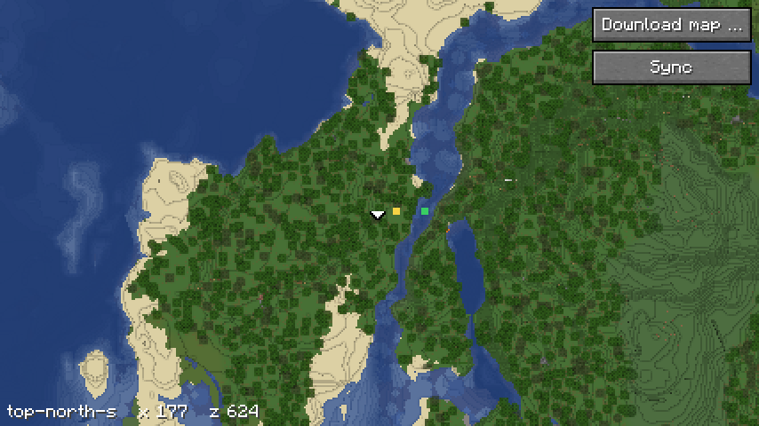

# Bauen und testen

Der Mod baut mit Gradle über den Wrapper und Fabric Loom. Er braucht
Java 25; Gradle holt es über die Toolchain in `build.gradle.kts`.

## Versionen

- **Minecraft, Fabric Loader, Fabric API, Loom und JUnit** stehen in
  `gradle/libs.versions.toml`. Minecraft folgt dem Server.
- **Gradle** steht in `gradle/wrapper/gradle-wrapper.properties`.

## Bauen

```bash
./gradlew build
```

Das baut das Jar nach `build/libs/` und lässt die Tests laufen.

## Tests

| Test | prüft |
|---|---|
| `ProjektionTest` | die Projektion gegen `projektion.json` des Renderers, braucht Netz, siehe [Projektion](projektion.md) |
| `LadenTest` | den Download gegen einen kleinen Server auf loopback: Fortsetzen, geänderte und gelöschte Kacheln, Stufen, Prüfsumme, Token, Heimnetz, alle harten Grenzen, Fristen, keine Weiterleitung, den Index während des Downloads, siehe [Download](download.md) |
| `FreigabeTest` | die `freigabe` lesen, reservierte Namen, und wann der Mod fragt, siehe [Download](download.md), „Zustimmung und Grösse“ |
| `ReiheTest` | Downloads nacheinander, je Baum höchstens einer, auch nach einem `Error`, siehe [Download](download.md), „Reihe“ |
| `AdresseTest` | die Prüfung der Adresse, siehe [Download](download.md), „Sicherheit“ |
| `KartenblickTest` | wie die Vollbildkarte Kacheln auf den Schirm legt, Zoom über Stufen und Lupe, Schieben, Platzhalter aus gröberen Stufen, siehe [Vollbildkarte](vollbildkarte.md) |
| `KachelnTest` | WebP mit TwelveMonkeys lesen, samt Alpha, die Grösse aus dem Kopf vor dem Dekodieren, siehe [Vollbildkarte](vollbildkarte.md), „Kacheln“ |
| `PyramideTest` | Verkleinern wie die Pyramide des Renderers, siehe [Live-Ebene](live.md), „Raster“ |
| `EbeneTest` | die Bilder der Live-Ebene schreiben, lesen, beim Abgleich räumen, auch über einen Fehler hinweg, beim Wechsel des Massstabs anpassen und in die Kacheln legen, auch bei negativen Chunks, siehe [Live-Ebene](live.md) |
| `LiveTest` | welche Änderungen die Live-Ebene zeichnet, siehe [Live-Ebene](live.md), „Wann gezeichnet wird“ |
| `SatzTest` | den Satz zur Dimension finden, Grenzen für `map.json`, siehe [Vollbildkarte](vollbildkarte.md), „Welcher Satz“ |
| `MinimapTest` | den Bereich der Minimap, siehe [Minimap](minimap.md), „Neu zeichnen“ |
| `LichtTest` | die Lightmap gegen die Werte aus der Doku des Renderers, siehe [Minimap](minimap.md), „Licht“ |

## Gametests

Die Client-Gametests starten das Spiel mit einem Fenster und laufen nicht
in der CI:

```bash
./gradlew runClientGameTest
```

| Gametest | tut |
|---|---|
| `Bilder` | baut eine Szene und nimmt die Minimap auf, danach die Vollbildkarte aus einem Testsatz und die Live-Ebene darüber; mit `-Pbilder=<ordner>` landen die Bilder dort, siehe [Minimap](minimap.md), „Bilder“, [Vollbildkarte](vollbildkarte.md), „Bild“, und [Live-Ebene](live.md), „Bild“ |
| `Messung` | nur mit `-Pmessung=<datei>`: Zeit je Chunk und Frametime mit und ohne Minimap, siehe [Minimap](minimap.md), „Kosten“ |
| `Abnahme` | nur mit `-Pabnahme=<ordner>`: die Live-Ebene gegen `top-north` scale 4 des Renderers an der Testwelt, siehe [Live-Ebene](live.md), „Abnahme“ |
| `Server` | nur mit `-Pserver=<adresse>`: von Ende zu Ende gegen einen echten Paper-Server mit dem Plugin, Angebot, voller Download des kleinsten Massstabs des ersten Baums, jeder Dialog mit Ja, die Vollbildkarte als Bild `server-karte`; siehe unten |
| `Uebernahme` | nur mit `-Puebernahme=<datei>`: was eine Kachel der Vollbildkarte den Render-Thread kostet, siehe [Vollbildkarte](vollbildkarte.md), „Kacheln“ |

### Gegen einen echten Server

Der Gametest `Server` verbindet sich wie der Testserver der Fabric API über
`ConnectScreen.startConnecting` mit der Adresse aus `-Pserver`. Der Server
braucht:

- **Paper in der Version des Clients,** heute 26.3; ein Client spricht nur
  das Protokoll seiner Version. Das Plugin baut gegen die API 26.2 und läuft
  darauf.
- **`online-mode=false`:** Der Client im Gametest hat keine Mojang-Sitzung.
  Auch der Testserver der Fabric API stellt das so ein.
- **`server-ip=127.0.0.1`:** Ohne Anmeldung kommt jeder mit jedem Namen
  herein. Das ist für einen Testserver auf demselben Rechner richtig, aber
  nur, solange er von aussen nicht erreichbar ist.
- **Keine Whitelist,** oder der Client darauf: `whitelist off` oder
  `whitelist add Player0`, so heisst der Client im Gametest. Weist der
  Server ihn ab, endet der Gametest gleich mit dem Bild `server-abgewiesen`,
  denn der Grund steht nur auf dem Schirm.
- **Das Plugin mit einem Baum zum Download und dem Webserver** aus
  heroic-map-renderer#151. Läuft der Webserver auf demselben Rechner wie
  der Server, passt die Prüfung der Adresse, siehe [Download](download.md),
  „Sicherheit“.

Er löscht vorher den Ordner dieses Servers unter `heroicmap/`, lädt den
kleinsten Massstab des ersten Baums und bestätigt jeden Dialog. Er läuft
unter der Sperrdatei und nur, wenn kein Minecraft-Client des Users offen
ist.

Lauf am 06.10. gegen Paper 26.3-157 mit dem Plugin, ein Baum `top-north-s`
aus der Testwelt: 46 Kacheln, 2,2 MB, Code 0. Das Bild `server-karte`:



## CI

`.github/workflows/ci.yml` hat zwei Jobs:

- **Gradle:** `./gradlew build` unter Ubuntu mit Java 25.
  `gradle/actions/setup-gradle` prüft dabei auch, dass `gradle-wrapper.jar`
  ein Wrapper von Gradle ist.
- **Doku:** `pruefe-doku.sh` vom Branch `master` des Hauptrepositorys,
  dieselbe Prüfung wie dort. Der Schritt läuft mit `shell: bash`, also mit
  `pipefail`: Scheitert der Download, wird der Job rot.

## Doku prüfen

Lokal aus der Wurzel des Repositorys:

```bash
curl -fsSL https://raw.githubusercontent.com/VonNekyia/heroic-map-renderer/master/.github/pruefe-doku.sh | bash
```

Neue Seiten erst nach `git add`, die Prüfung sieht nur, was Git verfolgt.
