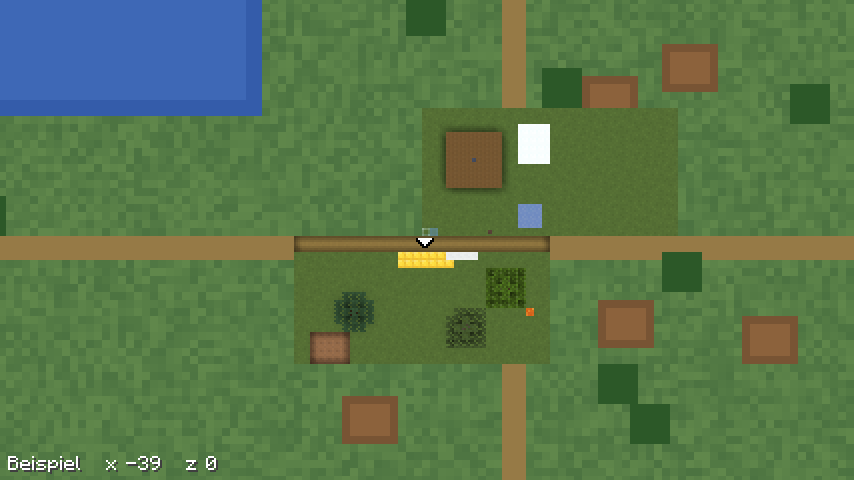

# Live-Ebene

Die Kacheln vom Server zeigen den Stand des letzten Laufs des Renderers.
Was sich seither in Chunks ändert, die der Client geladen hat, zeichnet der
Mod selbst nach und legt es über die [Vollbildkarte](vollbildkarte.md),
bis der nächste [Abgleich](download.md) die Änderung bringt. Gezeichnet
wird mit dem Maler der [Minimap](minimap.md), aber so, wie der Server
zeichnet: `top-north`, 4 Pixel je Block, Texturen und Biomübergang wie
dort.

## Raster

- **Zeichnen:** mit `scale` aus `map.json` Pixeln je Block, heute 4 (`Live`).
  Ein Chunk ist dann 64 Pixel breit und liegt auf Pixel- und
  Kachelgrenzen.
- **Verkleinern** auf die feinste Stufe des Satzes, 2 oder 1 Pixel je
  Block, wie die Pyramide des Renderers (`Pyramide`): je 2 × 2 Pixel in
  linearem Licht mit vormultipliziertem Alpha, links oben, rechts oben,
  links unten, rechts unten. Das Verfahren steht in
  [`zoomstufen.md` des Renderers](https://github.com/VonNekyia/heroic-map-renderer/blob/master/docs/benutzung/zoomstufen.md),
  „Verkleinern“; `PyramideTest` prüft dieselben Fälle wie dessen Tests.
- **In gröberen Stufen** verkleinert die Karte weiter, bis ein Chunk
  1 Pixel breit ist (`Ebene.lege`). Darunter mischte ein Pixel Chunks, die
  der Mod nicht hat; dort bleibt die Kachel des Servers.
- **Ersetzen, nicht mischen:** Das Bild eines Chunks ersetzt seinen
  Ausschnitt der Kachel ganz, auch wo es durchsichtig ist. Fehlt dem Server
  die Kachel, entsteht eine durchsichtige mit dem Chunk darin.
- **Rundung:** Java rechnet die sRGB-Kurve in `double`, der Renderer in
  `f32`. Ein Kanal kann deshalb selten um 1 abweichen.

## Texturen

Der Server zeichnet mit den Vanilla-Assets. Die Live-Ebene nimmt deshalb
die Texturen aus `Minecraft.getVanillaPackResources()`, nicht die Packs des
Spielers; sonst sähe man mit einem Pack Flicken (`ChunkMaler.Texel.vanilla`).

- **Je Sprite** die Datei `textures/<pfad>.png` seines Namens, bei einer
  Animation das erste Bild oben, so hoch wie breit.
- **Ohne Vanilla-Datei,** etwa ein Sprite eines Mods, bleiben die Texel aus
  dem Atlas.
- **Die Minimap** bleibt bei den Packs.

## Biomübergang

Der Radius kommt aus `biomeBlend` in `map.json`, nicht aus der Einstellung
des Spielers. Der Maler mischt die Tönung dafür selbst, wie
`ClientLevel.calculateBlockTint` im Spiel: das Mittel über (2r + 1)² Biome
auf gleicher Höhe, je Kanal ganzzahlig geteilt, belegt per javap am Client
26.3 (`ChunkMaler.Mischung`). Fehlt `biomeBlend` oder liegt es nicht
zwischen 0 und 7, gilt die Einstellung des Spielers.

## Wann gezeichnet wird

- **Auslöser:** `LevelExtractor.setBlockDirty(BlockPos, BlockState,
  BlockState)`, der zweite Mixin des Mods (`LevelExtractorMixin`). Dorthin
  führt `ClientLevel.setBlocksDirty` aus `Level.setBlock`: die Vorhersage
  des Spielers, die Antwort des Servers und Änderungen anderer Spieler in
  Sichtweite. Licht und das Laden von Chunks laufen dort nicht durch.
- **Am Rand** eines Chunks kommt auch der Nachbar dran, denn sein Schatten
  am Rand ändert sich mit.
- **Je Chunk höchstens alle 5 s** (`Live.PAUSE_MS`): Wasser fliesst,
  Getreide wächst.
- **Nur mit allen 8 Nachbarn geladen;** sonst rechneten Schatten und
  Biomübergang am Rand mit fehlenden Blöcken. Ist der Chunk selbst nicht
  mehr geladen, fällt er weg.
- **Die Minimap geht vor:** Solange sie sichtbar ist und zu zeichnen hat,
  wartet die Live-Ebene.
- **Je Tick** höchstens ein Abzug auf dem Render-Thread; das Zeichnen läuft
  in einem eigenen Worker mit niedriger Priorität.
- **Nur mit Satz:** Ohne geladenen Satz für die Dimension, in
  Dimensionen mit Decke wie dem Nether und im Einzelspieler zeichnet sie
  nichts.

## Ablage

- **Je Chunk ein PNG** in der Auflösung der feinsten Stufe des Satzes:
  `heroicmap/<server>/<baum>/overlay/<cx>.<cz>.png`, über eine
  Zwischendatei geschrieben (`Ebene`).
- **Die Zeit der Änderung** steht als mtime, in Serverzeit: Der Mod misst
  den Versatz der Uhren an `jetzt` jeder Nachricht des Plugins
  (`Downloads.serverzeit`).
- **Grösse:** roh 16 KiB je Chunk bei 4 px, 4 KiB bei 2 und 1 KiB bei 1;
  als PNG weniger.
- **Bei offener Karte** lädt nach einem neuen Bild nur die Kachel neu, die
  den Chunk zeigt, in jeder Stufe (`Kacheln.geaendert`).

## Abgleich

Nach jedem vollständigen Download, ob voll oder Abgleich:

- **Weg fällt,** was älter ist als `abdeckt_bis` aus der `freigabe`; das
  enthalten die Kacheln. Wie das Plugin die Zeit rechnet, steht in
  [`docs/download.md` des Plugins](https://github.com/VonNekyia/heroic-map-renderer-plugin/blob/main/docs/download.md),
  „Was die Kacheln abdecken“.
- **Ohne `abdeckt_bis`** bleiben alle Bilder.
- **Anderer Massstab:** Gröber verkleinert der Mod die Bilder, feiner fallen
  sie weg, denn feinere Pixel hat er nicht.
- **Ein gekappter Download** räumt nichts.

## Kosten

- **Je Chunk:** der Abzug auf dem Render-Thread und das Zeichnen im Worker,
  wie bei der Minimap mit 4 Pixeln je Block, siehe
  [Messung](messungen/2026-10-05-minimap-kosten.md). Verkleinern und PNG
  schreiben kommen im Worker dazu.
- **Je Frame** nichts; die Karte legt die Bilder beim Laden einer Kachel im
  Dekoder hinein.
- **Einmal je Atlas** liest der Worker die Vanilla-Texturen.

## Bild

`docs/bilder/live.png` nimmt der Gametest `Bilder` auf, siehe
[Bauen und testen](entwicklung.md), „Gametests“: Nach der Vollbildkarte
legt er Gold quer über die Grenze zweier Chunks und wartet, bis deren
Bilder abgelegt sind. Die Karte zeigt sie über dem gemalten Testsatz,
dazu zwei Chunks, in denen sich die Szene selbst geändert hat, etwa durch
fliessende Lava. Im Einzelspieler gibt es keinen Satz vom Server; der Test
setzt ihn (`Live.satzFuerTest`).

## Was bleibt eine Näherung

- **Ganze Chunks,** die der Server neu schickt, laufen nicht über
  `setBlock`, etwa nach grossen Bearbeitungen; sie kommen mit dem
  nächsten Abgleich.
- **Hängt der Autosave des Servers** länger als die Reserve des Plugins,
  fällt beim Abgleich eine Änderung weg, die die Kacheln noch nicht haben.
  Sie fehlt bis zum nächsten Abgleich oder bis der Chunk sich wieder
  ändert.
- **Was anders ist als `top-north`,** gilt auch hier, siehe
  [Minimap](minimap.md), „Was anders ist als top-north“; nur Texturen und
  Biomübergang folgen dem Server.
