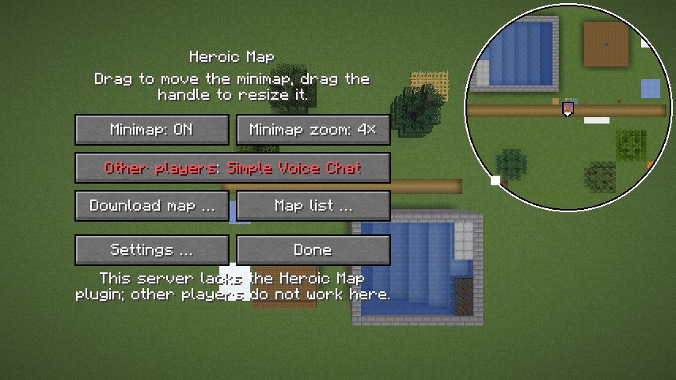
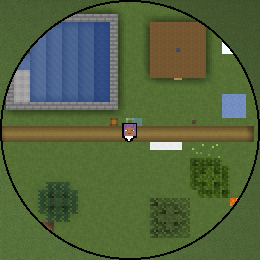
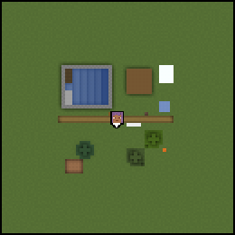
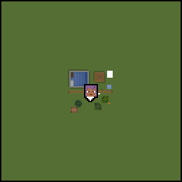

# Minimap

Die Minimap liegt in der Vorgabe rechts oben im HUD, 128 Einheiten des GUI
im Quadrat, eckig und genordet, der Spieler in der Mitte; Form, Lage und
Grösse stellt das Menü ein, siehe „Bedienung“. Sie zeichnet jeden Chunk mit
dem Tesselator des Spiels von oben, mit 1, 2 oder 4 Pixeln je Block in der
Textur, und
liegt damit nah an der Karte `top-north` des Renderers, siehe
[0001](entscheidungen/0001-minimap-mit-dem-tesselator.md). Was sie kostet,
steht unter „Kosten“.

## Bedienung

`/hmap` öffnet das Menü (`Einstellungen`):



| Einstellung | Vorgabe | tut |
|---|---|---|
| Minimap | an | blendet die Minimap aus und ein |
| Zoom der Minimap | 2× | 1, 2, 4 oder 8 Einheiten des GUI je Block: wie viel Gegend die Minimap zeigt |
| Auflösung der Minimap | 2 px je Block | 1, 2, 4, 8 oder 16 Pixel je Block in den Texturen: wie fein sie höchstens zeichnet |
| Form | eckig | eckig oder rund, siehe „Form“ |
| Knopf „Karte laden …“ | – | die Karten des Servers, wie in der [Vollbildkarte](vollbildkarte.md), „Bedienung“ |

- **Zoom und Auflösung** sind getrennt. Der Zoom legt fest, wie viel
  Gegend die Minimap zeigt: bei 128 Einheiten Seite 128 Blöcke bei 1×,
  64 bei 2×, 32 bei 4×, 16 bei 8×. Die Auflösung ist eine Obergrenze für
  die Pixel je Block in den Texturen. Gezeichnet wird mit der grössten von
  1, 2, 4, 8 und 16 px bis dahin, die in die Pixel eines Blocks auf dem Schirm ganz
  aufgeht (`Minimap.effektiv`). Ein Block ist auf dem Schirm Zoom ×
  GUI-Massstab Pixel gross: bei 1× und GUI-Massstab 2 also 2, bei
  GUI-Massstab 3 also 3, dann zeichnet die Minimap mit 1 px, 3 Pixel je
  Texel. Das Spiel verkleinert die Texturen so nie; verkleinert war die
  Minimap unscharf. Jeder Texel ist auf dem Schirm gleich gross. Mit einem
  anderen GUI-Massstab oder Zoom passt sich die Auflösung im nächsten Frame
  an und zeichnet neu; ein anderer Zoom ändert sonst nur den Bereich.
- **Lage und Grösse:** Das Menü dunkelt nicht ab, die Minimap im HUD bleibt
  sichtbar und ist weiss umrandet, rund mit einem Ring. Ziehen mit der
  linken oder rechten Taste verschiebt die ganze Minimap, etwa von rechts
  oben nach links oben. Der weisse Griff sitzt an der Ecke, die zur Mitte des
  Schirms zeigt, rund auf dem Ring in der Diagonale dorthin; ihn ziehen
  macht die Minimap grösser oder kleiner, die Ecke gegenüber bleibt
  stehen. Die Seite liegt zwischen 64 und 256 Einheiten des GUI
  (`Minimap.KLEINSTE`, `Minimap.GROESSTE`) und höchstens so gross, wie der
  Schirm Platz hat. Grösser zeigt mehr Gegend beim selben Zoom und
  zeichnet mehr Chunks, siehe „Neu zeichnen“, „Bereich“.
- **Knöpfe** stehen im grösseren freien Platz neben der Minimap, 200
  Einheiten breit oder schmaler, bis 120, wenn dort weniger Platz ist. So
  passen sie auch bei grossem GUI-Massstab auf den Schirm.
- **Koordinaten:** Im Menü stehen über der Minimap `x` und `z` des Blocks
  unter der Maus fest unten links, wie auf der Karte im Browser, genau wie
  gezeichnet; nicht beim Ziehen. Zum Umschauen dient die
  [Vollbildkarte](vollbildkarte.md), so will es der User.
- **Gespeichert** wird beim Schliessen des Menüs, in
  `config/heroicmap.properties`. Die Lage steht dort als Anteil des freien
  Platzes, 0 links oder oben bis 1 rechts oder unten, so bleibt die Minimap
  bei einer anderen Fenstergrösse in ihrer Ecke. Fehlt die Datei oder ist
  ein Wert unlesbar, gilt die Vorgabe. Eine Datei von vor dem Zoom hat nur
  `massstab`; dann gilt er für Auflösung und Zoom, der Ausschnitt bleibt.
- **Tasten:** Vorbelegt ist nur `.` für die
  [Vollbildkarte](vollbildkarte.md). „Minimap zeigen oder verbergen“ und
  „Zoom der Minimap“ gibt es auch als Tasten, ohne Belegung, unter
  Steuerung, Gruppe „Heroic Map“; was sie ändern, speichert der Mod gleich.
- **Der eigene Spieler** ist sein Kopf aus dem Skin, 8 Einheiten mit
  schwarzem Rand, daneben ein kleiner Pfeil in Blickrichtung
  (`Minimap.avatar`). Bei Gier 0 blickt der Spieler nach Süden, auf der
  Karte nach unten; der Pfeil kreist deshalb um Gier + 180° gedreht um den
  Kopf. So hat es der User gewünscht.
- **Wo ein Block liegt,** sagt die [Projektion](projektion.md).

## Mitspieler

Andere Spieler zeigt der Mod nur, wenn der Server sie nennt. Eigene Gruppen
gibt es nicht; so hat es der User gewählt.

- **Wahl `show`** im Menü, Knopf „Mitspieler“, gespeichert in
  `heroicmap.properties`: `simplevoicechat`, die Vorgabe, so hat es der
  Maintainer entschieden: Wer mich in Simple Voice Chat hört, also nah genug
  oder in derselben Sprachgruppe, sieht mich, und ich sehe ihn. `hidden`:
  Niemand sieht mich, und ich sehe niemanden; der Mod zeichnet dann auch
  nichts, was noch kommt.
- **Senden:** `{"v":1,"typ":"show","show":"simplevoicechat"}` (`Kanal.show`),
  sobald der Server den Kanal anmeldet (`ServerboundPlayChannelEvents`), und
  nach jeder Änderung im Menü.
- **Der Server** entscheidet, wen er nennt: nur mit der Permission
  `heroicmap.show` auf beiden Seiten, Vorgabe alle, mit Simple Voice Chat
  auf dem Server und wenn beide `simplevoicechat` gewählt haben. Er antwortet
  `{"typ":"show","erlaubt":true}`, oder mit `"erlaubt":false` und `grund`
  `permission` oder `simplevoicechat`; das Menü nennt den Grund unter den
  Knöpfen (`Mitspieler.antwort`), ein anderer Grund wird ein allgemeiner
  Text. Beim Verlassen des Servers fällt die Antwort weg.

- **Nachricht:** `spieler` über den Kanal, etwa einmal je Sekunde:

  ```json
  {"v":1,"typ":"spieler","jetzt":1696600000,"spieler":[
    {"uuid":"…","name":"Sam","dimension":"minecraft:overworld","x":12.5,"z":-40.2}]}
  ```

  Endet die Sicht, kommt einmal eine leere Liste.
- **Lesen** (`Mitspieler.lies`): höchstens 256 Einträge. Ein Eintrag ohne
  gültige UUID, mit einem Namen ausser druckbarem ASCII ohne Leerzeichen
  bis 16 Zeichen, wie das Spiel Namen zulässt, oder mit `x`, `z` nicht
  endlich fällt weg, die übrigen bleiben.
- **Verfallen:** Kommt 5 s keine Nachricht (`Mitspieler.FRIST`), ist die
  Liste leer; ebenso beim Verlassen des Servers. Die Positionen liegen nur
  im Speicher, nie auf der Platte.
- **Lage:** Hat der Client einen genannten Spieler als Entity mit derselben
  UUID, nimmt der Mod dessen Position, die ist flüssiger, zwischen zwei
  Ticks wie den eigenen Spieler, siehe „Bewegung“; sonst die des Servers.
- **Zeichnen:** der Kopf aus dem Skin (`PlayerFaceExtractor`), 8 Einheiten
  des GUI mit schwarzem Rand, nur in der Dimension des Spielers und
  innerhalb der Form; ohne Skin ein weisses Quadrat. Auf der
  [Vollbildkarte](vollbildkarte.md) steht der Name darüber.

## Form

Der Mod zeichnet die Minimap in Pixeln des Schirms, nicht des GUI
(`Minimap.male`), Zeile für Zeile der Form:

- **Läufe:** Gleich breite Zeilen fasst `Minimap.laeufe` zu einem Lauf
  zusammen. Eckig ist das ein einziger Lauf. Rund ist es der Kreis in das
  Quadrat, je Zeile die Sehne auf ganze Pixel gerundet; bei 384 Pixeln
  Seite sind das 225 Läufe, etwa 1,2 je Pixel des Radius.
- **Zeichnen:** je Region der Minimap ein Rechteck aus ihrer Textur je
  Lauf, das sie schneidet, mit den passenden Texturkoordinaten; dazu
  dieselbe Form eine Einheit grösser in Schwarz als Rand. Je Region gehen
  ihre Rechtecke nacheinander, so bleibt es ein Stapel je Textur. Der Mod
  braucht weder Scissor noch Shader noch Stencil.
- **Kanten:** Der Kreis ist auf ganze Pixel des Schirms gestuft, ohne
  Glättung.
- **Kosten:** rund 0,33 ms je Frame, eckig 0,003 ms, siehe „Kosten“.



## Bewegung

Die Minimap folgt dem Spieler in jedem Frame, nicht nur je Tick
(`Minimap.zeichne`, `Minimap.ecke`):

- **Zwischen zwei Ticks:** Die Mitte ist die Lage des Spielers zwischen
  `xo`, `zo` und `getX()`, `getZ()` beim Anteil des Ticks, wie bei der
  Kamera: `DeltaTracker.getGameTimeDeltaPartialTick(true)`, bei einem
  eingefrorenen Spieler 1 (`Minimap.anteil`). Belegt per javap am
  Client 26.3: `Camera` rechnet so, mit `Mth.lerp` von `xo` nach `getX()`.
  Mit der Lage des letzten Ticks rückte die Minimap nur 20-mal je Sekunde
  und ruckelte bei 60 fps und mehr.
- **Auf ganze Pixel des Schirms,** nicht auf ganze Einheiten des GUI. Ein
  Texel ist auf dem Schirm eine ganze Zahl von Pixeln, siehe „Bedienung“;
  verschoben wird nur, wo die Textur liegt, so bleibt sie scharf. Bei
  GUI-Massstab 3 rückt die Minimap so in Dritteln einer Einheit.
- **Der Pfeil** am Kopf dreht mit `getViewYRot(a)`, wie die Kamera.
- **Mitspieler** als Entity stehen beim selben Anteil
  (`Entity.getPosition`), ihre Köpfe auf ganzen Pixeln wie die Karte.
- **Die Koordinaten im Menü** rechnen genauso (`Einstellungen.koordinaten`).
- **Die Vollbildkarte** nimmt weiter die Lage des letzten Ticks.

## Welcher Block oben liegt

Je Spalte geht der Mod von oben nach unten, bis jeder Pixel der Spalte
deckt, Alpha ab 0,996, oder der Abschnitt mit dem ersten vollen Block
(`isSolidRender`) unter dem Beginn zu Ende ist; weiter reicht die Kopie
nicht, siehe „Neu zeichnen“ (`ChunkMaler.male`).

- **Beginn:** der oberste Block, den die Höhenkarte `WORLD_SURFACE` nennt.
  Der Client bekommt sie mit dem Chunk vom Server, `LevelChunk.setBlockState`
  führt sie nach, belegt per javap am Client 26.3.
- **Je Block:** die Flächen des Modells und die Oberfläche einer
  Flüssigkeit, nach ihrer Höhe geordnet, siehe „Wasser“. Von Flüssigkeiten
  zählt nur die oberste Oberfläche der Spalte.
- **Decke:** Hat die Dimension eine Decke (`DimensionType.hasCeiling`), wie
  der Nether, beginnt die Spalte auf Höhe des Kopfes. Ist der Block dort
  voll (`isSolidRender`), bleibt die Spalte leer: eine Wand. Wandert der
  Kopf um 2 Blöcke, zeichnet die Minimap neu.

## Flächen aus dem Tesselator

Für jeden Block ruft der Mod `ModelBlockRenderer.tesselateBlock` auf, mit
weicher Beleuchtung und Culling, der Variante aus `BlockState.getSeed` und
einer eigenen `BlockQuadOutput`. Das Spiel liefert damit jede sichtbare
Fläche als `BakedQuad`, dazu in `QuadInstance` je Ecke die Farbe aus
Schatten und Tönung und die Lichtkoordinaten. Belegt per javap am Client
26.3: `tesselateBlock` prüft `shouldRenderFace`, rechnet den Schatten mit
`BlockModelLighter.prepareQuadAmbientOcclusion` und multipliziert die
Tönung (`putQuadWithTint`).

- **Nach oben:** Der Mod behält Flächen, deren Normale nach oben zeigt,
  n_y > 10⁻⁴ · |n|. Die Normale ist (p1 − p0) × (p2 − p0); die Ecken einer
  Oberseite liegen so, dass sie nach oben zeigt (`FaceInfo.UP`). Kreuze wie
  Gras, Blumen und Getreide stehen senkrecht und fallen weg.
- **Reihenfolge:** In einem Block zuerst die höchste Fläche, dann die Blöcke
  darunter.
- **Versatz:** `tesselateBlock` gibt den Versatz des Blocks (`getOffset`)
  mit, etwa bei Bambus und Blumen; der Mod schiebt die Fläche um ihn. Was
  dabei über die eigene Spalte hinausragt, fällt weg, siehe „Was anders ist
  als top-north“.
- **Leuchten** einzelner Flächen (`lightEmission`) hebt ihr Licht wie im
  Spiel (`QuadInstance.getLightCoordsWithEmission`).
- **Weiche Beleuchtung** ist immer an, gleich was der Spieler eingestellt
  hat, wie auf der Serverkarte.
- **Tönung** kommt über `BlockColors`, auch die anderer Mods.

## Flächen und Pixel

Ein Pixel gehört zu einer Fläche, wenn seine Mitte in einem ihrer beiden
Dreiecke (0, 1, 2) und (0, 2, 3) liegt, in x und z (`ChunkMaler.schicht`).

- **Abtasten:** (16 / scale)² Punkte je Pixel, bei 4 px also 4 × 4, bei
  1 px 16 × 16; so zählt bei einer vollen Oberseite jedes Texel. u und v
  laufen affin über das Dreieck der Mitte und bleiben im UV-Ausschnitt der
  Fläche.
- **Texel:** aus dem ersten Bild des Sprites, aus einer Kopie, siehe „Neu
  zeichnen“.
- **Volle Oberseiten,** die den Block ganz decken und das ganze Sprite
  zeigen, nehmen ein Raster, das je Sprite, Schicht und scale einmal über
  jede Zelle gemittelt ist, nach denselben Regeln. Das ist der häufigste
  Fall und spart rund ein Drittel der Zeit je Chunk.
- **Mittel** in linearem Licht, je nach Schicht der Fläche
  (`ChunkSectionLayer`), wie im Renderer, siehe
  [Rastern ohne Nähte](https://github.com/VonNekyia/heroic-map-renderer/blob/master/docs/renderer/naehte.md),
  „Ausgeschnitten statt gemischt“:

  | Schicht | Regel |
  |---|---|
  | SOLID | deckt ganz |
  | CUTOUT | ein Texel deckt ab Alpha 0,5; decken mehr als die Hälfte der Punkte, deckt der Pixel ganz, genau die Hälfte entscheidet der Punkt in der Mitte |
  | TRANSLUCENT | Texel unter Alpha 0,1 fallen weg, der Rest wird gemischt |

- **Farbe:** das Mittel zurück nach sRGB, mal dem Faktor der Ecken aus Licht
  und Farbe, baryzentrisch an der Pixelmitte.
- **Übereinander** von vorn nach hinten, vormultipliziert; was nicht ganz
  deckt, liegt über Schwarz.

## Licht

Die Lightmap rechnet der Mod selbst, für den Tag, aus den Attributen des
Dimensionstyps (`Licht.von`): `AMBIENT_LIGHT_COLOR`, `SKY_LIGHT_COLOR`,
`SKY_LIGHT_FACTOR` und `BLOCK_LIGHT_TINT` aus `EnvironmentAttributes`, wo
der Typ keine setzt, deren Vorgabe.

- **Formel** wie der Renderer, siehe
  [Wasser und Licht](https://github.com/VonNekyia/heroic-map-renderer/blob/master/docs/renderer/wasser-und-licht.md),
  „Helligkeit wie im Spiel“ und „Blocklicht“: `BlockFactor` 1,4 ohne
  Flackern, `BrightnessFactor` 0,5.
- **Zwischen den Stufen** linear, die Lichtkoordinaten in Sechzehnteln einer
  Stufe, wie die gefilterte Lightmap des Spiels.
- **Nicht** nach Tageszeit, Wetter oder Gamma des Spielers.
- **`LichtTest`** prüft die Formel gegen die Werte, die die Doku des
  Renderers nennt: Licht 15 unter freiem Himmel gibt 1, und wie viel vom
  Grund durch Wasser zu sehen ist, 27 % bei Licht 14 bis 3 % bei Licht 0.

## Wasser

Eine Flüssigkeit zeichnet der Mod als eine Oberfläche
(`ChunkMaler.sammleFluessigkeit`) in der Höhe, in der das Spiel sie legt:
`FluidState.getHeight`, bei einer Quelle 8/9, so wie `FluidRenderer.tesselate`
die Oberseite bei 0,8888889 zeichnet. Sie reiht sich unter die Flächen des
Blocks; was höher liegt, Mangrovenwurzeln etwa oder eine obere Stufe, liegt
davor. Sie zeigt das ruhende Sprite aus `FluidModel`,
gemittelt, mal Tönung (`FluidModel.tintSource`), Licht und `CardinalLighting`
nach oben, in der Schicht des Modells. Das Licht ist das hellere aus dem
Block und dem darüber. Darunter liegt der Grund in seinem eigenen
Himmelslicht; jeder Block Wasser nimmt eine Stufe. So zeigt die Minimap die
Tiefe wie der Renderer, siehe
[Wasser und Licht](https://github.com/VonNekyia/heroic-map-renderer/blob/master/docs/renderer/wasser-und-licht.md),
„Tiefe über das Licht“.

## Blockentities

Truhen, Schilder, Banner und Köpfe haben im Modell keine Fläche, sie
zeichnet ein Renderer für Blockentities. Für sie legt der Mod das
Partikel-Sprite des Modells deckend über ihre Form von oben, das Rechteck
aus `getShape(...).bounds()` in x und z, in dessen Höhe, im Licht des
Blocks darüber (`ChunkMaler.sammleBlockentity`). Blöcke mit `RenderShape.INVISIBLE`, etwa Barrieren, zeichnen
nichts.

## Neu zeichnen

- **Wann:** Die Wege, auf denen der Client einen Abschnitt neu zeichnen
  lässt, enden in `LevelExtractor.setSectionDirty(int, int, int, boolean)`,
  belegt per javap am Client 26.3: `blockChanged`, `setBlockDirty`,
  `setBlocksDirty`, `setSectionDirtyWithNeighbors` und
  `setSectionRangeDirty`, auch das Licht eines neuen Chunks über
  `enableChunkLight`. Dort hängt der erste Mixin des Mods
  (`LevelExtractorMixin`) und markiert die Spalte. Der zweite, an
  `setBlockDirty`, gehört zur [Live-Ebene](live.md).
- **Ausnahme:** `LevelExtractor.allChanged` legt alles neu an, ohne
  `setSectionDirty`, etwa wenn der Biomübergang sich ändert. Der Mod
  vergleicht deshalb je Frame `Options.biomeBlendRadius` und den Block-Atlas
  und zeichnet bei einer Änderung neu.
- **Bereich:** Gezeichnet und behalten wird, was die Minimap zeigt, plus
  2 Chunks je Richtung (`Minimap.reichweite`), je nach Zoom: in der
  Vorgabe von 128 Einheiten bei 1× ±6 Chunks, bei 2× ±4, bei 4× ±3; bei
  256 Einheiten und 1× ±10; bei 8× ±3. Die Auflösung ändert den Bereich nicht. Rund zeichnet der Mod dasselbe Quadrat wie eckig. Verlässt ein Chunk den Bereich, fällt sein Bild weg;
  kommt er wieder, zeichnet der Mod ihn neu.
- **Reihenfolge:** die offenen Chunks, die nächsten zuerst. Eine Pause
  zwischen zwei Abzügen eines Chunks brachte messbar nichts und verzögerte
  jede Änderung; der Mod hat keine, siehe die Messung unter „Kosten“.
- **Render-Thread:** zieht einen Chunk ab (`ChunkMaler.abziehen`): je
  Spalte die erste Höhe und je Abschnitt von dort bis zum ersten vollen
  Block eine Kopie mit den Nachbarn, über `RenderRegionCache.createRegion`
  wie das Spiel, wenn es Abschnitte baut. Er übernimmt fertige Bilder in
  die Textur. Beides je Frame höchstens 2 ms (`Minimap.BUDGET_NS`).
- **Worker:** ein eigener Thread zeichnet den Chunk (`ChunkMaler.male`). Die
  Blöcke liest er aus den Kopien (`RenderSectionRegion`). Licht und Tönung
  holt die Region live aus der Welt: `getLightEngine` gibt die echte
  `LevelLightEngine`, `getBlockTint` geht an `ClientLevel.getBlockTint`,
  belegt per javap. Das tun die Worker des Spiels beim Bauen der Abschnitte
  ebenso. Vor ihm liegen höchstens 4 Chunks.
- **Texel:** Der Render-Thread kopiert die Texel aller Sprites des
  Block-Atlas, sobald der Atlas neu geladen ist, und zeichnet dann alles
  neu. Der Worker liest nie Bilder, die ein Neuladen freigeben könnte.
  `SpriteContents.originalImage` und `TextureAtlas.sprites` sind privat;
  der Mod öffnet sie per Access Widener (`heroicmap.accesswidener`), weil
  er so die Pixel im Atlas liest, auch für Sprites ohne eigene PNG-Datei,
  ohne sie ein zweites Mal von der Platte zu laden.
- **Ablage:** je 8 × 8 Chunks eine Textur (`DynamicTexture`), einmal leer
  hochgeladen. Danach schreibt der Mod nur das Bild des fertigen Chunks an
  seine Stelle (`CommandEncoder.writeToTexture` mit Versatz), bei 4 px
  64 × 64 Pixel. Regionen ausserhalb des Bereichs gibt er frei.
- **Wechsel** der Welt und Trennen leeren alles; eine andere Auflösung
  zeichnet alles neu. Bilder aus einem älteren Stand fallen weg.
- **Verborgen** zeichnet die Minimap nichts. Beim Zeigen gilt die Mitte als
  unbekannt; der nächste Frame passt den Bereich an und zeichnet nach, was
  neu in ihm liegt.

## Kosten

Bei Sichtweite 12 und einem Fenster von 854 × 480, gemessen am 05. und
06.10., siehe [Minimap, Kosten](messungen/2026-10-05-minimap-kosten.md) und
[Minimap, rund gegen eckig](messungen/2026-10-06-minimap-rund.md):

| Was | Bedingung | Zeit |
|---|---|---|
| Abzug je Chunk, Render-Thread | Median | 0,08 ms |
| Zeichnen je Chunk, Worker | Median | 1,9 ms bei 1 px, 2,1 ms bei 2 px, 2,6 ms bei 4 px |
| Frametime im p95, mehr als ohne Minimap | 144 und 60 fps, 4 px, Stand und Flug | höchstens 0,06 ms |
| Frametime im p99, mehr als ohne Minimap | 144 und 60 fps, 4 px, Stand und Flug | höchstens 0,45 ms |
| Frametime im p95, mehr als ohne Minimap | ohne Grenze, 3500 bis 5000 fps, 2 und 4 px | höchstens 0,18 ms |
| Kopie der Texel des Atlas | einmal je Neuladen | 3,5 bis 15 ms |
| neue Region | bei 4 px | 0,14 bis 0,17 ms |
| HUD-Element je Frame, eckig | 4 px, Stand, Median | 0,003 ms |
| HUD-Element je Frame, rund | 4 px, Stand, Median, 149 Läufe | 0,33 ms |
| Frametime im p50, rund, mehr als ohne Minimap | freie Bildrate, 4 px, Stand | 0,40 ms |

Der Flug geht dabei mit 20 Blöcken/s über geladenes Gelände.

Bei 8 und 16 px, gemessen am 07.10., siehe
[Minimap, 8 und 16 px](messungen/2026-10-07-minimap-8-16px.md):

- **Zeichnen je Chunk** im Worker, Median: 5,1 ms bei 8 px, 14,4 ms bei
  16 px, gegen 2,7 ms bei 4 px im selben Lauf. Der Abzug auf dem
  Render-Thread bleibt bei 0,1 ms.
- **Neue Region:** 5,8 ms auf dem Render-Thread bei 16 px, 0,17 ms bei
  4 px; einmal je Region. Eine Region hat 8 × 16 × Auflösung Pixel Seite,
  bei 16 px 2048 × 2048, 16 MiB in RGBA. 16 px nimmt die Minimap nur, wenn
  Zoom × GUI-Massstab mindestens 16 ist, dann liegen höchstens etwa 4
  Regionen im Bereich, rund 64 MiB.
- **Frametime:** bei 16 px und Zoom 8× gegen 4 px nicht messbar anders; das
  HUD-Element im Flug im p95 0,25 ms statt 0,11 ms.

Den Gametest dazu startet:

```bash
./gradlew runClientGameTest -Pmessung=messung.txt
```

## Bilder

Der Gametest `Bilder` baut eine Szene in einer flachen Welt und nimmt die
Minimap bei 1, 2 und 4 Pixeln je Block auf, mit dem Zoom gleich der
Auflösung, dann rund bei 4 px und das
Menü (siehe „Bedienung“ und „Form“):

```bash
./gradlew runClientGameTest -Pbilder=docs/bilder
```






Ein Becken mit Wasser von 1 bis 6 Blöcken Tiefe, nach Osten tiefer; im
Westen ragen Mangrovenwurzeln und obere Stufen aus dem Wasser. Dazu ein
Haus mit einem Schild an der Wand, Bambus, ein Kopf, drei Bäume, ein Weg, Glas, Eis, Schnee, Lava, eine Truhe, Teppich und
ein Feld. Gras, Blumen und Weizen stehen senkrecht und fehlen von oben.

## Was anders ist als top-north

- **Texturen** aus den Packs des Spielers, nicht aus den Vanilla-Assets.
- **Licht** aus dem Client, den der Server füttert; der Renderer breitet es
  selbst aus.
- **Blockentities** als Partikel-Sprite, nicht aus ihren Modellen.
- **Animierte Texturen** im ersten Bild.
- **Laub** ohne die dunkle Farbe in den Löchern, die der Renderer für
  `dark_cutout` mitzählt.
- **Flüssigkeiten** immer im ruhenden Sprite.
- **Kanten:** Liegt eine Kante genau auf einer Pixelmitte, gehört der Pixel
  zur Fläche; der Renderer hat dafür eine Füllregel.
- **Biomübergang** nach der Einstellung des Spielers, Vorgabe 2 wie der
  Renderer.
- **Nur geladene Chunks,** also nur die Sichtweite.
- **Versatz über die Spalte hinaus:** Der Mod tastet je Spalte nur deren
  Pixel ab. Was ein Versatz über die Spalte schiebt, etwa ein Bambusrohr am
  Rand, fehlt.
