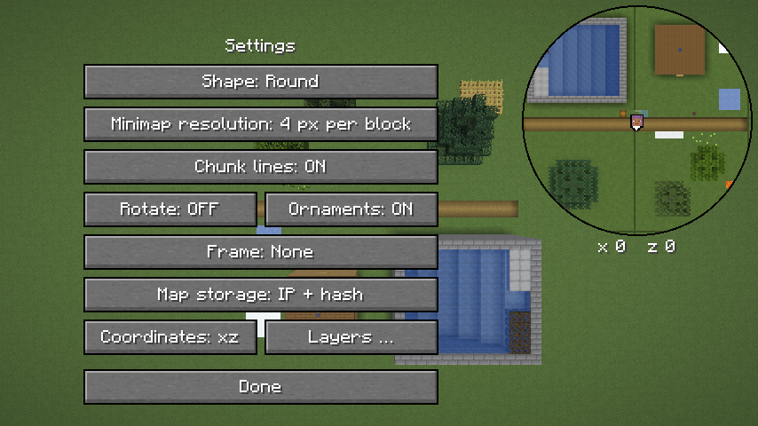
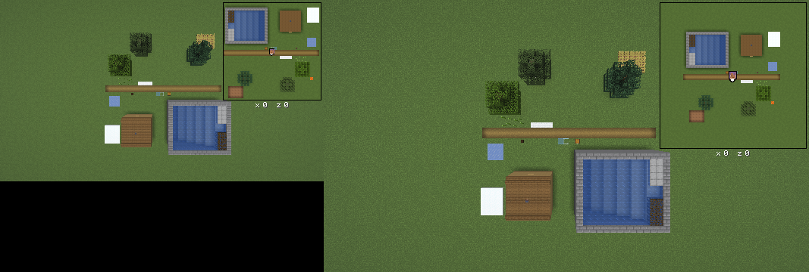
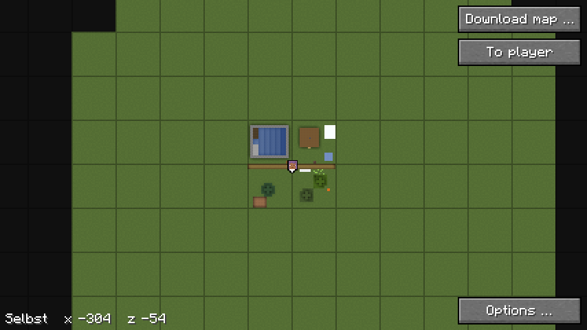
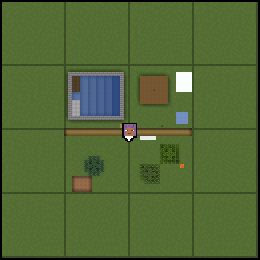
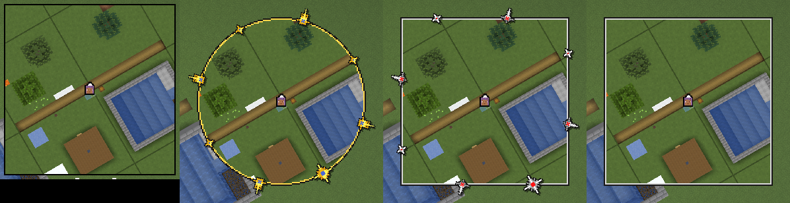
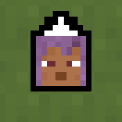
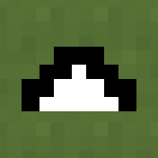
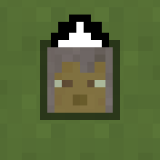
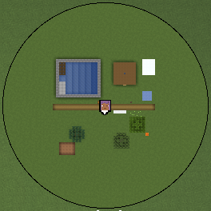
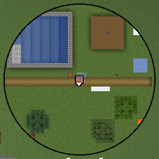

# Minimap

Die Minimap liegt in der Vorgabe rechts oben im HUD, 128 Einheiten des GUI
im Quadrat, eckig und genordet, der Spieler in der Mitte; Form, Lage und
Grösse stellt das Menü ein, siehe „Bedienung“. Sie zeichnet jeden Chunk mit
dem Tesselator des Spiels von oben, mit 1, 2 oder 4 Pixeln je Block in der
Textur, und
liegt damit nah an der Karte `top-north` des Renderers, siehe
[0001](entscheidungen/0001-minimap-mit-dem-tesselator.md). Was sie kostet,
steht unter „Kosten“.

## Bedienung

`/hmap` öffnet das Menü (`Einstellungen`):


| Einstellung | Vorgabe | tut |
|---|---|---|
| Minimap | an | blendet die Minimap aus und ein |
| Zoom der Minimap | 2× | 1, 2, 4 oder 8 Einheiten des GUI je Block: wie viel Gegend die Minimap zeigt |
| Mitspieler | Simple Voice Chat | siehe „Mitspieler“ |
| Knopf „Karte laden …“ | – | die Karten des Servers, wie in der [Vollbildkarte](vollbildkarte.md), „Bedienung“ |
| Knopf „Kartenliste …“ | – | alle Karten auf der Platte mit Grösse und Summe in GB, mit Löschen, siehe [Download](download.md), „Kartenliste“ |
| Knopf „Einstellungen …“ | – | das Untermenü für Vorlieben der Anzeige (`Anzeige`), siehe unten |

Das Untermenü „Einstellungen …“ hält, was man selten ändert; das Hauptmenü
bleibt so kurz. „Fertig“ führt zurück ins Menü:



| Einstellung | Vorgabe | tut |
|---|---|---|
| Form | eckig | eckig oder rund, siehe „Form“ |
| Auflösung der Minimap | 2 px je Block | 1, 2, 4, 8 oder 16 Pixel je Block in den Texturen: wie fein sie höchstens zeichnet |
| Chunklinien | aus | Linien je 16 Blöcke auf Minimap und Vollbildkarte, siehe „Chunklinien“ |
| Drehen | an | die Minimap dreht mit der Blickrichtung, siehe „Drehen“ |
| Verzierungen | an | die Marken N, O, S, W des Rahmens, aus nur Bänder oder Ring, siehe [Rahmen](rahmen.md), „Verzierungen“ |
| Effekte in der Welt | an | der Strahl über angehefteten Wegpunkten und der Schleier am Rand angehefteter Regionen, siehe [Wegpunkte](wegpunkte.md), „Strahl“ und „Schleier“ |
| Koordinaten | xz | aus, `x z` oder `x y z` des Spielers unter der Minimap, siehe „Koordinaten“ |
| Ablage der Karten | IP + Hash | wie die Ordner der Welten heissen, siehe [Download](download.md), „Ablage“ |
| Knopf „Ebenen …“ | – | je Ebene vom Server an oder aus, siehe [Ebenen](ebenen.md), „Umschalten“ |

Den eigenen Spieler und den Rahmen stellt ein Klick auf die Minimap ein,
nicht ein Knopf, siehe „Aussehen an der Minimap“.

- **Zoom und Auflösung** sind getrennt. Der Zoom legt fest, wie viel
  Gegend die Minimap zeigt: bei 128 Einheiten Seite 128 Blöcke bei 1×,
  64 bei 2×, 32 bei 4×, 16 bei 8×. Die Auflösung ist eine Obergrenze für
  die Pixel je Block in den Texturen. Gezeichnet wird mit der grössten von
  1, 2, 4, 8 und 16 px bis dahin, die in die Pixel eines Blocks auf dem Schirm ganz
  aufgeht (`Minimap.effektiv`). Ein Block ist auf dem Schirm Zoom ×
  GUI-Massstab Pixel gross: bei 1× und GUI-Massstab 2 also 2, bei
  GUI-Massstab 3 also 3, dann zeichnet die Minimap mit 1 px, 3 Pixel je
  Texel. Das Spiel verkleinert die Texturen so nie; verkleinert war die
  Minimap unscharf. Jeder Texel ist auf dem Schirm gleich gross. Mit einem
  anderen GUI-Massstab oder Zoom passt sich die Auflösung im nächsten Frame
  an und zeichnet neu; ein anderer Zoom ändert sonst nur den Bereich.
- **Lage und Grösse:** Das Menü dunkelt nicht ab, die Minimap im HUD bleibt
  sichtbar und ist weiss umrandet, rund mit einem Ring. Ziehen mit der
  linken oder rechten Taste verschiebt die ganze Minimap, etwa von rechts
  oben nach links oben, auch wenn es auf dem Spieler oder einer Marke
  beginnt. Der weisse Griff sitzt an der Ecke, die zur Mitte des
  Schirms zeigt, rund auf dem Ring in der Diagonale dorthin; ihn ziehen
  macht die Minimap grösser oder kleiner, die Ecke gegenüber bleibt
  stehen, zwischen 64 und 256 Einheiten des GUI (`Minimap.KLEINSTE`,
  `Minimap.GROESSTE`). Grösser zeigt mehr Gegend beim selben Zoom und
  zeichnet mehr Chunks, siehe „Neu zeichnen“, „Bereich“.
- **Grösse nach dem Fenster:** Die Seite ist ein Anteil der kürzeren Seite
  des Schirms (`Minimap.rahmen`), so hat es der User gewünscht, siehe
  [0013](entscheidungen/0013-groesse-als-anteil-des-schirms.md). Ein
  kleineres Fenster gibt eine kleinere Minimap, ein grösseres eine
  grössere; der GUI-Massstab ändert ihre Grösse in Pixeln nicht. Die
  Vorgabe sind 128 Einheiten im ersten Schirm, bei 854 × 480 und
  GUI-Massstab 2 also 128 von 240. Die Seite ist höchstens 256 Einheiten
  gross, das hält die Kosten, und höchstens so gross, wie der Schirm Platz
  hat; in einem kleineren Fenster auch unter 64. Der Zoom bleibt, kleiner
  zeigt also weniger Gegend.



- **Knöpfe** stehen im grösseren freien Platz neben der Minimap, 200
  Einheiten breit oder schmaler, bis 120, wenn dort weniger Platz ist
  (`Einstellungen.spalte`), im Untermenü ebenso. Im Hauptmenü teilen sich
  je zwei eine Zeile: „Minimap“ und „Zoom“, „Karte laden …“ und
  „Kartenliste …“, „Einstellungen …“ und „Fertig“; im Untermenü
  „Chunklinien“ und „Drehen“, „Verzierungen“ und „Koordinaten“, „Ebenen …“
  und „Fertig“. So passen Menü und
  Untermenü auch bei grossem GUI-Massstab auf den Schirm, bis 240
  Einheiten Höhe, etwa 1280 × 720 bei GUI-Massstab 3. Das Untermenü
  beginnt dafür höchstens 108 Einheiten über der Mitte und mindestens 20
  unter dem oberen Rand; bei 240 Einheiten endet „Fertig“ bei 236
  (`Anzeige.oben`).
- **Koordinaten:** Im Menü stehen über der Minimap `x` und `z` des Blocks
  unter der Maus fest unten links, wie auf der Karte im Browser, genau wie
  gezeichnet; nicht beim Ziehen. Zum Umschauen dient die
  [Vollbildkarte](vollbildkarte.md), so will es der User.
- **Gespeichert** wird beim Schliessen des Menüs, in
  `config/heroicmap.properties`. Die Lage steht dort als Anteil des freien
  Platzes, 0 links oder oben bis 1 rechts oder unten, so bleibt die Minimap
  bei einer anderen Fenstergrösse in ihrer Ecke. Die Seite steht als
  `groesse_anteil`. Fehlt die Datei oder ist ein Wert unlesbar, gilt die
  Vorgabe. Eine Datei von vor dem Zoom hat nur `massstab`; dann gilt er für
  Auflösung und Zoom, der Ausschnitt bleibt. Eine Datei von vor dem Anteil
  hat `groesse` in Einheiten; sie gilt im ersten Schirm und wird dort zum
  Anteil, so springt nichts.
- **Tasten:** Vorbelegt ist nur `.` für die
  [Vollbildkarte](vollbildkarte.md). „Minimap zeigen oder verbergen“ und
  „Zoom der Minimap“ gibt es auch als Tasten, ohne Belegung, unter
  Steuerung, Gruppe „Heroic Map“; was sie ändern, speichert der Mod gleich.
- **Der eigene Spieler** ist sein Kopf aus dem Skin mit schwarzem Rand,
  darüber ein kleiner Pfeil in Blickrichtung (`Minimap.avatar`), oder eine
  der anderen Darstellungen, siehe „Spieler“. Er ist
  6 Einheiten gross bei 128 Einheiten Seite und wächst mit der Seite, siehe
  [Wegpunkte](wegpunkte.md), „Grösse“. Bei Gier 0 blickt der Spieler nach Süden, auf der
  Karte nach unten; der Pfeil kreist deshalb um Gier + 180° gedreht um den
  Kopf. So hat es der User gewünscht.
- **Wo ein Block liegt,** sagt die [Projektion](projektion.md).

## Aussehen an der Minimap

Im Menü von `/hmap` und im Untermenü „Einstellungen …“ stellt man das
Aussehen an der Minimap selbst ein, nicht über Knöpfe (`MinimapKlick`). So
hat es der User gewünscht (mod#105); das Menü wird kürzer.

- **Spieler:** Ein Klick auf den eigenen Spieler in der Mitte schaltet die
  Darstellung weiter, Kopf, Pfeil, Halb, dann wieder Kopf, siehe „Spieler“.
  Er trifft ein Quadrat um die Mitte mit der halben Seite des Kopfes plus
  2 Einheiten, bei 128 Einheiten Seite 11 × 11.
- **Marken:** Ein Klick auf eine der Marken N, O, S, W schaltet den Rahmen
  weiter, in der Reihenfolge von `Skin.NAMEN`: Ohne, Biom, Grau, Holz,
  Papier, Kompass, Uhr, Kartograph, dann wieder Ohne. Eine Marke trifft man
  dort, wo die Minimap sie in diesem Frame gezeichnet hat, auch gedreht,
  mindestens 9 × 9 Einheiten um ihre Mitte (`Minimap.ziel`). Die Bänder
  sind kein Ziel; dort greift man wie bisher die Minimap.
- **Ohne Marken** stehen sie im Menü trotzdem, halb deckend: mit dem
  Schalter „Verzierungen“ aus und bei „ohne“, dort die von „grau“ auf dem
  Umriss. So lässt sich der Rahmen immer wechseln. Siehe
  [Rahmen](rahmen.md), „Im Menü“.
- **Klick oder Ziehen** entscheidet erst das Loslassen: höchstens 3
  Einheiten vom Drücken (`MinimapKlick.WEG`) und über demselben Ziel, mit
  der linken Taste. Wandert die Maus weiter, verschiebt sie die Minimap,
  und die steht bis dahin still. Der Griff geht vor, der Zoom bleibt ein
  Knopf.
- **Woran man es sieht:** Über einem Ziel zeigt der Zeiger die Hand
  (`CursorTypes.POINTING_HAND`, belegt per javap in 26.3), ein Tooltip sagt,
  was ein Klick tut und was jetzt gilt, darunter die Beschreibung; die
  Marke unter der Maus nimmt ihr helles Bild `_aktiv`. Der Hinweis über den
  Knöpfen des Menüs nennt beides.
- **Gespeichert** wird beim Schliessen des Menüs wie jede Wahl dort.
- **Geprüft** im Gametest `Bedienung` mit Klicks wie von Hand, siehe
  [Entwicklung](entwicklung.md), „Gametests“.

## Chunklinien

Mit dem Schalter im Untermenü „Einstellungen …“ zeichnen Minimap und
[Vollbildkarte](vollbildkarte.md) Linien auf den Grenzen der Chunks, je
16 Blöcke; gespeichert als `chunklinien` in `heroicmap.properties`,
Vorgabe aus. So hat es der User gewünscht.



- **Aussehen:** eine Einheit des GUI breit, Schwarz zu 30 % deckend
  (`Minimap.LINIE`), damit die Karte lesbar bleibt. Die Linie eines
  Chunks liegt auf seinem ersten Block, westlich und nördlich.
- **Auf dem Raster der Karte,** sonst wackelten die Linien beim Ziehen und
  Laufen: auf der Minimap von der Kante des Bildes aus `Minimap.ecke`, wie
  die Regionen (`Minimap.linien`, gleich `Minimap.pixel` für Block 16·c);
  auf der Vollbildkarte von der ganzzahligen Kante aus `Kartenblick`, wie
  Kacheln und Marken (`Kartenblick.linien`, `Kartenblick.rasterX`).
- **Kreuzungen:** Die waagrechten Linien sparen die Spalten der
  senkrechten aus (`Gitter.rechtecke`). So ist eine Kreuzung so dunkel wie
  die Linie, nicht 51 % statt 30 %; so ist es im Review entschieden.
- **Ein Element je Frame:** Alle Linien einer Karte sind ein Element des
  GUI (`Gitter`); die Rechtecke entstehen erst beim Zeichnen. Dafür öffnet
  der Access Widener `GuiGraphicsExtractor.guiRenderState`.
- **In der Form:** Die Minimap rechnet die Linien über das ganze Quadrat
  und schneidet sie mit derselben Form wie die Karte (`Gitter`); rund
  enden sie unter dem Ring, siehe „Form“.
- **Zu dicht:** Ist der Abstand der Linien auf der Vollbildkarte kleiner
  als 4 Einheiten oder als 8 Pixel des Schirms, zeichnet sie keine; es gilt
  der grössere der beiden (`Kartenblick.LINIEN_MIN`, `LINIEN_MIN_PIXEL`,
  `Kartenblick.chunklinien`). Die 8 Pixel greifen nur bei GUI-Massstab 1,
  dort sind es 8 Einheiten. Der Abstand ist `16 · scale / teiler · lupe`;
  auf welcher Stufe das eintritt, hängt am Satz. Auf der Minimap liegen sie
  mindestens 16 Einheiten auseinander, bei Zoom 1×.
- **Für jede Karte gleich,** die vom Server wie die
  [selbst gezeichnete](selbst.md): Die Vollbildkarte rechnet nur mit
  `scale` aus `map.json` und dem Raster der Kacheln.
- **Kosten** je Frame, geschätzt, nicht gemessen. Mit V senkrechten und
  H waagrechten Linien sind es V + H · (V + 1) Rechtecke zu je 4 Ecken, in
  einem Element:
  - **Minimap**, Seite s Einheiten, Zoom z, GUI-Massstab k: je Richtung
    höchstens s / (16 · z) + 1 Linien, bei 256 Einheiten und Zoom 1× also
    17 und höchstens 323 Rechtecke. Jedes schneidet sie mit der Form
    (`Drehung.schneide`), rund mit 64 Kanten, also höchstens rund 21 000
    Schritte je Frame.
  - **Vollbildkarte**, b × h Einheiten, Abstand a: V ≈ b / a + 1,
    H ≈ h / a + 1. Am dichtesten sind es bei 427 × 240 Einheiten
    (1280 × 720, GUI-Massstab 3) rund 6 600 Rechtecke, bei 960 × 540
    (1920 × 1080, GUI-Massstab 2) rund 32 600. Der schlechteste Fall ist
    3840 × 2160: bei GUI-Massstab 1 mit a ≥ 8, bei 2 mit a ≥ 4, je rund
    130 000 Rechtecke (`KartenblickTest.chunklinienBeiGuiMassstab1Auf4k`).
    Wird das zu teuer, wäre der nächste Schritt ein kachelbares Muster einer
    Chunk-Zelle als ein Quad; erst, wenn eine Messung es verlangt.
  - **Speicher:** je Frame sechs kleine Felder von `int` und ein Element,
    keine Allokation je Linie.



## Drehen

Mit dem Schalter „Drehen“ im Untermenü „Einstellungen …“ dreht die Minimap
mit der Blickrichtung: Was vor dem Spieler liegt, liegt oben. Nur die
Minimap, die Vollbildkarte bleibt genordet. So hat es der User gewünscht,
seit dem 10.10. als Vorgabe.

- **Vorgabe an.** Gespeichert als `drehen_wahl` in `heroicmap.properties`,
  nur wenn der Spieler den Schalter selbst gesetzt hat; sonst gilt die
  Vorgabe, auch wenn sie sich wieder ändert.
- **Aus einer älteren Version** stand `drehen` immer in der Datei. Ein
  `drehen=true` gilt als gewählt, denn die Vorgabe war aus. Ein
  `drehen=false` lässt sich nicht von der alten Vorgabe unterscheiden;
  dort gilt die neue Vorgabe.
- **Die Gametests** `Bilder` und `Messung` schalten Drehen aus, denn ihre
  Bilder und Messreihen zeigen die Minimap genordet.



- **Winkel:** 180° − Gier (`Drehung.winkel`), zwischen zwei Ticks wie die
  Kamera (`LocalPlayer.getViewYRot`). Bei Blick nach Norden dreht nichts.
- **Um den Spieler:** Der Spieler liegt genau auf der Mitte der Minimap,
  die Karte dreht um seinen Ort im Bild (`Minimap.lage`, `Drehung.Lage`).
  Gedreht gibt es keine ganzen Pixel mehr; ungedreht bleibt alles auf dem
  Raster wie bisher.
- **Karte und Form** wie ungedreht, siehe „Form“; nur die Lage dreht.
- **Reichweite:** Eckig gedreht sieht die Minimap bis in die Ecken, √2 so
  weit wie ungedreht (`Minimap.sicht`); sie zeichnet so viele Chunks mehr
  vor. Rund reicht der Kreis wie ungedreht.
- **Chunklinien** rechnet sie über die ganze Gegend um den Spieler, dreht
  sie und schneidet sie mit der Form (`Gitter`); Kreuzungen decken weiter
  einfach.
- **Wegpunkte und Mitspieler** drehen mit, auch am Rand (`Minimap.marke`
  mit `lage`), und liegen danach auf ganzen Pixeln, sonst flimmerten ihre
  Texel beim Drehen. Der eigene Kopf liegt auf der Mitte, auf ganzen Pixeln
  wie ungedreht; sein Pfeil zeigt nach oben.
- **Im Menü** rechnet die Zeile mit den Koordinaten unter der Maus zurück
  ins Bild.
- **Mit Rahmen** drehen die Marken N, O, S, W starr mit, Lage und Bild;
  der Schalter „Verzierungen“ stellt sie ab. Siehe [Rahmen](rahmen.md),
  „Drehen“.
- **Kosten** je Frame, gemessen am 09.10. bei 4 px und Zoom 4, siehe
  [Minimap, Vieleck auch ungedreht](messungen/2026-10-09-minimap-vieleck.md):
  Drehen kostet im p50 eckig 0,011 ms und rund 0,009 ms Frametime im
  Stand, im Flug nichts über der Streuung, schräg im Flug 0,008 und
  0,009 ms. Die Messung davor, mit Läufen ungedreht, steht in
  [Minimap, Drehen](messungen/2026-10-09-minimap-drehen.md).

## Koordinaten

Unter der Minimap stehen die Blockkoordinaten des Spielers, abgerundet wie
im Debug-Bildschirm des Spiels (`Mth.floor`). So hat es der User gewünscht.

- **Schalter** „Koordinaten“ im Untermenü: aus, `xz` oder `xyz`, Vorgabe
  `xz` (`Minimap.Koordinaten`). Gespeichert als `koordinaten` in
  `heroicmap.properties`, `aus`, `xz` oder `xyz`; ein anderer Wert gilt als
  Vorgabe.
- **Lage:** mittig unter der Minimap, in der Schrift des Spiels, weiss mit
  Schatten. 2 Einheiten Abstand unter dem Ring, mit Rahmen unter den
  Ornamenten, die halb über die Ecken ragen, so weit wie der Abstand zum
  Rand (`Minimap.rand`). Sie folgt
  Grösse und Lage der Minimap. Ist unten kein Platz mehr, steht die Zeile
  ebenso über der Minimap (`Minimap.koordinatenLage`).
- **Nicht gedreht:** Die Zeile bleibt waagrecht, auch wenn die Minimap
  dreht.

## Spieler

Der eigene Spieler auf Minimap und Vollbildkarte, in einer von drei
Darstellungen. So hat es der User gewünscht (mod#101).

- **Umschalten** mit einem Klick auf den Spieler in der Minimap im Menü,
  siehe „Aussehen an der Minimap“: `Kopf`,
  `Pfeil` oder `Halb`, Vorgabe `Kopf` (`Minimap.Darstellung`). Bis 0.2.27
  war es der Schalter „Spieler“ im Untermenü. Gespeichert
  als `spieler` in `heroicmap.properties`, `kopf`, `pfeil` oder
  `durchsichtig`; ein anderer Wert gilt als Vorgabe. Er gilt für Minimap
  und Vollbildkarte.
- **Kopf:** der Kopf mit schwarzem Rand, deckend, der Pfeil darüber.
- **Pfeil:** nur der Pfeil, doppelt so gross, seine Mitte auf dem Spieler;
  er dreht um sie.
- **Halb:** Kopf und Rand mit Alpha 50 % (`Minimap.HALB_SCHWARZ`), unter
  dem Gesicht kein Schwarz, so scheint die Karte durch; der Pfeil deckend.
- **Mittig:** Der Pfeil liegt waagrecht mittig auf dem Spieler. Gezeichnet
  wird in Achteln des Kopfes; die Zeilen des Pfeils sind 3, 5 und 7 Achtel
  breit, ab `-i - 1`, ihre Mitte läge ein halbes Achtel rechts. Darum
  rückt der Pfeil ein halbes Achtel nach links. Bis 0.2.25 fehlte das; bei
  einem Kopf von 30 px, 3 px je Achtel, stand der Pfeil 1,5 px rechts.
- **Auf ganze Pixel** rastet nichts ein: Ein Achtel ist fast nie ein ganzer
  Pixel, etwa 0,75 px bei GUI-Massstab 1 und 128 Einheiten Seite. Der
  Rasterer rundet Kopf und Pfeil, die Achse des Pfeils liegt so höchstens
  0,5 px neben der Mitte. Einrasten änderte die Grösse des Kopfes bei
  GUI-Massstab 1 um bis zu ein Drittel.
- **Geprüft** im Gametest `Spieler` am Bildschirmfoto: je Darstellung bei
  GUI-Massstab 1, 2 und 3, gedreht und ungedreht, Blick nach Norden. Je
  Zeile des Pfeils die Mitte seiner schwarzen und weissen Pixel gegen die
  Mitte, die die Minimap rechnet, höchstens 0,5 px daneben; halb
  durchsichtig ist mindestens die Hälfte des Gesichts anders als deckend.





Die drei Darstellungen bei GUI-Massstab 2, ungedreht, viermal vergrössert
ohne Glätten; der Gametest `Spieler` nimmt sie mit `-Pbilder=<ordner>` auf.

## Mitspieler

Andere Spieler zeigt der Mod nur, wenn der Server sie nennt. Eigene Gruppen
gibt es nicht; so hat es der User gewählt.

- **Wahl `show`** im Menü, Knopf „Mitspieler“, gespeichert in
  `heroicmap.properties`: `simplevoicechat`, die Vorgabe, so hat es der
  Maintainer entschieden: Wer mich in Simple Voice Chat hört, also nah genug
  oder in derselben Sprachgruppe, sieht mich, und ich sehe ihn. `hidden`:
  Niemand sieht mich, und ich sehe niemanden; der Mod zeichnet dann auch
  nichts, was noch kommt.
- **Senden:** `{"v":1,"typ":"show","show":"simplevoicechat"}` (`Kanal.show`),
  sobald der Server den Kanal anmeldet (`ServerboundPlayChannelEvents`), und
  nach jeder Änderung im Menü.
- **Der Server** entscheidet, wen er nennt: nur mit der Permission
  `heroicmap.show` auf beiden Seiten, Vorgabe alle, mit Simple Voice Chat
  auf dem Server und wenn beide `simplevoicechat` gewählt haben. Er antwortet
  `{"typ":"show","erlaubt":true}`, oder mit `"erlaubt":false` und `grund`
  `permission` oder `simplevoicechat` (`Mitspieler.antwort`); ein anderer
  Grund wird ein allgemeiner Text. Beim Verlassen des Servers fällt die
  Antwort weg.
- **Ohne Plugin:** Meldet der Server den Kanal nicht, hat er das Plugin
  nicht, und Mitspieler gehen dort nie; auch im Einzelspieler nicht.
- **Rot:** Gehen Mitspieler nicht, ohne Plugin oder weil der Server
  ablehnt, steht der Knopf „Mitspieler“ rot, mit dem Grund als Tooltip
  und unter den Knöpfen, soweit der Schirm reicht (`Mitspieler.grund`). So
  sieht jeder, dass die Wahl hier nichts bewirkt; so hat es der User
  gewünscht. Kommt der Kanal oder die Antwort erst bei offenem Menü, baut
  es die Knöpfe neu.

- **Nachricht:** `spieler` über den Kanal, etwa einmal je Sekunde:

  ```json
  {"v":1,"typ":"spieler","jetzt":1696600000,"spieler":[
    {"uuid":"…","name":"Sam","dimension":"minecraft:overworld","x":12.5,"z":-40.2}]}
  ```

  Endet die Sicht, kommt einmal eine leere Liste.
- **Lesen** (`Mitspieler.lies`): höchstens 256 Einträge. Ein Eintrag ohne
  gültige UUID, mit einem Namen ausser druckbarem ASCII ohne Leerzeichen
  bis 16 Zeichen, wie das Spiel Namen zulässt, oder mit `x`, `z` nicht
  endlich fällt weg, die übrigen bleiben.
- **Verfallen:** Kommt 5 s keine Nachricht (`Mitspieler.FRIST`), ist die
  Liste leer; ebenso beim Verlassen des Servers. Die Positionen liegen nur
  im Speicher, nie auf der Platte.
- **Lage:** Hat der Client einen genannten Spieler als Entity mit derselben
  UUID, nimmt der Mod dessen Position, die ist flüssiger, zwischen zwei
  Ticks wie den eigenen Spieler, siehe „Bewegung“; sonst die des Servers.
- **Zeichnen:** der Kopf aus dem Skin (`PlayerFaceExtractor`) mit schwarzem
  Rand, so gross wie der eigene, nur in der Dimension des Spielers und
  innerhalb der Form; ohne Skin ein weisses Quadrat. Angeheftete Mitspieler,
  die ausserhalb der Form liegen, stehen an ihrem Rand, nach innen
  geklemmt, siehe [Wegpunkte](wegpunkte.md), „Am Rand“. Auf der [Vollbildkarte](vollbildkarte.md) steht der Name
  darüber.

## Form

Der Mod zeichnet die Minimap in Pixeln des Schirms, nicht des GUI
(`Minimap.male`), gedreht und ungedreht auf demselben Weg:

- **Lage:** Wie das Bild auf den Schirm kommt, sagt eine `Drehung.Lage`.
  Ungedreht verschiebt sie nur, um ganze Pixel; jede Ecke bleibt auf dem
  Raster der Karte (`DrehungTest.ungedrehtAufDemRaster`). Gedreht siehe
  „Drehen“.
- **Karte:** Je Region schneidet die Minimap ihr Quadrat mit der Form, ein
  konvexes Vieleck mit einem anderen, Kante für Kante (`Drehung.schneide`).
  Jede Region ist ein Element des GUI, ein Fächer aus Dreiecken
  (`Drehung.Bild`); die UV jeder Ecke kommen aus der Lage zurück ins Bild.
  Der Umlaufsinn bleibt, das GUI verwirft nichts. Der Mod braucht weder
  Scissor noch Shader noch Stencil.
- **Form:** eckig das Quadrat, rund ein Vieleck mit 64 Ecken aussen um
  einen Kreis mit dem Radius r (`Drehung.kreis`), gemerkt, bis sich Lage,
  Seite, GUI-Massstab oder Rahmen ändern (`Minimap.schnitt`). Seine Kanten
  berühren den Kreis, seine Ecken liegen 0,12 % weiter aussen, bei r = 512
  Pixeln 0,6 Pixel. Was über den Rand der Karte ragt, deckt der Ring.
- **Rand ohne Rahmen:** eckig ein schwarzes Quadrat, eine Einheit grösser,
  vor der Karte. Rund ein schwarzer Ring, eine Einheit breit, nach Karte
  und Linien: eine Textur mit einem Texel je Pixel des Schirms
  (`Minimap.umrissRing`); je Zeile zwei Stücke, die Sehnen auf ganze Pixel
  gerundet (`Minimap.umrissStuecke`, `Minimap.sehne`). Jede Pixelmitte, die
  er innen frei lässt, liegt höchstens n/2 von der Mitte, n die Seite in
  Pixeln; keine ausserhalb liegt näher als n/2 + k.
- **Spielraum ohne Rahmen:** r = n/2 + 1/16 Pixel. OpenGL und Vulkan
  rasten Ecken auf mindestens 1/16 Pixel ein (`GL_SUBPIXEL_BITS` und
  `subPixelPrecisionBits`, je mindestens 4). Der Test verlangt darum
  1/16 Pixel Abstand zur nächsten Kante, innen wie aussen
  (`DrehungTest.ohneRahmenDecktDerUmrissDenRand`); ohne den Zuschlag ist
  er rot. Das deckt das Runden auf dieses Raster, das eine Kante um
  höchstens √2/32 ≈ 0,044 Pixel verschiebt. Schnitte die Karte die Ecken
  ab statt zu runden, wären es bis √2/16 ≈ 0,088 Pixel; feinere Raster
  verschieben weniger. Innen bleibt so mehr als 1/16 Pixel, weil jede freie Pixelmitte
  näher als n/2 liegt. Aussen ist es bei GUI-Massstab 1 und 256 Einheiten
  am knappsten, mit 0,78 Pixeln bis zum Rand des Umrisses. Bei 256
  Einheiten und GUI-Massstab 4 ragen die Ecken 0,7 Pixel über n/2, unter
  einen Ring von 4 Pixeln.
- **Rand mit Rahmen:** Der Ring ist in Einheiten gestuft und dort
  durchsichtig, wo die Mitte der Einheit innen liegt. Das Vieleck reicht
  darum √2/2 Einheiten über die Bänder hinaus, bis in die Ecke jeder
  solchen Einheit, und bleibt unter dem deckenden Ring, mit demselben
  Abstand von 1/16 Pixel wie ohne Rahmen
  (`DrehungTest.mitRahmenDecktDerRingDenRand`). Bei einem Band ragte es
  über den Ring; darum verlangt `Skin.lies` mindestens zwei.
- **Kanten:** Der Kreis ist gestuft, ohne Glättung: ohne Rahmen auf ganze
  Pixel des Schirms, mit Rahmen auf Einheiten des GUI.
- **Kosten:** siehe „Kosten“.






## Bewegung

Die Minimap folgt dem Spieler in jedem Frame, nicht nur je Tick
(`Minimap.zeichne`, `Minimap.ecke`):

- **Zwischen zwei Ticks:** Die Mitte ist die Lage des Spielers zwischen
  `xo`, `zo` und `getX()`, `getZ()` beim Anteil des Ticks, wie bei der
  Kamera: `DeltaTracker.getGameTimeDeltaPartialTick(true)`, bei einem
  eingefrorenen Spieler 1 (`Minimap.anteil`). Belegt per javap am
  Client 26.3: `Camera` rechnet so, mit `Mth.lerp` von `xo` nach `getX()`.
  Mit der Lage des letzten Ticks rückte die Minimap nur 20-mal je Sekunde
  und ruckelte bei 60 fps und mehr.
- **Auf ganze Pixel des Schirms,** nicht auf ganze Einheiten des GUI. Ein
  Texel ist auf dem Schirm eine ganze Zahl von Pixeln, siehe „Bedienung“;
  verschoben wird nur, wo die Textur liegt, so bleibt sie scharf. Bei
  GUI-Massstab 3 rückt die Minimap so in Dritteln einer Einheit.
- **Der Pfeil** am Kopf dreht mit `getViewYRot(a)`, wie die Kamera.
- **Mitspieler** als Entity stehen beim selben Anteil
  (`Entity.getPosition`), ihre Köpfe auf ganzen Pixeln wie die Karte.
- **Die Koordinaten im Menü** rechnen genauso (`Einstellungen.koordinaten`).
- **Die Vollbildkarte** nimmt weiter die Lage des letzten Ticks.

## Welcher Block oben liegt

Je Spalte geht der Mod von oben nach unten, bis jeder Pixel der Spalte
deckt, Alpha ab 0,996, oder der Abschnitt mit dem ersten vollen Block
(`isSolidRender`) unter dem Beginn zu Ende ist; weiter reicht die Kopie
nicht, siehe „Neu zeichnen“ (`ChunkMaler.male`).

- **Beginn:** der oberste Block, den die Höhenkarte `WORLD_SURFACE` nennt.
  Der Client bekommt sie mit dem Chunk vom Server, `LevelChunk.setBlockState`
  führt sie nach, belegt per javap am Client 26.3.
- **Je Block:** die Flächen des Modells und die Oberfläche einer
  Flüssigkeit, nach ihrer Höhe geordnet, siehe „Wasser“. Von Flüssigkeiten
  zählt nur die oberste Oberfläche der Spalte. Blockentities ohne Fläche im
  Modell, etwa Truhen, siehe „Blockentities“.
- **Dünne Blöcke** wie Türen, Zaunpfosten, Scheiben, Gitter und Fackeln
  stehen mindestens einen Pixel breit da, siehe „Flächen und Pixel“.
- **Decke:** Hat die Dimension eine Decke (`DimensionType.hasCeiling`), wie
  der Nether, beginnt die Spalte auf Höhe des Kopfes. Ist der Block dort
  voll (`isSolidRender`), bleibt die Spalte leer: eine Wand. Wandert der
  Kopf um 2 Blöcke, zeichnet die Minimap neu.

## Flächen aus dem Tesselator

Für jeden Block ruft der Mod `ModelBlockRenderer.tesselateBlock` auf, mit
weicher Beleuchtung und Culling, der Variante aus `BlockState.getSeed` und
einer eigenen `BlockQuadOutput`. Das Spiel liefert damit jede sichtbare
Fläche als `BakedQuad`, dazu in `QuadInstance` je Ecke die Farbe aus
Schatten und Tönung und die Lichtkoordinaten. Belegt per javap am Client
26.3: `tesselateBlock` prüft `shouldRenderFace`, rechnet den Schatten mit
`BlockModelLighter.prepareQuadAmbientOcclusion` und multipliziert die
Tönung (`putQuadWithTint`).

- **Nach oben:** Der Mod behält Flächen, deren Normale nach oben zeigt,
  n_y > 10⁻⁴ · |n|. Die Normale ist (p1 − p0) × (p2 − p0); die Ecken einer
  Oberseite liegen so, dass sie nach oben zeigt (`FaceInfo.UP`). Kreuze wie
  Gras, Blumen und Getreide stehen senkrecht und fallen weg.
- **Reihenfolge:** In einem Block zuerst die höchste Fläche, dann die Blöcke
  darunter.
- **Versatz:** `tesselateBlock` gibt den Versatz des Blocks (`getOffset`)
  mit, etwa bei Bambus und Blumen; der Mod schiebt die Fläche um ihn. Was
  dabei über die eigene Spalte hinausragt, fällt weg, siehe „Was anders ist
  als top-north“.
- **Leuchten** einzelner Flächen (`lightEmission`) hebt ihr Licht wie im
  Spiel (`QuadInstance.getLightCoordsWithEmission`).
- **Weiche Beleuchtung** ist immer an, gleich was der Spieler eingestellt
  hat, wie auf der Serverkarte.
- **Tönung** kommt über `BlockColors`, auch die anderer Mods.

## Flächen und Pixel

Ein Pixel gehört zu einer Fläche, wenn seine Mitte in einem ihrer beiden
Dreiecke (0, 1, 2) und (0, 2, 3) liegt, in x und z (`ChunkMaler.schicht`).

- **Mindestens ein Pixel:** Trifft eine Fläche in einer Achse keine Mitte
  eines Pixels, gilt in dieser Achse die Reihe, in der ihre Mitte liegt; dort
  prüft der Mod an ihrer Mitte statt an der des Pixels (`ChunkMaler.duenn`).
  So ist jede Fläche mindestens einen Pixel breit. Die Oberseite einer Tür
  ist 3/16 Block tief; bei 2 px je Block liegen die Mitten bei 1/4 und 3/4,
  und vorher fehlte die Tür ganz, ebenso Zaunpfosten (6/16), Scheiben,
  Gitter (2/16) und Fackeln. Bei 1 px nimmt eine Tür so den ganzen Block
  ein. Das will der User für alle dünnen Blöcke (mod#80).

  

- **Abtasten:** (16 / scale)² Punkte je Pixel, bei 4 px also 4 × 4, bei
  1 px 16 × 16; so zählt bei einer vollen Oberseite jedes Texel. u und v
  laufen affin über das Dreieck der Mitte und bleiben im UV-Ausschnitt der
  Fläche.
- **Texel:** aus dem ersten Bild des Sprites, aus einer Kopie, siehe „Neu
  zeichnen“.
- **Volle Oberseiten,** die den Block ganz decken und das ganze Sprite
  zeigen, nehmen ein Raster, das je Sprite, Schicht und scale einmal über
  jede Zelle gemittelt ist, nach denselben Regeln. Das ist der häufigste
  Fall und spart rund ein Drittel der Zeit je Chunk.
- **Mittel** in linearem Licht, je nach Schicht der Fläche
  (`ChunkSectionLayer`), wie im Renderer, siehe
  [Rastern ohne Nähte](https://github.com/VonNekyia/heroic-map-renderer/blob/master/docs/renderer/naehte.md),
  „Ausgeschnitten statt gemischt“:

  | Schicht | Regel |
  |---|---|
  | SOLID | deckt ganz |
  | CUTOUT | ein Texel deckt ab Alpha 0,5; decken mehr als die Hälfte der Punkte, deckt der Pixel ganz, genau die Hälfte entscheidet der Punkt in der Mitte |
  | TRANSLUCENT | Texel unter Alpha 0,1 fallen weg, der Rest wird gemischt |

- **Farbe:** das Mittel zurück nach sRGB, mal dem Faktor der Ecken aus Licht
  und Farbe, baryzentrisch an der Pixelmitte.
- **Übereinander** von vorn nach hinten, vormultipliziert; was nicht ganz
  deckt, liegt über Schwarz.

## Licht

Die Lightmap rechnet der Mod selbst, für den Tag, aus den Attributen des
Dimensionstyps (`Licht.von`): `AMBIENT_LIGHT_COLOR`, `SKY_LIGHT_COLOR`,
`SKY_LIGHT_FACTOR` und `BLOCK_LIGHT_TINT` aus `EnvironmentAttributes`, wo
der Typ keine setzt, deren Vorgabe.

- **Formel** wie der Renderer, siehe
  [Wasser und Licht](https://github.com/VonNekyia/heroic-map-renderer/blob/master/docs/renderer/wasser-und-licht.md),
  „Helligkeit wie im Spiel“ und „Blocklicht“: `BlockFactor` 1,4 ohne
  Flackern, `BrightnessFactor` 0,5.
- **Zwischen den Stufen** linear, die Lichtkoordinaten in Sechzehnteln einer
  Stufe, wie die gefilterte Lightmap des Spiels.
- **Nicht** nach Tageszeit, Wetter oder Gamma des Spielers.
- **`LichtTest`** prüft die Formel gegen die Werte, die die Doku des
  Renderers nennt: Licht 15 unter freiem Himmel gibt 1, und wie viel vom
  Grund durch Wasser zu sehen ist, 27 % bei Licht 14 bis 3 % bei Licht 0.

## Wasser

Eine Flüssigkeit zeichnet der Mod als eine Oberfläche
(`ChunkMaler.sammleFluessigkeit`) in der Höhe, in der das Spiel sie legt:
`FluidState.getHeight`, bei einer Quelle 8/9, so wie `FluidRenderer.tesselate`
die Oberseite bei 0,8888889 zeichnet. Sie reiht sich unter die Flächen des
Blocks; was höher liegt, Mangrovenwurzeln etwa oder eine obere Stufe, liegt
davor. Sie zeigt das ruhende Sprite aus `FluidModel`,
gemittelt, mal Tönung (`FluidModel.tintSource`), Licht und `CardinalLighting`
nach oben, in der Schicht des Modells. Das Licht ist das hellere aus dem
Block und dem darüber. Darunter liegt der Grund in seinem eigenen
Himmelslicht; jeder Block Wasser nimmt eine Stufe. So zeigt die Minimap die
Tiefe wie der Renderer, siehe
[Wasser und Licht](https://github.com/VonNekyia/heroic-map-renderer/blob/master/docs/renderer/wasser-und-licht.md),
„Tiefe über das Licht“.

## Blockentities

Truhen, Schilder, Banner und Köpfe haben im Modell keine Fläche, sie
zeichnet ein Renderer für Blockentities. Für sie legt der Mod ein Bild
deckend über ihre Form von oben, das Rechteck aus `getShape(...).bounds()` in
x und z, in dessen Höhe, im Licht des Blocks darüber
(`ChunkMaler.sammleBlockentity`). Blöcke mit `RenderShape.INVISIBLE`, etwa
Barrieren, zeichnen nichts.

- **Truhen** zeigen die Oberseite ihres Deckels aus ihrer Textur im Atlas
  der Truhen (`AtlasIds.CHESTS`), so wie das Spiel sie wählt und dreht;
  belegt per javap am Client 26.3:
  - Textur nach `ChestRenderer.getChestMaterial`: eine Kupfertruhe nach
    ihrem Zustand, die Endertruhe, die Fallentruhe, sonst die gewöhnliche
    (`ChunkMaler.truhe`, `Sheets.chooseSprite` mit dem `ChestType`).
    Weihnachten nicht, wie auf der Serverkarte.
  - Deckel im Modell (`ChestModel`): einzeln über x 1 bis 15, als linke
    Hälfte einer Doppeltruhe 0 bis 15, als rechte 1 bis 16, über z 1 bis 15.
    Seine Oberseite liegt in der Textur von 64 × 64 bei u 28 bis 42, als
    Hälfte 29 bis 44, und v 0 bis 14, die Front bei v 0.
  - Gedreht wie im Spiel um die Mitte um −`facing.toYRot()`
    (`ChestRenderer.createModelTransformation`); der Mod rechnet jede Ecke
    der Form zurück ins Modell (`ChunkMaler.deckel`).

  Vorher lag das Partikel-Sprite darüber, bei Truhen das Eichenbrett, bei
  der Endertruhe Obsidian; eine Truhe sah aus wie ein Holzblock (mod#80).
- **Alle übrigen** bekommen das Partikel-Sprite ihres Modells.

## Neu zeichnen

- **Wann:** Die Wege, auf denen der Client einen Abschnitt neu zeichnen
  lässt, enden in `LevelExtractor.setSectionDirty(int, int, int, boolean)`,
  belegt per javap am Client 26.3: `blockChanged`, `setBlockDirty`,
  `setBlocksDirty`, `setSectionDirtyWithNeighbors` und
  `setSectionRangeDirty`, auch das Licht eines neuen Chunks über
  `enableChunkLight`. Dort hängt der Mixin des Mods
  (`LevelExtractorMixin`) und markiert die Spalte, für die Minimap und die
  [selbst gezeichnete Karte](selbst.md).
- **Auch mit Sodium:** Sodium 0.9.2 für 26.3 ersetzt in `LevelExtractor`
  `setBlockDirty`, `setSectionDirty`, `setSectionDirtyWithNeighbors` und
  `setBlocksDirty` per `@Overwrite`, belegt per javap an
  `sodium-fabric-0.9.2+mc26.3`. Eine gesetzte Truhe kam damit nicht beim
  Mixin an, erst ein weiterer Block löste das Neuzeichnen aus (mod#84).
  Darum hängt ein zweiter Mixin an der Welt (`ClientLevelMixin`): an
  `sendBlockUpdated`, `setBlocksDirty`, `setSectionDirtyWithNeighbors` und
  `setSectionRangeDirty` von `ClientLevel`. Über sie laufen alle Wege in
  den Renderer ausser `handleChunksBiomes`, das der erste Mixin fängt,
  belegt per javap am Client 26.3. Er markiert wie der Renderer: einen
  Block mit seinen Nachbarn, einen Abschnitt mit seinen Nachbarn, einen
  Bereich ganz. Doppelt markiert schadet nicht, ein Chunk ist nur einmal
  offen.
- **Geprüft** im Gametest `Blockentities`: Truhe, Tür, Schild und Kopf,
  gesetzt und abgebaut wie ein Spieler; die Minimap zeigt sie ohne
  weiteres Zutun, verglichen am Bild auf dem Schirm. Mit
  `-Psodium` auch mit Sodium, so auch in der CI, mit
  `-Peula=<datei>` auch auf einem Server, mit dem der Client übers Netz
  spricht, siehe [Bauen und testen](entwicklung.md); ohne
  `ClientLevelMixin` ist er mit Sodium rot, im Einzelspieler wie auf dem
  Server.
- **Ausnahme:** `LevelExtractor.allChanged` legt alles neu an, ohne
  `setSectionDirty`, etwa wenn der Biomübergang sich ändert. Der Mod
  vergleicht deshalb je Frame `Options.biomeBlendRadius` und den Block-Atlas
  und zeichnet bei einer Änderung neu.
- **Bereich:** Gezeichnet und behalten wird, was die Minimap zeigt, plus
  2 Chunks je Richtung (`Minimap.reichweite`), je nach Zoom: in der
  Vorgabe von 128 Einheiten bei 1× ±6 Chunks, bei 2× ±4, bei 4× ±3; bei
  256 Einheiten und 1× ±10; bei 8× ±3. Die Auflösung ändert den Bereich nicht. Rund zeichnet der Mod dasselbe Quadrat wie eckig. Verlässt ein Chunk den Bereich, fällt sein Bild weg;
  kommt er wieder, zeichnet der Mod ihn neu.
- **Reihenfolge:** die offenen Chunks, die nächsten zuerst. Eine Pause
  zwischen zwei Abzügen eines Chunks brachte messbar nichts und verzögerte
  jede Änderung; der Mod hat keine, siehe die Messung unter „Kosten“.
- **Render-Thread:** zieht einen Chunk ab (`ChunkMaler.abziehen`): je
  Spalte die erste Höhe und je Abschnitt von dort bis zum ersten vollen
  Block eine Kopie mit den Nachbarn, über `RenderRegionCache.createRegion`
  wie das Spiel, wenn es Abschnitte baut. Er übernimmt fertige Bilder in
  die Textur. Beides je Frame höchstens 2 ms (`Minimap.BUDGET_NS`).
- **Worker:** ein eigener Thread zeichnet den Chunk (`ChunkMaler.male`). Die
  Blöcke liest er aus den Kopien (`RenderSectionRegion`). Licht und Tönung
  holt die Region live aus der Welt: `getLightEngine` gibt die echte
  `LevelLightEngine`, `getBlockTint` geht an `ClientLevel.getBlockTint`,
  belegt per javap. Das tun die Worker des Spiels beim Bauen der Abschnitte
  ebenso. Vor ihm liegen höchstens 4 Chunks.
- **Texel:** Der Render-Thread kopiert die Texel aller Sprites des
  Block-Atlas, sobald der Atlas neu geladen ist, und zeichnet dann alles
  neu. Der Worker liest nie Bilder, die ein Neuladen freigeben könnte.
  `SpriteContents.originalImage` und `TextureAtlas.sprites` sind privat;
  der Mod öffnet sie per Access Widener (`heroicmap.accesswidener`), weil
  er so die Pixel im Atlas liest, auch für Sprites ohne eigene PNG-Datei,
  ohne sie ein zweites Mal von der Platte zu laden.
- **Ablage:** je 8 × 8 Chunks eine Textur (`DynamicTexture`), einmal leer
  hochgeladen. Danach schreibt der Mod nur das Bild des fertigen Chunks an
  seine Stelle (`CommandEncoder.writeToTexture` mit Versatz), bei 4 px
  64 × 64 Pixel. Regionen ausserhalb des Bereichs gibt er frei.
- **Wechsel** der Welt und Trennen leeren alles; eine andere Auflösung
  zeichnet alles neu. Bilder aus einem älteren Stand fallen weg.
- **Verborgen** zeichnet die Minimap nichts. Beim Zeigen gilt die Mitte als
  unbekannt; der nächste Frame passt den Bereich an und zeichnet nach, was
  neu in ihm liegt.

## Kosten

Bei Sichtweite 12 und einem Fenster von 854 × 480, gemessen am 05. und
06.10., siehe [Minimap, Kosten](messungen/2026-10-05-minimap-kosten.md) und
[Minimap, rund gegen eckig](messungen/2026-10-06-minimap-rund.md); die
runde Form am 09.10., seit dem Vieleck, siehe
[Minimap, Vieleck auch ungedreht](messungen/2026-10-09-minimap-vieleck.md):

| Was | Bedingung | Zeit |
|---|---|---|
| Abzug je Chunk, Render-Thread | Median | 0,08 ms |
| Zeichnen je Chunk, Worker | Median | 1,9 ms bei 1 px, 2,1 ms bei 2 px, 2,6 ms bei 4 px |
| Frametime im p95, mehr als ohne Minimap | 144 und 60 fps, 4 px, Stand und Flug | höchstens 0,06 ms |
| Frametime im p99, mehr als ohne Minimap | 144 und 60 fps, 4 px, Stand und Flug | höchstens 0,45 ms |
| Frametime im p95, mehr als ohne Minimap | ohne Grenze, 3500 bis 5000 fps, 2 und 4 px | höchstens 0,18 ms |
| Kopie der Texel des Atlas | einmal je Neuladen | 3,5 bis 15 ms |
| neue Region | bei 4 px | 0,14 bis 0,17 ms |
| HUD-Element je Frame, eckig | 4 px, Stand, Median | 0,003 ms |
| HUD-Element je Frame, rund | 4 px, Stand, Median, 09.10. | 0,007 ms |
| Frametime im p50, rund, mehr als ohne Minimap | freie Bildrate, 4 px, Stand, 09.10. | 0,03 ms |

Der Flug geht dabei mit 20 Blöcken/s über geladenes Gelände.

**Der Umriss rund ohne Rahmen** (`Minimap.umrissRing`), geschätzt, nicht
gemessen:

- **Speicher:** eine Textur mit (n + 2k)² Texeln, bei 256 Einheiten und
  GUI-Massstab 4 also 1032², rund 4 MiB auf der Grafikkarte. Noch einmal so
  viel im RAM, weil die `DynamicTexture` ihr Bild behält.
- **Neu gebaut,** wenn sich Seite oder GUI-Massstab ändern, beim Ziehen am
  Griff also bei jedem Schritt. Geschrieben werden nur die Stücke des
  Rings, bei 256 Einheiten und GUI-Massstab 4 rund 13 000 Pixel.
- **Freigegeben,** sobald die Minimap eckig ist, einen Rahmen hat oder
  nicht zu sehen ist, auch ohne Welt.

Bei 8 und 16 px, gemessen am 07.10., siehe
[Minimap, 8 und 16 px](messungen/2026-10-07-minimap-8-16px.md):

- **Zeichnen je Chunk** im Worker, Median: 5,1 ms bei 8 px, 14,4 ms bei
  16 px, gegen 2,7 ms bei 4 px im selben Lauf. Der Abzug auf dem
  Render-Thread bleibt bei 0,1 ms.
- **Neue Region:** 5,8 ms auf dem Render-Thread bei 16 px, 0,17 ms bei
  4 px; einmal je Region. Eine Region hat 8 × 16 × Auflösung Pixel Seite,
  bei 16 px 2048 × 2048, 16 MiB in RGBA. 16 px nimmt die Minimap nur, wenn
  Zoom × GUI-Massstab mindestens 16 ist, dann liegen höchstens etwa 4
  Regionen im Bereich, rund 64 MiB.
- **Frametime:** bei 16 px und Zoom 8× gegen 4 px nicht messbar anders; das
  HUD-Element im Flug im p95 0,25 ms statt 0,11 ms.

Den Gametest dazu startet:

```bash
./gradlew runClientGameTest -Pmessung=messung.txt
```

## Bilder

Der Gametest `Bilder` baut eine Szene in einer flachen Welt und nimmt die
Minimap bei 1, 2 und 4 Pixeln je Block auf, mit dem Zoom gleich der
Auflösung, dann rund bei 4 px, das Menü und das Untermenü
„Einstellungen …“ (siehe „Bedienung“ und „Form“), den Rand rund ohne
Rahmen bei GUI-Massstab 1 und 2 (siehe „Form“), das ganze Fenster bei
854 × 480 und 1280 × 720 (siehe „Bedienung“), zuletzt die
Chunklinien auf Vollbildkarte und Minimap (siehe „Chunklinien“):

```bash
./gradlew runClientGameTest -Pbilder=docs/bilder
```


Ein Becken mit Wasser von 1 bis 6 Blöcken Tiefe, nach Osten tiefer; im
Westen ragen Mangrovenwurzeln und obere Stufen aus dem Wasser. Dazu ein
Haus mit einem Schild an der Wand, Bambus, ein Kopf, drei Bäume, ein Weg, Glas, Eis, Schnee, Lava, eine Truhe, Teppich und
ein Feld. Gras, Blumen und Weizen stehen senkrecht und fehlen von oben.

Danach die Ebenen (siehe [ebenen.md](ebenen.md)): Flächen, Kreis, Linie und
Kartenschrift, der Kreis und eine eigene Region aus drei Wegpunkten angeheftet (`formen.png`,
`formen-karte.png`), dieselbe Karte mit offener Liste der Ebenen
(`ebenen-liste.png`), dann Nadeln in drei
Grössen, ein Banner und ihre Namen, dazu ein altes Rechteck; die Minimap
ohne Angeheftetes, mit angehefteter Nadel und angeheftetem Banner und nah am
Banner (`orte.png`), die Vollbildkarte (`orte-karte.png`), auf
der Vollbildkarte noch einmal mit „Unicode-Schrift erzwingen“
(`orte-unicode.png`). Die Bilder der Nadeln und des Banners holt der Mod
von einem Server, den der Test auf 127.0.0.1 startet. Dann die Tafel
einer Nadel beim Zeigen (`tafel-zeigen.png`); ein Klick hält sie nicht, und
Escape schliesst die Karte. Die Antwort des Plugins legt der Test selbst ab.
Zuletzt das Banner in drei Grössen bei GUI-Massstab 2 und 3
(`banner-groessen.png`). Westlich der Szene Türen in vier Richtungen, offen
und aus Eisen, Truhen einzeln und doppelt, Ender- und Fallentruhe, ein Fass,
dazu ein Stück Dorf mit Zaun, Fackeln, Scheiben, Gitter, Mauer und
Falltüren, auf der Minimap bei 1, 2 und 4 px (`tueren.png`); bei 2 px prüft
der Test, dass die Türen zu sehen sind.

## Was anders ist als top-north

- **Texturen** aus den Packs des Spielers, nicht aus den Vanilla-Assets.
- **Licht** aus dem Client, den der Server füttert; der Renderer breitet es
  selbst aus.
- **Blockentities** als Partikel-Sprite, nicht aus ihren Modellen.
- **Animierte Texturen** im ersten Bild.
- **Laub** ohne die dunkle Farbe in den Löchern, die der Renderer für
  `dark_cutout` mitzählt.
- **Flüssigkeiten** immer im ruhenden Sprite.
- **Kanten:** Liegt eine Kante genau auf einer Pixelmitte, gehört der Pixel
  zur Fläche; der Renderer hat dafür eine Füllregel.
- **Biomübergang** nach der Einstellung des Spielers, Vorgabe 2 wie der
  Renderer.
- **Nur geladene Chunks,** also nur die Sichtweite.
- **Versatz über die Spalte hinaus:** Der Mod tastet je Spalte nur deren
  Pixel ab. Was ein Versatz über die Spalte schiebt, etwa ein Bambusrohr am
  Rand, fehlt.
