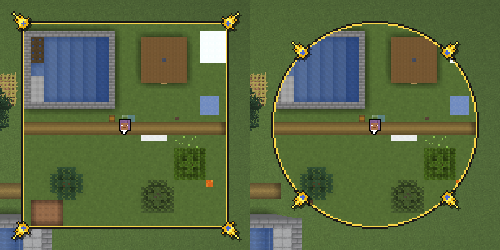
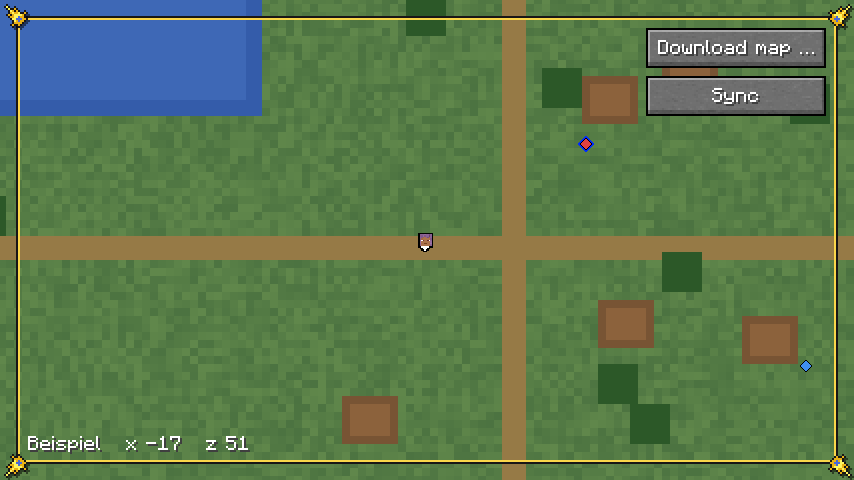
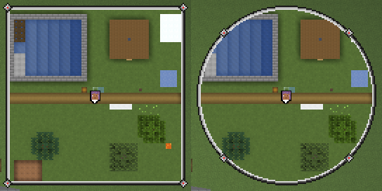
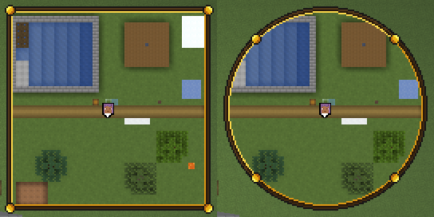
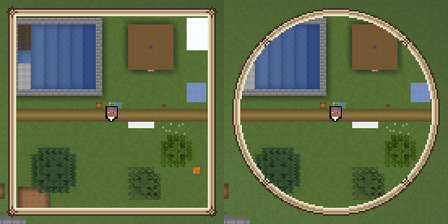
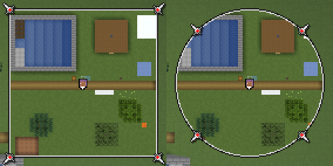
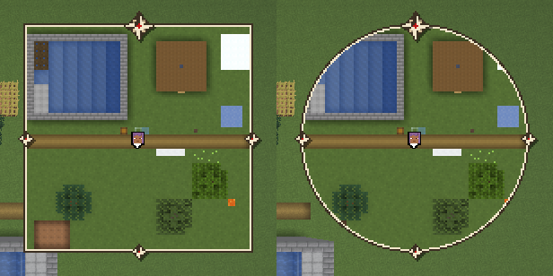

# Rahmen

Um Minimap und Vollbildkarte kann ein Rahmen liegen, ein Skin aus dem Paket
des Designers: Bänder in festen Farben und Ornamente in den Ecken. Die Wahl
steht im Untermenü „Einstellungen …“; die Vorgabe ist ohne Rahmen, der
dünne Umriss wie bisher. Warum so:
[0005](entscheidungen/0005-rahmen-als-skins.md).

## Wahl

- **Wo:** Knopf „Rahmen“ im Untermenü „Einstellungen …“, siehe
  [Minimap](minimap.md), „Bedienung“. Der Tooltip beschreibt den Skin.
- **Gespeichert** als `rahmen` in `heroicmap.properties`, Vorgabe `ohne`;
  ein unbekannter Name gilt als `ohne` (`Minimap.setzeSkin`).
- **Gilt** für die Minimap gleich und für die Vollbildkarte beim nächsten
  Öffnen.

## Skins

| Skin | Bänder | Schatten | zier |
|---|---|---|---|
| `grau` | 3 | nein | 7 × 7 |
| `holz` | 4 | nein | 7 × 7 |
| `papier` | 5 | nein | 7 × 7 |
| `kompass` | 2 | ja | 13 × 13 |
| `uhr` | 2 | ja | 15 × 15 |
| `kartograph` | 2 | ja | 13 × 13 |

## Dateien

Je Skin ein Ordner `assets/heroicmap/textures/rahmen/<skin>/`:

- **`zier.png`, `zier_aktiv.png`:** das Ornament der Ecken, gezeichnet für
  oben links.
- **`griff.png`, `griff_aktiv.png`:** der Griff, 7 × 7, gezeichnet für
  unten rechts.
- **`palette.txt`:** eine Zeile je Band, von aussen nach innen, eine Farbe
  `#RRGGBB` oder zwei, Licht und Schatten; `//` beginnt einen Kommentar
  (`Skin.lies`).
- **`info.txt`:** nur `schatten=ja` oder `schatten=nein`.
- **Namen und Beschreibungen** stehen in `de_de.json` und `en_us.json`
  unter `heroicmap.rahmen.<skin>` und `heroicmap.rahmen.<skin>.beschreibung`.
- **Ein neuer Skin** ist ein Ordner, ein Eintrag in `Skin.NAMEN` und zwei
  Schlüssel je Sprache.
- **Nicht im Atlas des GUI:** Der Mod liest die PNG selbst und legt je
  Ecke eine gespiegelte Kopie als eigene Textur an. Gespiegelt zeichnen
  über die Pose geht nicht: Das GUI verwirft Rückseiten, belegt per javap
  (`RenderPipeline.Builder.build` mit `cull` vorgegeben `true`).
- **Ohne Nordmarke:** `norden`, `marke` und `marke_quer` aus dem Paket
  kommen erst mit der drehenden Minimap; ohne Drehung zeigt der Rahmen
  keine Marken, so hat es der User gewählt.

## Bänder

- **Eckig** liegt ein Pixel in Band `min(x, y, w − 1 − x, h − 1 − y)`, in
  Licht, wenn `min(x, y) < min(w − 1 − x, h − 1 − y)`, also oben und
  links. Gezeichnet als vier Rechtecke je Band (`Skin.baender`), über der
  Karte; die Bänder decken sie.
- **Rund** liegt ein Pixel in Band `⌊R − d⌋`, d der Abstand von der Mitte
  des Pixels zur Mitte, R die halbe Seite; in Licht, wenn
  `dx + dy < 0`. Gezeichnet als ein Ring, eine Textur mit einem Texel je
  Einheit des GUI (`Skin.ring`).
- **Die Karte rund** liegt nur, wo das Band mindestens so gross ist wie die
  Zahl der Bänder: dieselbe Rechnung als Maske, je Einheit des GUI und dann
  mal GUI-Massstab (`Skin.maskeRund`). So endet die Karte genau am Ring,
  auch die Chunklinien.
- **Breite** in Einheiten des GUI, sie wächst mit dem GUI-Massstab.

## Ornamente

- **Wo:** die Mitte des Bilds auf der Mitte der Bänder, eckig in jeder
  Ecke, rund bei 45° (`Skin.ecken`); die linke obere Ecke bei
  `⌊p − w / 2 + 0,5⌋` (`Skin.lage`). Nie gedreht.
- **Gespiegelt** für die anderen Ecken: oben rechts waagrecht, unten links
  senkrecht, unten rechts beides.
- **Schatten** bei `schatten=ja`: erst das Bild in Schwarz zu 50 % um
  (+1, +1) versetzt, dann das Bild. Die PNG haben nur Alpha 0 oder 255.
- **Im Menü** (`/hmap`) stehen die zier als `zier_aktiv`. An der Ecke, an
  der sonst der Griff sitzt, zur Mitte des Schirms, steht statt der zier
  der Griff, unter der Maus oder beim Ziehen als `griff_aktiv`; greifen
  lässt er sich 9 × 9 Einheiten um seine Mitte (`Einstellungen.griff`).
  Ohne Rahmen bleibt der weisse Griff wie bisher.

## Minimap

- **Abstand zum Rand des Schirms:** 4 Einheiten, mit Rahmen mindestens
  dessen Einrückung, siehe „Vollbildkarte“, so bleibt die zier ganz auf dem
  Schirm (`Minimap.rand`).
- **Der schwarze Umriss** entfällt mit Rahmen.

## Vollbildkarte

- **Eingerückt** um die halbe zier, aufgerundet (`Skin.einrueckung`), bei
  `uhr` 8 Einheiten; dazu die zier in allen vier Ecken, ohne Griff.
- **Nach innen rücken** um Einrückung und Bänder: die Knöpfe rechts oben,
  die Zeile mit Name und Koordinaten links unten und die Marken am Rand.
  Der Rahmen bleibt ganz, ohne Aussparung.
- **Die Kacheln** liegen weiter über den ganzen Schirm, auch ausserhalb des
  Rahmens.

## Kosten

Geschätzt, nicht gemessen:

- **Eckig** je Frame höchstens 20 Rechtecke für 5 Bänder und 4 Ornamente,
  mit Schatten 8 Bilder.
- **Rund** je Frame ein Bild für den Ring und die Läufe der Maske, eine je
  Zeile von Einheiten, höchstens 256. Den Ring baut der Mod einmal je
  Seite, bei 256 Einheiten 256 × 256 Texel, 256 KiB; er behält nur den
  letzten.
- **Ornamente:** je Skin höchstens 4 Bilder mal 4 Ecken als Texturen von
  höchstens 15 × 15, beim ersten Zeichnen geladen.

## Bilder

Der Gametest `Bilder` nimmt jeden Rahmen eckig und rund bei 4 px auf,
`rahmen-<skin>.png`, und die Vollbildkarte mit `uhr`, siehe
[Minimap](minimap.md), „Bilder“.

