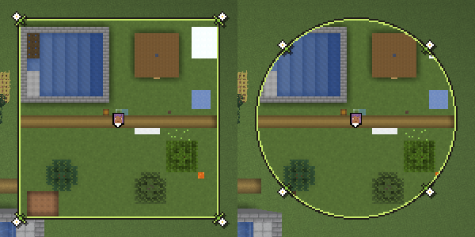
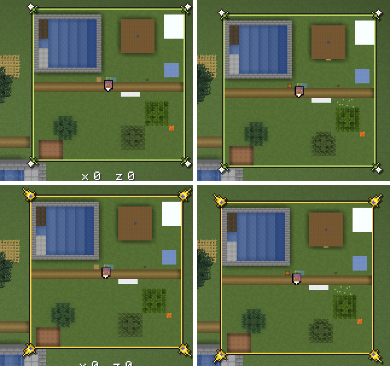

# Rahmen

Um die Minimap kann ein Rahmen liegen, ein Skin aus dem Paket des
Designers: Bänder in festen Farben und Ornamente in den Ecken. Die Wahl
steht im Untermenü „Einstellungen …“; die Vorgabe ist „biom“, ein Rahmen,
der mit dem Biom unter dem Spieler wechselt. „Ohne“ ist der dünne Umriss
wie bisher. Die Vollbildkarte bekommt keinen Rahmen. Warum so:
[0005](entscheidungen/0005-rahmen-als-skins.md) und
[0008](entscheidungen/0008-biom-rahmen-als-vorgabe.md).

## Wahl

- **Wo:** Knopf „Rahmen“ im Untermenü „Einstellungen …“, siehe
  [Minimap](minimap.md), „Bedienung“. Der Tooltip beschreibt den Skin.
- **Vorgabe `biom`.** Gespeichert als `rahmen_wahl` in
  `heroicmap.properties`, nur wenn der Spieler den Rahmen selbst gewählt
  hat, auch „ohne“; sonst gilt die Vorgabe, auch wenn sie sich wieder
  ändert. Ein unbekannter Name gilt als nicht gewählt.
- **Aus einer älteren Version** stand `rahmen` immer in der Datei. Ein
  Rahmen ausser `ohne` gilt als gewählt, denn die Vorgabe war `ohne`. Ein
  `rahmen=ohne` lässt sich nicht von der alten Vorgabe unterscheiden; dort
  gilt die neue Vorgabe. Wie bei Drehen, siehe [Minimap](minimap.md),
  „Drehen“.
- **Die Gametests** `Bilder` und `Messung` stellen „ohne“ ein, denn ihre
  Bilder und Messreihen zeigen die Minimap ohne Rahmen.

## Skins

| Skin | Bänder | Schatten | zier | `norden` | Abstand zum Rand |
|---|---|---|---|---|---|
| `biom` | 2 | ja | 9 × 9 bis 12 × 12, siehe „Biom“ | 15 × 15 | 11 |
| `grau` | 3 | nein | 7 × 7 | 6 × 7 | 5 |
| `holz` | 4 | nein | 7 × 7 | 6 × 7 | 5 |
| `papier` | 5 | nein | 7 × 7 | 6 × 7 | 5 |
| `kompass` | 2 | ja | 13 × 13 | 17 × 17 | 13 |
| `uhr` | 2 | ja | 15 × 15 | 17 × 17 | 13 |
| `kartograph` | 2 | ja | 13 × 13 | 17 × 17 | 13 |

## Biom

Der Rahmen `biom` zeigt einen von acht Skins, je nach dem Biom unter dem
Spieler (`Biom`, `Minimap.skinJetzt`). So hat es der User gewünscht, als
Vorgabe.

- **Kategorien:** `waelder`, `grasland`, `gebirge`, `schnee`, `wueste`,
  `tropen`, `feuchtgebiete`, `gewaesser`; je ein Ordner
  `rahmen/biom/<kategorie>/` wie ein fester Skin, aufgebaut wie `kompass`,
  `uhr` und `kartograph`.
- **Zuordnung** in fester Rangfolge, die erste passende Zeile gewinnt
  (`Biom.kategorie`). Je Zeile Tags der Biome und Biome des Spiels mit
  Namen:

  | Kategorie | Tags | Biome |
  |---|---|---|
  | `schnee` | `c:is_snowy`, `c:is_icy`, `c:is_aquatic_icy` | `snowy_plains`, `ice_spikes`, `snowy_taiga`, `snowy_beach`, `snowy_slopes`, `grove`, `frozen_peaks`, `jagged_peaks`, `frozen_river`, `frozen_ocean`, `deep_frozen_ocean` |
  | `feuchtgebiete` | `c:is_swamp` | `swamp`, `mangrove_swamp` |
  | `tropen` | `minecraft:is_jungle` | |
  | `wueste` | `c:is_desert`, `minecraft:is_badlands` | `desert` |
  | `gewaesser` | `minecraft:is_ocean`, `minecraft:is_river`, `minecraft:is_beach` | `mushroom_fields`, `stony_shore` |
  | `waelder` | `minecraft:is_forest`, `minecraft:is_taiga` | `cherry_grove` |
  | `grasland` | `c:is_plains`, `minecraft:is_savanna` | `plains`, `sunflower_plains`, `meadow` |
  | `gebirge` | `minecraft:is_mountain`, `minecraft:is_hill` | |

  Vor allen Zeilen: Nether und End nehmen Grasland, Höhlen behalten die
  letzte Kategorie, siehe unten.
- **Warum Namen neben Tags:** Der Server schickt dem Client die Tags der
  Biome, denn `Registries.BIOME` steht in
  `RegistryDataLoader.SYNCHRONIZED_REGISTRIES` (26.3, per javap): die des
  Spiels und die seiner Datapacks. `c:` gibt es nur mit Fabric API oder
  mit einem Datapack, der sie mitbringt. Für Schnee, Sumpf, Wüste, Ebene
  und Pilze hat das Spiel keinen Tag, darum stehen seine Biome mit Namen
  da.
- **Rangfolge:** Schnee vor Wald, so ist die verschneite Taiga Schnee,
  obwohl sie in `minecraft:is_taiga` liegt. Grasland vor Gebirge, denn
  `minecraft:is_mountain` enthält `meadow` und `cherry_grove`; Wiese ist
  Grasland, der Kirschhain Wald, so schlägt es der Designer vor.
- **Rückfall über den Namen:** Passt keine Zeile, etwa bei Biomen aus
  Datapacks, entscheidet ein Wort im Namen, in derselben Rangfolge: etwa
  `snowy`, `frozen` oder `winter` Schnee, `shrubland` oder `canyon` Wüste,
  `forest` oder `taiga` Wald, `peak` oder `hills` Gebirge (`Biom.WOERTER`).
  Ein Wort ist ein ganzes Stück zwischen `_` oder `/`. Sonst Grasland.
- **Nether und End** (`minecraft:is_nether`, `minecraft:is_end`) nehmen
  Grasland, auch der Wald im Nether.
- **Höhlen** (`c:is_cave`, dazu `dripstone_caves`, `lush_caves`,
  `deep_dark` und `sulfur_caves` mit Namen, `Biom.HOEHLEN`): Der Rahmen
  bleibt bei der letzten Kategorie. „Biom unter dem Spieler“ heisst die
  Landschaft, nicht die Höhle; so hat es der Reviewer entschieden.
- **Noch nicht geladen:** Steht der Spieler in einem Chunk, den der Client
  noch nicht hat, fragt die Minimap nicht (`hasChunkAt`); sonst läse sich
  das Biom als Ebene, und nach einem weiten Teleport spränge der Rahmen
  hin und zurück.
- **Wechsel:** erst, wenn der Spieler 2 s in der neuen Kategorie ist
  (`Biom.WARTEN_MS`); jeder Schritt zurück setzt die Zeit neu, so flackert
  der Rahmen an Grenzen nicht. Die erste Kategorie nach dem Start und nach
  einem Wechsel der Welt oder Dimension gilt sofort (`Minimap.leeren`).
  Dann blendet der Rahmen in 0,3 s über (`Biom.BLENDE_MS`): Die Bänder sind
  in allen acht gleich gebaut, darum liegen die alten zu 1 und die neuen zu
  t darüber; nur die alten Ornamente blenden zu 1 − t aus. So sinkt die
  Deckung der Bänder nie.
- **Abstand zum Rand:** der grösste aller acht, 11 Einheiten, denn `norden`
  ist in allen 15 × 15 Pixel gross (`Minimap.rand`). So springt die Minimap beim
  Wechsel nicht; ebenso die Koordinaten darunter.
- **Kosten:** Das Biom unter dem Spieler liest die Minimap je Frame; die
  Kategorie rechnet sie nur neu, wenn sich das Biom ändert. Während der
  Überblendung zeichnet sie zwei Rahmen, siehe „Kosten“.

## Dateien

Je Skin ein Ordner `assets/heroicmap/textures/gui/sprites/rahmen/<skin>/`,
im Atlas des GUI; F3+T und Ressourcenpakete laden ihn neu:

- **`zier.png`, `zier_aktiv.png`:** das Ornament der Ecken, gezeichnet für
  oben links.
- **`griff.png`, `griff_aktiv.png`:** der Griff, 7 × 7, gezeichnet für
  unten rechts.
- **`norden.png`, `marke.png`, `marke_quer.png`,** je mit `_aktiv`: die
  Marken beim Drehen, siehe „Marken“.
- **`palette.txt`:** eine Zeile je Band, von aussen nach innen, eine Farbe
  `#RRGGBB` oder zwei, Licht und Schatten; `//` beginnt einen Kommentar
  (`Skin.lies`). Der Atlas nimmt nur PNG, die Textdatei liegt daneben.
  Mindestens zwei Bänder, siehe [Minimap](minimap.md), „Form“.
- **`info.txt`:** nur `schatten=ja` oder `schatten=nein`.
- **Namen und Beschreibungen** stehen in `de_de.json` und `en_us.json`
  unter `heroicmap.rahmen.<skin>` und `heroicmap.rahmen.<skin>.beschreibung`.
- **Ein neuer Skin** ist ein Ordner, ein Eintrag in `Skin.NAMEN` und zwei
  Schlüssel je Sprache. `Skin.ORDNER` sind die Ordner, die der Mod lädt:
  die festen Skins und je Kategorie von `biom` einer.
- **Geladen** einmal je Skin, auch ein Fehlschlag bleibt gemerkt, bis der
  Atlas neu lädt (`Skin.von`); sonst stünde je Frame eine Warnung im Log.
- **Quellen** unter `docs/bilder/quellen/rahmen/`: je Skin die Datei von
  Aseprite, eine Ebene je Bild; für `biom` je Kategorie eine unter
  `biom/`.

## Bänder

- **Eckig** liegt ein Pixel in Band `min(x, y, w − 1 − x, h − 1 − y)`, in
  Licht, wenn `min(x, y) < min(w − 1 − x, h − 1 − y)`, also oben und
  links. Gezeichnet als vier Rechtecke je Band (`Skin.baender`), über der
  Karte; die Bänder decken sie.
- **Rund** liegt ein Pixel in Band `⌊R − d⌋`, d der Abstand von der Mitte
  des Pixels zur Mitte, R die halbe Seite; in Licht, wenn
  `dx + dy < 0`. Gezeichnet als ein Ring, eine Textur mit einem Texel je
  Einheit des GUI (`Skin.ring`).
- **Die Karte rund** reicht als Vieleck unter den Ring, siehe
  [Minimap](minimap.md), „Form“. Sichtbar endet sie so genau am Ring, auch
  die Chunklinien.
- **Breite** in Einheiten des GUI, sie wächst mit dem GUI-Massstab.

## Ornamente

- **Wo:** die Mitte des Bilds auf der Mitte der Bänder, eckig in jeder
  Ecke, rund bei 45° (`Skin.ecken`); die linke obere Ecke bei
  `⌊p − w / 2 + 0,5⌋` (`Skin.lage`). Dreht die Minimap, drehen sie mit,
  siehe „Drehen“.
- **Gespiegelt** für die anderen Ecken, oben rechts waagrecht, unten links
  senkrecht, unten rechts beides (`Skin.spiegeltX`, `Skin.spiegeltY`): über
  vertauschte Koordinaten im Atlas, u0 > u1 oder v0 > v1. Die Ecken des
  Quads bleiben in derselben Reihenfolge, das GUI verwirft es nicht; über
  die Pose gespiegelt verwürfe es die Rückseite. Beides belegt per javap:
  `BlitRenderState.buildVertices` setzt die Ecken nur aus x und y,
  `RenderPipeline.Builder.build` gibt `cull` mit `true` vor. Gezeichnet
  über `GuiGraphicsExtractor.innerBlit`, per Access Widener offen, denn
  nur dort gehen Koordinaten im Atlas und eine Farbe zusammen.
- **Schatten** bei `schatten=ja`: erst das Bild in Schwarz zu 50 % um
  (+1, +1) versetzt, dann das Bild. Die PNG haben nur Alpha 0 oder 255.
- **Im Menü** (`/hmap`) stehen die zier als `zier_aktiv`. An der Ecke zur
  Mitte des Schirms (`Minimap.griffEcke`) steht statt der zier der Griff,
  unter der Maus oder beim Ziehen als `griff_aktiv`; greifen lässt er sich
  9 × 9 Einheiten um seine Mitte (`Minimap.imGriff`). Der Griff steht
  immer fest, auch gedreht und mit dem Schalter „Verzierungen“ aus; gedreht
  liegt er über den mitdrehenden zier. Der weisse Umriss entfällt mit
  Rahmen; ohne Rahmen bleiben Umriss und weisser Griff wie bisher.

## Marken

- **Nur beim Drehen,** siehe [Minimap](minimap.md), „Drehen“; ohne Drehung
  zeigt der Rahmen keine Marken, so hat es der User gewählt. Ohne Rahmen
  gibt es keine, die Bilder gehören zum Skin.
- **Wo:** von der Mitte der Minimap in die Himmelsrichtung, auf der Mitte
  der Bänder, rund auf dem Kreis, eckig auf dem Quadrat (`Skin.marke`).
  So wandern sie beim Drehen am Rahmen entlang.
- **Bild:** fest je Richtung, N `norden`, S `marke`, O und W `marke_quer`
  (`Skin.MARKE_JE_RICHTUNG`); im Menü `_aktiv`. Es dreht mit, siehe
  „Drehen“.
- **Reihenfolge:** Bänder, zier, die Marken, `norden` zuoberst, im Menü
  zuletzt der Griff.

## Drehen

Dreht die Minimap, siehe [Minimap](minimap.md), „Drehen“, drehen zier und
Marken starr mit der Karte, Lage und Bild; nichts steht fest ausser dem
Griff im Menü. So hat es der User gewünscht, siehe
[0012](entscheidungen/0012-verzierungen-drehen-mit.md).

- **Lage:** die zier auf den Diagonalen des Kartenbilds, die Marken auf N,
  O, S, W, gedreht wie die Karte, auf der Mitte der Bänder; rund auf dem
  Kreis, eckig auf dem Quadrat, das selbst achsparallel bleibt
  (`Minimap.verzierung`, `Skin.marke`). Ungedreht trifft die Diagonale
  genau die Ecke wie `Skin.ecken`.
- **Bild:** um seine Mitte um denselben Winkel gedreht, über die Pose
  (`Skin.ornament`); gespiegelt wird weiter über die Koordinaten im Atlas.
  Der Schatten bleibt auf dem Schirm um (+1, +1).
- **Pixel:** Die Mitte liegt auf ganzen Pixeln des Schirms, sonst zitterte
  sie beim Laufen. Gedreht ist die Pixelkunst nicht pixelgenau: Das Spiel
  rastert sie mit Nearest, die Kanten werden treppig, und beim Drehen
  flimmern Texel am Rand, wie bei der gedrehten Karte. Ungedreht liegt
  alles auf ganzen Einheiten wie bisher.

## Verzierungen

Der Schalter „Verzierungen“ im Untermenü „Einstellungen …“, in der Zeile
von „Drehen“, stellt zier und Marken an oder aus; gespeichert als
`verzierungen` in `heroicmap.properties`, Vorgabe an. Aus zeigt der Rahmen
nur seine Bänder oder den Ring, gedreht wie ungedreht. Der Griff im Menü
bleibt, der Abstand zum Rand auch.

## Abstand zum Rand

Die Minimap hält 4 Einheiten Abstand zum Rand des Schirms, mit Rahmen
mindestens die halbe Diagonale der grössten Verzierung, zier oder Marke,
aufgerundet (`Minimap.rand`, `Skin.einrueckung`), siehe die Tabelle unter
„Skins“: bei `uhr` 13, bei `biom` 11. So bleibt jede Verzierung in jeder
Drehung ganz auf dem Schirm, auch ihr Schatten, denn ihre Mitte liegt auf
der Mitte der Bänder. Das gilt immer, auch ungedreht und mit dem Schalter
„Verzierungen“ aus; so springt die Minimap beim Umschalten nicht, siehe
[0012](entscheidungen/0012-verzierungen-drehen-mit.md). Vorher war es die
halbe zier, bei `uhr` 8, bei `biom` 6.

Der schwarze Umriss entfällt mit Rahmen.

## Kosten

Geschätzt, nicht gemessen:

- **Eckig** je Frame höchstens 20 Rechtecke für 5 Bänder und 4 Ornamente,
  mit Schatten 8 Bilder.
- **Gedreht** wie vorher 4 zier und 4 Marken, mit Schatten 16 Bilder; neu
  ist je Bild eine gedrehte Pose, und die Minimap rechnet die 8 Punkte je
  Frame neu (`Minimap.verzierung`).
- **Rund** je Frame ein Bild für den Ring. Den Ring rechnet der Mod nur,
  wenn sich die Seite ändert, und behält je Skin nur den letzten
  (`Skin.ring`); bei 256 Einheiten sind das 256 × 256 Texel, 256 KiB, und
  eine Wurzel je Texel einmal. Mit `biom` hat jede Kategorie, die schon
  gezeigt wurde, ihren Ring, höchstens 8, also bis 2 MiB.
- **Ornamente:** Wo sie sitzen, rechnet die Minimap nur neu, wenn sich
  Skin, Lage oder Form ändern (`Minimap.ecken`); die Namen der Sprites
  stehen je Skin fest. Während der Überblendung wechseln zwei Skins je
  Frame, dann rechnet sie die vier Punkte jedes Mal neu.
- **Überblendung:** 0,3 s lang zwei Rahmen je Frame.
- **Abstand zum Rand bei `biom`:** je Frame das Grösste über die acht
  Kategorien; ihre Namen stehen fest (`Biom.ORDNER`).

## Bilder

Der Gametest `Bilder` nimmt jeden Rahmen eckig und rund bei 4 px auf,
`rahmen-<skin>.png`, und das Menü mit `uhr`, siehe [Minimap](minimap.md),
„Bilder“.
`rahmen-abstand.png` setzt die Bildschirmfotos `rahmen-biom-0` und
`rahmen-uhr-0` dieses Gametests zusammen, aus einem Lauf auf `feef6a5` und
einem mit 0012, je die rechte obere Ecke.

