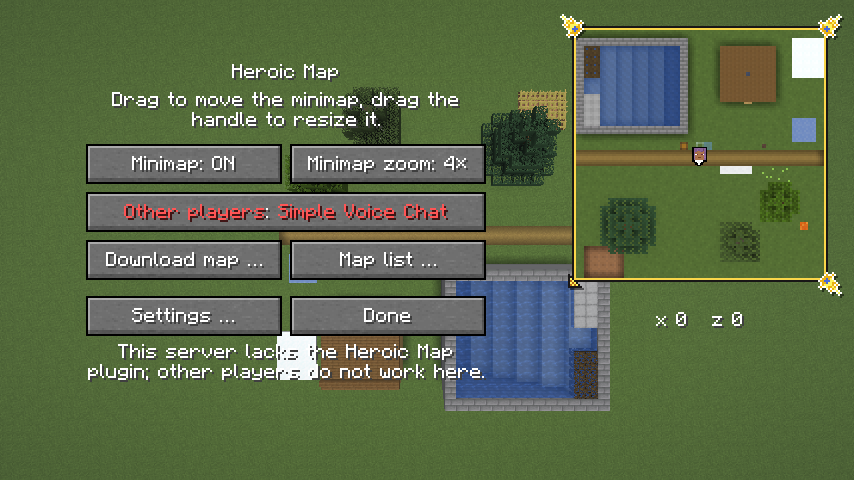

# Rahmen

Um die Minimap kann ein Rahmen liegen, ein Skin aus dem Paket des
Designers: Bänder in festen Farben und Ornamente in den Ecken. Die Wahl
steht im Untermenü „Einstellungen …“; die Vorgabe ist „biom“, ein Rahmen,
der mit dem Biom unter dem Spieler wechselt. „Ohne“ ist der dünne Umriss
wie bisher. Die Vollbildkarte bekommt keinen Rahmen. Warum so:
[0005](entscheidungen/0005-rahmen-als-skins.md) und
[0008](entscheidungen/0008-biom-rahmen-als-vorgabe.md).

## Wahl

- **Wo:** Knopf „Rahmen“ im Untermenü „Einstellungen …“, siehe
  [Minimap](minimap.md), „Bedienung“. Der Tooltip beschreibt den Skin.
- **Vorgabe `biom`.** Gespeichert als `rahmen_wahl` in
  `heroicmap.properties`, nur wenn der Spieler den Rahmen selbst gewählt
  hat, auch „ohne“; sonst gilt die Vorgabe, auch wenn sie sich wieder
  ändert. Ein unbekannter Name gilt als nicht gewählt.
- **Aus einer älteren Version** stand `rahmen` immer in der Datei. Ein
  Rahmen ausser `ohne` gilt als gewählt, denn die Vorgabe war `ohne`. Ein
  `rahmen=ohne` lässt sich nicht von der alten Vorgabe unterscheiden; dort
  gilt die neue Vorgabe. Wie bei Drehen, siehe [Minimap](minimap.md),
  „Drehen“.
- **Die Gametests** `Bilder` und `Messung` stellen „ohne“ ein, denn ihre
  Bilder und Messreihen zeigen die Minimap ohne Rahmen.

## Skins

| Skin | Bänder | Schatten | zier |
|---|---|---|---|
| `biom` | 2 | ja | 9 × 9 bis 12 × 12, siehe „Biom“ |
| `grau` | 3 | nein | 7 × 7 |
| `holz` | 4 | nein | 7 × 7 |
| `papier` | 5 | nein | 7 × 7 |
| `kompass` | 2 | ja | 13 × 13 |
| `uhr` | 2 | ja | 15 × 15 |
| `kartograph` | 2 | ja | 13 × 13 |

## Biom

Der Rahmen `biom` zeigt einen von acht Skins, je nach dem Biom unter dem
Spieler (`Biom`, `Minimap.skinJetzt`). So hat es der User gewünscht, als
Vorgabe.

- **Kategorien:** `waelder`, `grasland`, `gebirge`, `schnee`, `wueste`,
  `tropen`, `feuchtgebiete`, `gewaesser`; je ein Ordner
  `rahmen/biom/<kategorie>/` wie ein fester Skin, aufgebaut wie `kompass`,
  `uhr` und `kartograph`.
- **Zuordnung** in fester Rangfolge, die erste passende Zeile gewinnt
  (`Biom.kategorie`). Je Zeile Tags der Biome und Biome des Spiels mit
  Namen:

  | Kategorie | Tags | Biome |
  |---|---|---|
  | `schnee` | `c:is_snowy`, `c:is_icy`, `c:is_aquatic_icy` | `snowy_plains`, `ice_spikes`, `snowy_taiga`, `snowy_beach`, `snowy_slopes`, `grove`, `frozen_peaks`, `jagged_peaks`, `frozen_river`, `frozen_ocean`, `deep_frozen_ocean` |
  | `feuchtgebiete` | `c:is_swamp` | `swamp`, `mangrove_swamp` |
  | `tropen` | `minecraft:is_jungle` | |
  | `wueste` | `c:is_desert`, `minecraft:is_badlands` | `desert` |
  | `gewaesser` | `minecraft:is_ocean`, `minecraft:is_river`, `minecraft:is_beach`, `c:is_mushroom` | `mushroom_fields` |
  | `waelder` | `minecraft:is_forest`, `minecraft:is_taiga` | `cherry_grove` |
  | `grasland` | `c:is_plains`, `minecraft:is_savanna` | `plains`, `sunflower_plains`, `meadow` |
  | `gebirge` | `minecraft:is_mountain`, `minecraft:is_hill` | `stony_shore` |

- **Warum Namen neben Tags:** Der Server schickt dem Client die Tags der
  Biome, denn `Registries.BIOME` steht in
  `RegistryDataLoader.SYNCHRONIZED_REGISTRIES` (26.3, per javap). Die
  Tags `c:` kommen aber aus Fabric API; ein Server ohne sie, etwa Paper,
  schickt nur die des Spiels. Für Schnee, Sumpf, Wüste, Ebene und Pilze hat
  das Spiel keinen Tag, darum stehen diese Biome mit Namen da.
- **Rangfolge:** Schnee vor Wald, so ist die verschneite Taiga Schnee,
  obwohl sie in `minecraft:is_taiga` liegt. Grasland vor Gebirge, denn
  `minecraft:is_mountain` enthält `meadow` und `cherry_grove`; Wiese ist
  Grasland, der Kirschhain Wald, so schlägt es der Designer vor.
- **Rückfall über den Namen:** Passt keine Zeile, etwa bei Biomen aus
  Datapacks, entscheidet ein Wort im Namen, in derselben Rangfolge: etwa
  `snowy` oder `frozen` Schnee, `forest` oder `taiga` Wald, `peaks` oder
  `hills` Gebirge (`Biom.WOERTER`). Ein Wort ist ein ganzes Stück zwischen
  `_` oder `/`. Sonst Grasland.
- **Nether und End** (`minecraft:is_nether`, `minecraft:is_end`) nehmen
  Grasland, auch der Wald im Nether. Höhlen wie `lush_caves` und
  `deep_dark` passen auf nichts und nehmen ebenso Grasland.
- **Wechsel:** erst, wenn der Spieler 2 s in der neuen Kategorie ist
  (`Biom.WARTEN_MS`); jeder Schritt zurück setzt die Zeit neu, so flackert
  der Rahmen an Grenzen nicht. Die erste Kategorie nach dem Start gilt
  sofort. Dann blendet der alte Rahmen in 0,3 s aus und der neue ein
  (`Biom.BLENDE_MS`): beide gezeichnet, der alte zu 1 − t deckend, der neue
  zu t.
- **Abstand zum Rand:** der grösste aller acht, 6 Einheiten, denn die zier
  ist 9 bis 12 Pixel gross (`Minimap.rand`). So springt die Minimap beim
  Wechsel nicht; ebenso die Koordinaten darunter.
- **Kosten:** Das Biom unter dem Spieler liest die Minimap je Frame; die
  Kategorie rechnet sie nur neu, wenn sich das Biom ändert. Während der
  Überblendung zeichnet sie zwei Rahmen.

## Dateien

Je Skin ein Ordner `assets/heroicmap/textures/gui/sprites/rahmen/<skin>/`,
im Atlas des GUI; F3+T und Ressourcenpakete laden ihn neu:

- **`zier.png`, `zier_aktiv.png`:** das Ornament der Ecken, gezeichnet für
  oben links.
- **`griff.png`, `griff_aktiv.png`:** der Griff, 7 × 7, gezeichnet für
  unten rechts.
- **`norden.png`, `marke.png`, `marke_quer.png`,** je mit `_aktiv`: die
  Marken beim Drehen, siehe „Marken“.
- **`palette.txt`:** eine Zeile je Band, von aussen nach innen, eine Farbe
  `#RRGGBB` oder zwei, Licht und Schatten; `//` beginnt einen Kommentar
  (`Skin.lies`). Der Atlas nimmt nur PNG, die Textdatei liegt daneben.
  Mindestens zwei Bänder, siehe [Minimap](minimap.md), „Form“.
- **`info.txt`:** nur `schatten=ja` oder `schatten=nein`.
- **Namen und Beschreibungen** stehen in `de_de.json` und `en_us.json`
  unter `heroicmap.rahmen.<skin>` und `heroicmap.rahmen.<skin>.beschreibung`.
- **Ein neuer Skin** ist ein Ordner, ein Eintrag in `Skin.NAMEN` und zwei
  Schlüssel je Sprache. `Skin.ORDNER` sind die Ordner, die der Mod lädt:
  die festen Skins und je Kategorie von `biom` einer.
- **Geladen** einmal je Skin, auch ein Fehlschlag bleibt gemerkt, bis der
  Atlas neu lädt (`Skin.von`); sonst stünde je Frame eine Warnung im Log.
- **Quellen** unter `docs/bilder/quellen/rahmen/`: je Skin die Datei von
  Aseprite, eine Ebene je Bild; für `biom` je Kategorie eine unter
  `biom/`.

## Bänder

- **Eckig** liegt ein Pixel in Band `min(x, y, w − 1 − x, h − 1 − y)`, in
  Licht, wenn `min(x, y) < min(w − 1 − x, h − 1 − y)`, also oben und
  links. Gezeichnet als vier Rechtecke je Band (`Skin.baender`), über der
  Karte; die Bänder decken sie.
- **Rund** liegt ein Pixel in Band `⌊R − d⌋`, d der Abstand von der Mitte
  des Pixels zur Mitte, R die halbe Seite; in Licht, wenn
  `dx + dy < 0`. Gezeichnet als ein Ring, eine Textur mit einem Texel je
  Einheit des GUI (`Skin.ring`).
- **Die Karte rund** reicht als Vieleck unter den Ring, siehe
  [Minimap](minimap.md), „Form“. Sichtbar endet sie so genau am Ring, auch
  die Chunklinien.
- **Breite** in Einheiten des GUI, sie wächst mit dem GUI-Massstab.

## Ornamente

- **Wo:** die Mitte des Bilds auf der Mitte der Bänder, eckig in jeder
  Ecke, rund bei 45° (`Skin.ecken`); die linke obere Ecke bei
  `⌊p − w / 2 + 0,5⌋` (`Skin.lage`). Nie gedreht.
- **Gespiegelt** für die anderen Ecken, oben rechts waagrecht, unten links
  senkrecht, unten rechts beides (`Skin.spiegeltX`, `Skin.spiegeltY`): über
  vertauschte Koordinaten im Atlas, u0 > u1 oder v0 > v1. Die Ecken des
  Quads bleiben in derselben Reihenfolge, das GUI verwirft es nicht; über
  die Pose gespiegelt verwürfe es die Rückseite. Beides belegt per javap:
  `BlitRenderState.buildVertices` setzt die Ecken nur aus x und y,
  `RenderPipeline.Builder.build` gibt `cull` mit `true` vor. Gezeichnet
  über `GuiGraphicsExtractor.innerBlit`, per Access Widener offen, denn
  nur dort gehen Koordinaten im Atlas und eine Farbe zusammen.
- **Schatten** bei `schatten=ja`: erst das Bild in Schwarz zu 50 % um
  (+1, +1) versetzt, dann das Bild. Die PNG haben nur Alpha 0 oder 255.
- **Im Menü** (`/hmap`) stehen die zier als `zier_aktiv`. An der Ecke zur
  Mitte des Schirms (`Minimap.griffEcke`) steht statt der zier der Griff,
  unter der Maus oder beim Ziehen als `griff_aktiv`; greifen lässt er sich
  9 × 9 Einheiten um seine Mitte (`Minimap.imGriff`). Der weisse Umriss
  entfällt mit Rahmen; ohne Rahmen bleiben Umriss und weisser Griff wie
  bisher.

## Marken

- **Nur beim Drehen,** siehe [Minimap](minimap.md), „Drehen“; ohne Drehung
  zeigt der Rahmen keine Marken, so hat es der User gewählt. Ohne Rahmen
  gibt es keine, die Bilder gehören zum Skin.
- **Wo:** von der Mitte der Minimap in die Himmelsrichtung, auf der Mitte
  der Bänder, rund auf dem Kreis, eckig auf dem Quadrat (`Skin.marke`).
  So wandern sie beim Drehen am Rahmen entlang.
- **Bild:** Norden `norden`, die anderen oben und unten `marke`, links und
  rechts `marke_quer`, je nachdem, ob die Richtung mehr nach oben oder mehr
  zur Seite zeigt (`Skin.markeFuer`); im Menü `_aktiv`. Nie gedreht.
- **Reihenfolge:** Bänder, zier, die Marken, `norden` zuoberst.

## Abstand zum Rand

Die Minimap hält 4 Einheiten Abstand zum Rand des Schirms, mit Rahmen
mindestens die halbe zier, aufgerundet (`Minimap.rand`,
`Skin.einrueckung`), bei `uhr` 8, bei `biom` 6; so bleibt die zier ganz
auf dem Schirm.
Der schwarze Umriss entfällt mit Rahmen.

## Kosten

Geschätzt, nicht gemessen:

- **Eckig** je Frame höchstens 20 Rechtecke für 5 Bänder und 4 Ornamente,
  mit Schatten 8 Bilder.
- **Rund** je Frame ein Bild für den Ring. Den Ring rechnet der Mod nur,
  wenn sich die Seite ändert, und behält je Skin nur den letzten
  (`Skin.ring`); bei 256 Einheiten sind das 256 × 256 Texel, 256 KiB, und
  eine Wurzel je Texel einmal.
- **Ornamente:** Wo sie sitzen, rechnet die Minimap nur neu, wenn sich
  Skin, Lage oder Form ändern (`Minimap.ecken`); die Namen der Sprites
  stehen je Skin fest.

## Bilder

Der Gametest `Bilder` nimmt jeden Rahmen eckig und rund bei 4 px auf,
`rahmen-<skin>.png`, und das Menü mit `uhr`, siehe [Minimap](minimap.md),
„Bilder“.

