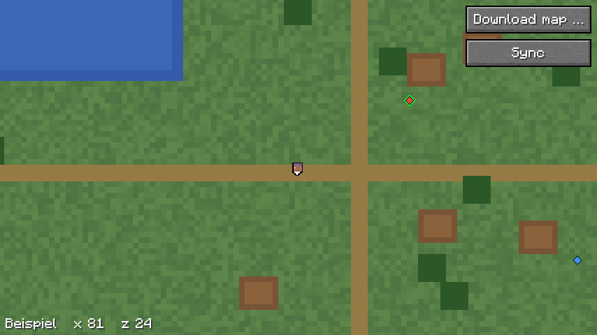

# Vollbildkarte

Die Vollbildkarte zeigt den Satz Kacheln, den der Mod vom Plugin geladen
hat ([Download](download.md)), über den ganzen Schirm. Sie liest nur von der
Platte und braucht keine Verbindung; ohne geladenen Satz für die Dimension
sagt sie das und zeigt nichts.

## Bedienung

| Eingabe | tut |
|---|---|
| Taste `.` | öffnet die Karte, schliesst sie wieder; frei belegbar unter „Heroic Map“, die einzige vorbelegte Taste des Mods |
| Ziehen mit links | verschiebt die Karte, der Inhalt folgt der Maus |
| Mausrad | zoomt, siehe „Stufen und Lupe“ |
| Rechtsklick | öffnet ein kleines Menü „Hierher teleportieren (x, z)“ für den Block unter der Maus, wie die Anzeige unten links; erst ein Klick darauf teleportiert, mit der linken oder rechten Taste, jeder Klick daneben schliesst es, ein Rechtsklick öffnet es dort neu; siehe unten |
| Knopf „Karte laden …“ | zeigt die Karten des Servers, je Baum der Name und darunter ein Knopf je Massstab mit seiner Grösse (`Auswahl`); die Knöpfe teilen sich die Breite des Schirms, höchstens 90 Einheiten je Knopf, so passen sie auch bei grossem GUI-Massstab; den Massstab, den der Spieler schon ganz hat (`Downloads.vollstaendig`: ein vollständiger Satz, und das Plugin misst den Abgleich an demselben Massstab), zeigt der Knopf als „Abgleich“ und gleicht ab wie der Knopf „Abgleich“, nach einer Ablehnung mit `wieder` bis dahin aus; ein Klick fragt wie `/hmap laden` erst im Dialog nach |
| Knopf „Abgleich“ | fragt einen Abgleich des gezeigten Satzes an, wie `/hmap abgleich`; nur mit Satz. Lehnt der Server mit `wieder` ab, ist der Knopf bis dahin aus und nennt die Uhrzeit |
| `Esc` | schliesst |

- **Das Spiel läuft weiter,** die Karte hält es nicht an (`isPauseScreen`).
- **Unten links** stehen der Name des Satzes und `x`, `z` des Blocks unter
  der Maus, fest wie auf der Karte im Browser; so will es der User.
- **Beim Öffnen** liegt der Spieler in der Mitte.
- **Geht ein Knopf nicht,** etwa weil der Server den Baum nicht anbietet oder
  schon ein Download läuft, steht der Grund über den Koordinaten.
- **Ohne Satz** zeigt die Karte nur den Hinweis und den Knopf zum Laden.

### Teleportieren

- **Befehl** (`Teleport.befehl`): `execute in <dimension> positioned <x+0,5>
  0 <z+0,5> positioned over motion_blocking_no_leaves run tp @s ~ ~ ~`. Der
  Server liest die Höhe selbst und setzt den Spieler auf den obersten
  Block, der Bewegung aufhält, ohne Laub, auch in Chunks, die der Client
  nicht hat. Der Mod schickt ihn mit `sendCommand`; darin stehen nur die
  Dimension des Spielers und die beiden Zahlen, kein Text vom Server.
- **Nur mit Recht:** Den Eintrag gibt es nur, wenn der Befehlsbaum des
  Servers `execute` und `tp` enthält (`Teleport.erlaubt`); der Server
  schickt nur Befehle, die der Spieler nutzen darf. Die Rechte prüft er
  beim Ausführen noch einmal, der Mod umgeht nichts.
- **Nicht unter einer Decke:** In Dimensionen mit Decke
  (`dimensionType().hasCeiling()`), etwa dem Nether, fehlt der Eintrag. Der
  oberste Block wäre dort das Dach aus Grundgestein.
- **Das Menü** bleibt ganz auf dem Schirm, auch bei grossem GUI-Massstab.
- Nach dem Klick schliesst sich die Karte.

## Welcher Satz

- **Je Baum** schreibt der Mod nach einem vollständigen Download
  `satz.json` neben die Massstäbe: Name und Dimension aus dem `angebot`,
  dazu der Massstab. Ein gekappter Download schreibt sie nicht.
- **Die Karte** nimmt unter dem Ordner des Servers den Baum, dessen
  Dimension die des Spielers ist (`Satz.fuer`). Kachelgrösse, Stufen und
  `scale` liest sie aus `map.json` des Satzes.
- **`map.json` kommt vom Server** und hat deshalb Grenzen (`Satz.lies`):

  | Feld | erlaubt |
  |---|---|
  | `tileSize` | Zweierpotenz von 64 bis 1024 |
  | `minZoom`, `maxZoom` | `0 ≤ minZoom ≤ maxZoom ≤ 30`, und die Stufe des Massstabs nicht unter `minZoom` |
  | `scale` | ab 1 |
  | Massstab aus `satz.json` | 1, 2 oder 4 |

- **Ein Baum ohne `satz.json`, `map.json` oder mit unlesbarer Datei oder
  verletzter Grenze** zählt nicht und verdeckt keinen anderen.
- **Bietet ein Server zwei Bäume derselben Dimension an,** nimmt die Karte
  den ersten, den das Dateisystem nennt.

## Stufen und Lupe

- **Die feinste Stufe** des Satzes hängt am Massstab: 4 px ist `maxZoom`,
  2 px eine gröber, 1 px zwei (`Satz.stufe`). Dort öffnet die Karte, ein
  Pixel der Kachel auf eine Einheit des GUI.
- **Mausrad zurück** geht eine Stufe gröber, bis `minZoom`.
- **Mausrad vor** geht eine Stufe feiner, auf der feinsten vergrössert die
  Lupe auf 2 und 4 Einheiten je Pixel.
- **Die Mitte** rechnet `Kartenblick` in Pixeln der Basis, der Stufe
  `maxZoom`; so bleibt sie beim Zoomen stehen. Die Kacheln einer Stufe
  liegen auf ganzen Einheiten nebeneinander, ohne Naht.

## Kacheln

- **WebP lesen:** Das Spiel liest Texturen nur als PNG. Die Kacheln
  dekodiert TwelveMonkeys `imageio-webp`, im Jar des Mods mitgeliefert;
  der Hinweis seiner Lizenz steht in [`NOTICE`](../NOTICE). Einfache
  verlustfreie WebP, wie der Renderer sie schreibt, liest eine geänderte
  Kopie seines Dekoders, siehe „Farbindex hinter der Palette“.
- **Grösse vor dem Dekodieren:** Der Kopf der WebP nennt Breite und Höhe.
  Sind sie nicht genau `tileSize`, gilt die Kachel als leer, bevor
  ein Dekoder Speicher anlegt; sonst könnte eine kleine Datei mit einem
  Kopf von 16384 × 16384 rund 1 GiB verlangen.
- **Im Hintergrund:** Ein Thread dekodiert und füllt das `NativeImage`; auf
  dem Render-Thread bleibt nur das Hochladen als `DynamicTexture`. Die
  Rückgabe an den Render-Thread steht im `finally`, auch nach einem `Error`.
- **Platzhalter:** Bis eine Kachel da ist, zeigt die Karte ihren Ausschnitt
  aus der nächsten gröberen Stufe, die schon geladen ist, vergrössert
  (`Karte.platzhalter`, `Kartenblick.grob`). Angefragt wird dafür nichts;
  beim Hineinzoomen liegt die gröbere Kachel meist schon da. Sonst bleibt
  der Platz dunkel.
- **Kosten** ([Messung](messungen/2026-10-06-vollbildkarte-uebernahme.md)):
  Eine Kachel 256² dekodiert in rund 2,8 ms, der Thread liefert also rund
  350 je Sekunde, etwa 6 je Frame bei 60 fps. Das Hochladen kostet den
  Render-Thread rund 0,05 ms je Kachel, also rund 0,3 ms je Frame beim
  Öffnen. 160 Kacheln, ein Schirm in 4K bei GUI-Massstab 1, kosten ihn
  zusammen rund 8 ms, verteilt über eine knappe halbe Sekunde.
- **Behalten:** die 192 zuletzt gezeigten Texturen, bei 256² Pixeln rund
  48 MiB auf der Grafikkarte. Die älteste gibt der Mod frei.
- **Fehlt eine Kachel** oder lässt sie sich nicht lesen, merkt sich die
  Karte das und fragt nicht wieder, bis sie neu öffnet oder ein Download
  fertig ist.
- **Nach einem vollständigen Download** lädt die offene Karte jede Kachel
  neu (`Kacheln.satzGeladen`). Die alte Textur bleibt sichtbar, bis die
  neue da ist; ein Ergebnis, das während des Downloads entstand, lädt sie
  gleich noch einmal.
- **Beim Schliessen** gibt die Karte alle Texturen frei.
- **Nur Kacheln vom Server:** Was sich seit dem letzten Lauf des Renderers
  ändert, bringt der Abgleich; selbst zeichnet der Mod nur die Minimap,
  siehe [0002](entscheidungen/0002-vollbildkarte-nur-vom-server.md).

### Farbindex hinter der Palette

Verlustfreies WebP kann die Farben eines Bildes als Palette ablegen, die
Farbindex-Transformation. Ein Index hinter dem Ende der Palette ergibt
`0x00000000`, durchsichtiges Schwarz (RFC 9649, 3.5.4). libwebp nutzt das
und lässt durchsichtiges Schwarz als letzten Eintrag weg. TwelveMonkeys
3.15.2 und 3.15.3 lesen solche Pixel als die letzte Farbe der Palette,
deckend; gemeldet als
[haraldk/TwelveMonkeys#1361](https://github.com/haraldk/TwelveMonkeys/issues/1361).
Warum eine Kopie: [0003](entscheidungen/0003-kopie-des-vp8l-dekoders.md).

- **Die Kopie:** Das Paket `com.nekyia.heroicmap.webp` ist das Paket
  `com.twelvemonkeys.imageio.plugins.webp.lossless` aus TwelveMonkeys
  ImageIO 3.15.2, alle 12 Dateien, unter BSD-3-Clause; jede Datei behält
  ihren Lizenzkopf, der Hinweis steht in [`NOTICE`](../NOTICE). Geändert
  sind nur das Paket und in `VP8LDecoder.readTransform` die Schleife, die
  die Farbtabelle auflöst: Sie läuft bis `colorTableSize * 4` statt über
  den ganzen aufgefüllten Puffer.
- **Welche Kacheln:** `Kacheln.dekodiere` liest eine einfache verlustfreie
  WebP, `RIFF` mit nur dem Chunk `VP8L`, mit der Kopie, in dasselbe
  Bildformat wie TwelveMonkeys: `TYPE_4BYTE_ABGR`, ohne Alpha im Kopf
  `TYPE_3BYTE_BGR`. Alles andere, etwa verlustbehaftet oder mit `VP8X`,
  liest TwelveMonkeys selbst.
- **Geprüft** an `src/test/resources/farbindex.webp`, 8 × 8 Pixel,
  erzeugt mit `python -I src/test/resources/farbindex.py` aus der Wurzel
  des Repositorys, mit Pillow und damit libwebp wie der Renderer (method 0,
  quality 0, `exact`). Das Skript prüft am Kopf, dass die erste
  Transformation der Farbindex ist und die Palette 31 Einträge hat, das
  Bild aber 32 Farben, und dass libwebp die Datei verlustfrei liest. Eine
  Farbe kommt also aus Indizes hinter der Palette. `KachelnTest` prüft,
  dass die Kopie diese Pixel durchsichtig liest, und dass sie `kachel.webp`
  und die 24 Kacheln des Testsatzes Pixel für Pixel wie TwelveMonkeys
  liest, ausser hinter der Palette. Das gibt es auch im Testsatz: In den 4
  Kacheln der Stufe 0 liest libwebp je 49152 Pixel durchsichtig,
  TwelveMonkeys liest sie deckend, die Kopie wie libwebp.
- **Wann sie wegfällt:** sobald eine Version von TwelveMonkeys den Fehler
  behebt. Hebt man die Version in `gradle/libs.versions.toml` auf eine
  solche, schlägt `KachelnTest.indexHinterDerPaletteIstDurchsichtig` fehl,
  weil TwelveMonkeys `farbindex.webp` dann selbst richtig liest. Dann gehen
  das Paket `webp`, der Weg über die Kopie in `Kacheln.dekodiere`, der
  Absatz in `NOTICE` und dieser Abschnitt.

## Spieler und Koordinaten

Der eigene Kopf und die Koordinaten rechnen mit derselben Projektion wie der
Renderer und mit `scale` aus `map.json`, siehe [Projektion](projektion.md).
Kopf und Pfeil sind dieselben wie auf der Minimap. Mitspieler stehen als Kopf mit Namen darüber,
siehe [Minimap](minimap.md), „Mitspieler“.

## Bild

`docs/bilder/vollbildkarte.png` nimmt der Gametest `Bilder` auf, siehe
[Bauen und testen](entwicklung.md), „Gametests“. Er legt einen gemalten
Testsatz an, `scale` 4, Stufen 0 bis 2, 24 Kacheln, aus
`src/gametest/resources/satz/`. Der Satz ist keine gerenderte Welt; er
prüft, dass TwelveMonkeys im Spiel lädt und die Kacheln richtig liegen.

## Was fehlt

- **Mehrere Bäume einer Dimension** zeigt die Karte nicht zur Wahl, siehe
  „Welcher Satz“.
