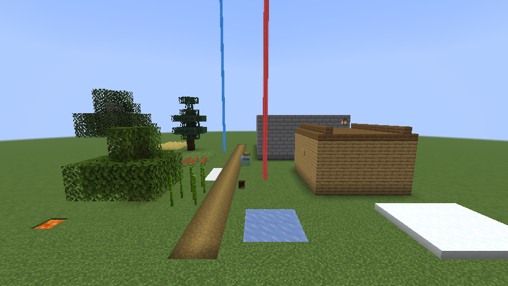

# Wegpunkte

Wegpunkte setzt der Spieler auf der [Vollbildkarte](vollbildkarte.md). Dort
stehen sie als Raute in ihrer Farbe, wie Mitspieler und der eigene Spieler;
was ausserhalb des Schirms liegt, steht am Rand in seiner Richtung. Ein
Klick legt eine Marke in die Mitte, ein Doppelklick heftet einen Wegpunkt
oder Mitspieler an die [Minimap](minimap.md). So hat es der User am 08.10.
gewünscht. Ebenso heftet ein Doppelklick eine eigene Form oder eine
Fläche oder einen Kreis vom Server an, siehe „Anheften“ (mod#36). Aus
Wegpunkten baut der Spieler eigene Linien und Regionen, siehe „Formen aus
Wegpunkten“ (mod#79).

## Bedienung

| Eingabe auf der Vollbildkarte | tut |
|---|---|
| Rechtsklick, „Wegpunkt setzen“ | der Eintrag unter „Hierher teleportieren“; setzt einen Wegpunkt auf den Block unter der Maus, in der ersten der 8 Farben (`Wegpunkte.FARBEN`), die in der Dimension noch frei ist, sind alle vergeben, reihum. Steht dort schon einer, bleibt es einer. Den Eintrag gibt es auch ohne Recht zum Teleportieren und unter einer Decke |
| Rechtsklick auf einen Wegpunkt | das Menü für seinen Block: „Hierher teleportieren“, wenn erlaubt, und „Wegpunkt löschen“ |
| Klick auf eine Marke | legt sie in die Mitte, sobald kein zweiter Klick mehr folgen kann, 250 ms nach dem Loslassen: einen Wegpunkt, einen Mitspieler oder den eigenen Spieler. So kommt man vom Wegpunkt zum eigenen Spieler zurück. Wer auf einer Marke zu ziehen beginnt und weiter als 3 Einheiten zieht (`Karte.ZUG`), zieht nur die Karte |
| Doppelklick auf einen Wegpunkt oder Mitspieler | heftet ihn an die Minimap oder löst ihn wieder; die Karte bewegt sich dabei nicht |
| Linke Taste 2 s still auf einem Wegpunkt halten | er hängt an der Maus, die Karte zieht nicht mit; beim Loslassen liegt er auf dem Block darunter, mit Farbe und Anheften (`Wegpunkte.verschiebe`). Liegt dort schon einer, bleibt er, wo er war; `Esc` bricht ab. Still heisst: nicht weiter als 3 Einheiten gezogen (`Karte.ZUG`); unter 2 s ist es ein Klick oder ein Zug wie sonst (`Karte.HALTEN_MS`, mod#75). Nur Wegpunkte, nicht die Rauten eigener Regionen |
| Doppelklick in eine eigene Region, auf eine eigene Linie, auf die Raute eines alten Rechtecks, auf eine Fläche, einen Kreis, eine Nadel oder ein Banner vom Server | heftet sie an die Minimap oder löst sie wieder, siehe „Anheften“ |
| Rechtsklick auf einen Wegpunkt, „Punkt hinzufügen“ | beginnt eine Form mit ihm oder fügt ihn an die Form im Bau an, siehe „Formen aus Wegpunkten“ |
| Linksklick auf einen Wegpunkt, solange eine Form im Bau ist | fügt ihn an, statt ihn in die Mitte zu legen; auf den ersten Punkt schliesst er bei drei und mehr Punkten die Region. Ziehen verschiebt die Karte wie sonst |
| Rechtsklick, „Form fertig“ | speichert die Form im Bau, mit zwei Punkten eine Linie, mit mehr eine Region; den Eintrag gibt es ab zwei Punkten |
| Rechtsklick, „Form abbrechen“, oder `Esc` | verwirft die Form im Bau; die Wegpunkte bleiben |
| Rechtsklick in eine eigene Region oder auf eine eigene Linie | „Form löschen“; die Wegpunkte bleiben |
| Rechtsklick in ein altes Rechteck oder auf seine Raute | „Region löschen“ |

- **Doppelklick:** Das Spiel meldet einen Klick als doppelt, wenn derselbe
  Knopf im selben Schirm weniger als 250 ms nach dem letzten kommt, gleich
  wo, und nur, wenn der Schirm den letzten Klick angenommen hat
  (`mouseClicked` gab `true`; `MouseHandler.onButton`, belegt per javap am
  Client 26.3). Die Karte nimmt jeden Linksklick an, auch einen auf
  freie Karte, sonst zählte ein Doppelklick auf eine Fläche nie. Der erste
  Klick auf eine Marke legt sie erst in die Mitte, wenn 250 ms lang kein
  zweiter kam (`MouseHandler.DOUBLE_CLICK_THRESHOLD_MS`, `Karte.wartend`);
  so bewegt ein Doppelklick die Karte nicht, wie der User es will (mod#75).
  Der zweite zählt für die Marke des ersten (`Karte.letzte`), nicht für die
  unter der Maus, und hebt das Zentrieren auf. Jeder andere Klick vergisst
  sie; ein schneller Klick nach „Wegpunkt setzen“ heftet so nichts an.
- **Doppelklick auf ein Objekt vom Server:** Der erste Klick merkt sich
  beim Loslassen ohne Zug das Ziel unter der Maus (`Karte.letztesZiel`),
  eine Nadel, ein Banner, eine Fläche oder einen Kreis mit `id`; eine Nadel
  geht vor, wie bei der Tafel. Der zweite heftet es an, wenn unter ihm
  dasselbe Ziel liegt; ein Knopf geht vor. Eine Tafel hält dabei keiner
  der Klicks, siehe [Ebenen](ebenen.md), „Infotafel“.
- **Treffer:** eine halbe Kopfseite und eine Einheit um die Mitte der
  Marke. Ein Wegpunkt oder Mitspieler geht dem eigenen Kopf vor, sonst
  liesse sich ein Wegpunkt am eigenen Standort nicht greifen; sonst die
  zuletzt gezeichnete zuerst. Die Knöpfe oben rechts gehen vor.
- **Ohne Namen:** Die Farbe unterscheidet die Wegpunkte; unten links stehen
  die Koordinaten unter der Maus, siehe [Vollbildkarte](vollbildkarte.md),
  „Bedienung“.

## Am Rand

- **Vollbildkarte:** Eine Marke, die nicht mindestens 14 Einheiten
  (`Karte.RAND`) vom Rand des Schirms liegt, rückt auf der Linie von der
  Mitte des Schirms zu ihr bis dorthin (`Kartenblick.marke`). Die Seite
  sagt so die Richtung, nicht die Entfernung. Die 14 Einheiten lassen Platz
  für den Namen über einem Kopf. Den Knöpfen rechts oben weicht eine Marke
  am Rand aus, oben nach links, rechts nach unten.
- **Auf der Karte:** Eine Marke steht auf dem Pixel, auf dem die Karte
  ihren Ort zeichnet, und wackelt beim Ziehen und Laufen nicht gegen sie.
  Auf der Vollbildkarte rechnen Kacheln, Marken und Klicks von derselben
  ganzzahligen Kante aus, der Kante des Pixels 0 der Basis
  (`Kartenblick.kanteX`): Kachel `tx` liegt bei `kante + tx · kachel ·
  lupe`, eine Marke bei `kante + B / teiler · lupe` (`Kartenblick.rasterX`).
  Umgekehrt nehmen „Wegpunkt setzen“, „Hierher teleportieren“ und die
  Koordinaten unten links den Block, den die Karte unter der Maus zeichnet
  (`Kartenblick.basisRasterX`). So stimmen sie auch in Doubles überein. Auf der
  Minimap rechnet die Marke von der Kante des Bildes aus `Minimap.ecke`
  (`Minimap.pixel`, `Minimap.marke`).
- **Namen** über Köpfen stehen ganz auf dem Schirm. Träfe der Name über
  dem Kopf die Knöpfe rechts oben, steht er unter dem Kopf; erst wenn auch
  das sie träfe, links neben ihnen (`Kartenblick.name`). Die
  Knöpfe misst die Karte an ihren eigenen Grenzen.
- **Minimap:** Angeheftete Wegpunkte und Mitspieler, die ausserhalb der
  Form liegen, stehen an ihrem Rand in ihrer Richtung, rund am Kreis, eckig
  am Quadrat, eine halbe Kopfseite und eine Einheit nach innen geklemmt. Mitspieler, die nicht angeheftet
  sind, stehen wie bisher nur in der Form; Wegpunkte, die nicht angeheftet
  sind, gar nicht.
- **Mitspieler** gibt es nur, solange der Server sie nennt, siehe
  [Minimap](minimap.md), „Mitspieler“. Ein angehefteter Mitspieler, den er
  nicht nennt, fehlt auch am Rand.
- **Angeheftet** zeigt die Vollbildkarte mit einem Ring, dessen Farbe
  einmal in 2 s durch alle Töne läuft (`Karte.BUNT_MS`); die Minimap zeigt
  keinen Ring. Gewünscht hat der User den Ring für Mitspieler; Wegpunkte
  haben ihn ebenso, sonst sähe man nicht, welche angeheftet sind.

## Strahl

Über jedem angehefteten Wegpunkt steht in der Welt der Strahl eines
Leuchtfeuers in seiner Farbe, so wünscht es der Maintainer (mod#36).



- **Gezeichnet** mit dem Strahl des Spiels, `BeaconRenderer.submitBeaconBeam`,
  aus `LevelRenderEvents.COLLECT_SUBMITS` von Fabric (`Strahlen.zeichne`).
  Er sieht aus wie der eines Leuchtfeuers: dieselbe Textur, derselbe Lauf
  in 40 Ticks, innen 0,2 und aussen 0,25 Blöcke Radius. Ab 96 Blöcken
  waagrechtem Abstand wird er mit dem Abstand breiter, durchs Fernrohr
  nicht, wie beim Leuchtfeuer (`BeaconRenderer.extract`, belegt per javap am
  Client 26.3).
- **Unten** steht er auf dem Boden unter dem Laub, auf Wasser auf seiner
  Oberfläche: der Heightmap `MOTION_BLOCKING_NO_LEAVES` des Clients
  (`Level.getHeight`). Der Client bekommt `WORLD_SURFACE`, `MOTION_BLOCKING`
  und `MOTION_BLOCKING_NO_LEAVES` vom Server (`Heightmap.Types.sendToClient`,
  per javap). Ist der Chunk nicht geladen, beginnt der Strahl am Boden der
  Welt.
- **Oben** reicht er 2048 Blöcke hoch (`BeaconRenderer.MAX_RENDER_Y`), wie
  der Strahl eines Leuchtfeuers. Der Plan nannte die Bauhöhe; über ihr
  sähe man aber das Ende, wenn man höher fliegt.
- **Welche:** angeheftete Wegpunkte dieser Dimension, deren Block waagrecht
  höchstens die Sichtweite entfernt liegt, also Sichtweite × 16 Blöcke wie
  beim Leuchtfeuer (`Strahlen.waehle`). Höchstens 64 je Frame
  (`Strahlen.MAX_STRAHLEN`), die ersten in der Reihe der Wegpunkte.
- **Schalter** „Effekte in der Welt“ im Untermenü „Einstellungen …“, Vorgabe
  an, siehe [Minimap](minimap.md), „Bedienung“. Aus zeichnet der Mod
  keinen Strahl. Derselbe Schalter gilt später für den Schleier.
- **Ohne Allokation im Mod je Frame:** Die Indizes der Gewählten liegen in
  einem festen Feld, die Liste der Wegpunkte ist eine feste Sicht, und den
  Namen der Dimension rechnet `Strahlen` nur beim Wechsel. Der Strahl des
  Spiels selbst legt je Aufruf zwei kleine Objekte an, wie bei jedem
  Leuchtfeuer.

## Grösse

- **Köpfe und Wegpunkte** sind 6 Einheiten des GUI gross (`Minimap.KOPF`),
  vorher waren es 8. Auf der Minimap wachsen sie mit deren Seite:
  6 × Seite / 128, mindestens 4, also 4 bei 64 Einheiten und 12 bei 256
  (`Minimap.kopf`). Mit dem GUI-Massstab wachsen sie wie alles im GUI.
- **Rand und Pfeil** wachsen mit: Kopf, Pfeil und Raute sind in Achteln
  oder Sechzehnteln gezeichnet und mit der Grösse skaliert
  (`Minimap.avatar`, `Mitspieler.kopf`, `Minimap.wegpunkt`).
- **Auf ganze Pixel** des Schirms gelegt, wie die Karte darunter.
- **Texel:** Gleich breit sind die 8 Texel eines Gesichts nur, wenn seine
  Seite in Pixeln ein Vielfaches von 8 ist. Bei 6 Einheiten und
  GUI-Massstab 2 sind es 12 Pixel, die Texel also abwechselnd 1 und 2
  Pixel breit. Ob 6 Einheiten gut aussehen, sieht der User im Spiel.

## Formen aus Wegpunkten

Eigene Linien und Regionen baut der Spieler aus seinen Wegpunkten, statt
„Region von hier“, so will es der User (mod#79). Zwei Punkte sind eine
Linie, drei und mehr eine Region, ein Vieleck in der Folge der Punkte.

- **Bauen:** Rechtsklick auf einen Wegpunkt, „Punkt hinzufügen“ beginnt die
  Form. Danach fügt ein Linksklick ohne Zug auf einen Wegpunkt ihn an, oder
  wieder „Punkt hinzufügen“ (`Karte.hinzu`). Ein Linksklick auf den ersten
  Punkt schliesst die Region, sobald drei dabei sind; „Form fertig“ speichert
  die Form, wie sie ist (`Karte.fertig`, `Wegpunkte.setzeForm`). Solange sie
  im Bau ist, verbindet eine gepunktete weisse Vorschau die Punkte und den
  letzten mit der Maus, und unten links steht der Hinweis „Linksklick auf
  Wegpunkte: Punkt dazu, auf den ersten: Region; Rechtsklick: Form fertig;
  Esc bricht ab“.
- **Nicht dazu** kommt ein Punkt, der schon dabei ist, einer aus einer
  anderen Dimension oder einer über 64 (`Wegpunkte.MAX_PUNKTE_FORM`). Wer
  die Dimension wechselt, verliert die Form im Bau.
- **Verweise:** Jeder Wegpunkt hat eine feste `id`; die Form nennt die ids
  ihrer Punkte in Reihenfolge (`Wegpunkte.EigeneForm`). Wer einen Wegpunkt
  verschiebt, verschiebt die Form mit. Wer ihn löscht, nimmt ihn aus jeder
  Form; bleiben weniger als zwei Punkte, fällt die Form weg. Aus einer
  Region mit drei Punkten wird so eine Linie.
- **Höchstens 256** Formen je Welt (`Wegpunkte.MAX_EIGENE_FORMEN`);
  darüber speichert „Form fertig“ nichts, und unten links steht „Höchstens
  256 eigene Formen“.
- **Farbe** wie ein Wegpunkt: die erste der 8 Farben, die in der Dimension
  unter Wegpunkten, Rechtecken und Formen noch frei ist.
- **Gezeichnet** auf der Vollbildkarte über den Formen der Ebenen
  (`Wegpunkte.form`, `Wegpunkte.karte`): eine Region als Fläche in ihrer
  Farbe zu 25 % mit 1 Einheit Rand, eine Linie 2 Einheiten breit, beide
  durch die Mitten der Blöcke ihrer Wegpunkte. Die Wegpunkte selbst stehen
  darüber wie sonst.
- **Treffer:** in einer Region, oder höchstens 3 Einheiten des GUI neben
  einer Linie (`Karte.eigeneUnter`, `Tafeln.abstand`); überlappen zwei, die
  zuletzt gebaute. Ein Wegpunkt geht vor.
- **Löschen:** Rechtsklick in die Region oder auf die Linie, „Form
  löschen“. Die Wegpunkte bleiben.
- **Anheften:** Doppelklick, siehe „Anheften“. Auch Linien, entschieden
  vom Reviewer; den Schleier in der Welt bekommen nur Regionen.

## Regionen

Die Rechtecke aus „Region von hier“ bis 0.2.15 (mod#35, mod#73). Neue
gibt es nicht mehr, entschieden vom Reviewer (mod#79); vorhandene bleiben
ohne Umwandlung.

- **Aus der Datei** gelesen, höchstens 256 je Welt
  (`Wegpunkte.MAX_REGIONEN`).
- **Gezeichnet** auf der Vollbildkarte nach den Formen der Ebenen, vor
  Nadeln und Marken (`Karte.regionen`): die Fläche in ihrer Farbe zu 25 %,
  1 Einheit Rand deckend, auf ganzen Pixeln wie die Kacheln. In ihrer Mitte
  die Raute eines Wegpunkts; sie verhält sich wie eine Marke: Ein Klick legt
  sie in die Mitte, ausserhalb des Schirms steht sie am Rand.
- **Löschen:** Rechtsklick in die Region oder auf ihre Raute, „Region
  löschen“; überlappen zwei, die zuletzt gesetzte.
- **Anheften:** Doppelklick auf die Raute, siehe „Anheften“.
- **Minimap:** nur angeheftet, siehe „Anheften“.

## Anheften

Regionen und Kreise lassen sich anheften wie Wegpunkte, so wünscht es der
Maintainer (mod#36): eigene Formen und Rechtecke und Flächen und Kreise der
Ebenen vom Server. Linien vom Server nicht, entschieden vom Reviewer; eigene
Linien schon (mod#79). Ebenso Nadeln und Banner,
so will es der User (mod#71); auf der Minimap stehen sie nur angeheftet,
siehe [Ebenen](ebenen.md), „Nadeln“. Angeheftete Wegpunkte bekommen in der
Welt einen Strahl, siehe „Strahl“; der Schleier an Regionen kommt in einem
eigenen PR.


- **Doppelklick** auf der Vollbildkarte in eine eigene Region, auf eine
  eigene Linie, auf die Raute eines Rechtecks oder auf eine Fläche oder
  einen Kreis vom Server, siehe „Bedienung“. Vom Server lässt sich nur
  anheften, was eine `id` hat; ohne `id` gibt es auch keine Tafel. Der
  erste Klick merkt sich die eigene Form unter der Maus
  (`Karte.letzteEigene`), wenn dort nichts vom Server liegt.
- **Ganze Ebene:** Ein Doppelklick auf ihren Schalter in der Liste der
  Vollbildkarte heftet alles von ihr an oder löst es, siehe
  [Vollbildkarte](vollbildkarte.md), „Ebenen“ (mod#76).
- **Höchstens 64** Formen, Rechtecke und Kreise je Welt, eigene und vom
  Server zusammen (`Wegpunkte.MAX_ANGEHEFTET`). Darüber heftet der Doppelklick
  nichts an, und unten links steht „Höchstens 64 Regionen angeheftet; erst
  eine lösen“. Lösen geht immer. Auch aus der Datei liest der Mod nicht
  mehr.
- **Höchstens 64 Nadeln und Banner** je Welt, eine eigene Grenze
  (`Wegpunkte.MAX_NADELN_ANGEHEFTET`), entschieden vom Reviewer: Nadeln sind
  Punkte und kosten auf der Minimap fast nichts, die 64 Regionen begrenzen
  später auch den Schleier in der Welt. Darüber steht unten links
  „Höchstens 64 Nadeln und Banner angeheftet; erst eins lösen“.
- **Vom Server** merkt sich der Mod die Kennungen `{ebene, id}`
  (`Wegpunkte.Anheftung`), nicht die `version`: So bleibt angeheftet, was
  eine neue `version` der Ebene noch hat. Flächen und Kreise stehen in
  `formen`, Nadeln und Banner in `nadeln`.
- **Tote Einträge:** Kommt eine Ebene ganz an, vergisst der Mod, was von ihr
  angeheftet ist und sie nicht mehr hat (`Wegpunkte.pruefe`, aus
  `Kanal.anmelden`); sonst füllten tote Einträge die 64. Einträge anderer
  Ebenen bleiben, auch wenn deren Daten gerade da sind: Nach dem Wechsel
  über einen Proxy können sie noch vom vorigen Server sein.
- **Minimap:** die angehefteten Flächen und Kreise der sichtbaren Ebenen,
  wie die Vollbildkarte sie zeichnet, darüber die angehefteten Rechtecke
  (`Wegpunkte.flaeche`) und eigenen Formen (`Wegpunkte.form`) wie auf der
  Vollbildkarte. Alle liegen unter der Kartenschrift und den
  Nadeln; eine ausgeblendete Ebene fehlt auch angeheftet.
- **Vollbildkarte:** Der Rand angehefteter Flächen, Kreise, Rechtecke und
  eigener Formen ist 2 Einheiten breiter (`Wegpunkte.BREITER`), höchstens 64 wie
  jeder Rand. Hat eine Form keinen Rand, bekommt sie einen von 2 Einheiten
  in der Füllung ohne Alpha, wie die Vorgabe des Formats. Die Raute einer
  angehefteten Region hat den bunten Ring wie ein Wegpunkt.
- **Kosten:** Die Listen für Karte und Minimap baut der Mod nur neu, wenn
  sich Ebenen (`Ebenen.stand`) oder Wegpunkte (`Wegpunkte.stand`) ändern
  (`Wegpunkte.karte`, `Wegpunkte.minimap`). Sonst sind es dieselben
  Listen, und der Speicher der Formen bleibt gültig, siehe
  [Ebenen](ebenen.md), „Flächen, Kreise und Linien“, „Neu gerechnet“. Eine
  Ebene ohne Angeheftetes gibt ihre eigene Liste weiter.

## Ablage

- **Je Welt** in `wegpunkte.json` im Ordner der Welt, `heroicmap/<welt>/`,
  siehe [Download](download.md), „Ablage“. Gelesen beim Wechsel der Welt
  (`ClientLevelEvents.AFTER_CLIENT_LEVEL_CHANGE`, `Wegpunkte.wechsel`),
  wenn der Ordner ein anderer ist, und nach dem Schliessen des Menüs, falls
  die Ablage eine andere ist; vergessen beim Trennen. Ein Wechsel über einen
  Proxy bringt so die Wegpunkte der neuen Welt. Im Einzelspieler gibt es
  keinen Ordner; dort liegen sie nur im Speicher und bleiben beim Wechsel
  der Dimension.
- **Format:**

  ```json
  {"wegpunkte":[{"id":1,"dimension":"minecraft:overworld","x":12,"z":-40,"farbe":0,"minimap":true}],
   "eigene_formen":[{"punkte":[1,2,3],"farbe":2,"minimap":false}],
   "regionen":[{"dimension":"minecraft:overworld","x0":2,"z0":-5,"x1":10,"z1":3,"farbe":1,"minimap":false}],
   "spieler":["00000000-0000-0000-0000-000000000001"],
   "formen":[{"ebene":"b:staedte","id":"westmark"}],
   "nadeln":[{"ebene":"b:staedte","id":"nordhafen"}]}
  ```

  `farbe` ist ein Index in `Wegpunkte.FARBEN`, `minimap` heisst angeheftet,
  `eigene_formen` nennt die ids ihrer Wegpunkte in Reihenfolge,
  `spieler` sind die angehefteten Mitspieler, `formen` die angehefteten
  Flächen und Kreise vom Server, `nadeln` die angehefteten Nadeln und
  Banner. Eine Region nennt die Blöcke ihrer Ecken,
  `x0` ≤ `x1` und `z0` ≤ `z1`, beide samt. Eine Datei von vor mod#36 ohne
  `formen` oder von vor mod#71 ohne `nadeln` liest der Mod ohne Fehler.
  Wegpunkte von vor mod#79 ohne `id`, oder mit einer doppelten, bekommen
  beim Lesen eine neue (`Wegpunkte.vergibIds`); einer Form, deren Punkte
  fehlen, fallen sie heraus wie beim Löschen.
- **Schreiben** nach jeder Änderung, über `wegpunkte.json.tmp`, dann
  verschieben; nie liegt eine halbe Datei da.
- **Lesen:** Ein unlesbarer Eintrag fällt weg, die übrigen bleiben. Ist die
  Datei unlesbar, gibt es keine Wegpunkte, und der Mod verschiebt sie nach
  `wegpunkte.json.kaputt`; die nächste Änderung legt eine neue an. Scheitert
  das Verschieben, bleiben neue Wegpunkte nur im Speicher.

## Tests

- `WegpunkteTest`: setzen, löschen, anheften, über den Neustart behalten,
  kaputte Einträge, eine kaputte Datei bleibt gesichert, Farben bleiben
  nach dem Löschen verschieden, nur im Speicher. Zum Anheften:
  `alteDateiOhneListeLaedt`, `anheftenUeberstehtDenNeustart`,
  `hoechstens64Angeheftet`, `toteEintraegeFallenWeg`,
  `listenFuerKarteUndMinimap` (dieselben Listen ohne Änderung, nur
  Angeheftetes auf der Minimap, breiterer Rand auf der Karte) und
  `breiterOhneRandNimmtDieFuellung`. Zu Nadeln: `nadelnAnheftenUndBehalten`,
  `hoechstens64NadelnEigeneGrenze` und `nadelnAufDerMinimapNurAngeheftet`.
  Zur ganzen Ebene: `ganzeEbeneAnheftenUndLoesen` und
  `ganzeEbeneHaeltDieGrenzen`. Zu Formen aus Wegpunkten: `festeIdsAuchAusAltenDateien`,
  `formenAusWegpunktenGehenMitUndBleiben` und `formenGrenzenUndAlteDatei`.
- `StrahlenTest`: nur angeheftete Wegpunkte dieser Dimension in Sichtweite,
  genau an der Grenze, höchstens 64, die ersten der Reihe nach; breiter in
  der Ferne, durchs Fernrohr nicht.
- `MinimapTest`: `kopfWaechstMitDerSeite`, `amRandInSeinerRichtung` und
  `markeAufDemPixelDerKarte`; der Schalter „Effekte in der Welt“, Vorgabe
  an, gespeichert.
- `KartenblickTest`: `markenAufDemRasterDerKacheln`,
  `klickTrifftDenGezeichnetenBlock` (Lupe 1, 2, 4, grobe Stufe, links des
  Ursprungs, genau auf der Kante), `kachelnRasterUndKlickAufEinerKante`,
  `nameBleibtAufDemSchirmUndNebenDenKnoepfen` und
  `markeWeichtDenKnoepfenAus`.
- Gametest `Bedienung` mit echten Eingaben: Rechtsklick und „Wegpunkt
  setzen“; die Karte ziehen, bis der Wegpunkt am rechten Rand steht; auf
  der Marke ziehen zieht nur die Karte; ein Klick legt sie in die Mitte;
  ein schneller Klick nach „Wegpunkt setzen“ heftet nichts an; ein
  Doppelklick heftet an; am eigenen Standort holt ein Klick den Spieler
  zurück, und ein Rechtsklick bietet „Wegpunkt löschen“. Dazu ein Kreis
  vom Server: Ein Klick heftet nichts an, ein Doppelklick heftet an, ein
  zweiter löst; ein Doppelklick auf eine Nadel und einer auf die Raute
  einer eigenen Region heften sie an. Dazu „Zum Spieler“, „Optionen …“ und
  zurück, und ein Wegpunkt, 2,5 s still gehalten, an der Maus verschoben,
  ein zweites Mal mit Escape abgebrochen (mod#75). Formen wie ein Spieler
  (mod#79): fünf Wegpunkte über „Wegpunkt setzen“; auf dem ersten „Punkt
  hinzufügen“, Linksklicks auf den zweiten, dritten und ersten schliessen
  eine Region; „Punkt hinzufügen“, ein Linksklick und „Form fertig“ geben
  eine Linie; ein Doppelklick in die Region heftet sie an, „Form löschen“
  löscht sie.
- `AblageTest`: der Ordner der Welt je Wahl und je Dimension, siehe
  [Download](download.md), „Ablage“.
- Gametest `Bilder`: die Vollbildkarte mit einem angehefteten Wegpunkt und
  einem am Rand, siehe [Vollbildkarte](vollbildkarte.md), „Bild“; in der
  Szene `formen` ein angehefteter Kreis und eine angeheftete Region aus
  drei Wegpunkten
  auf Minimap und Vollbildkarte, siehe [Ebenen](ebenen.md), „Flächen,
  Kreise und Linien“; in der Szene `strahl` die Strahlen zweier
  angehefteter Wegpunkte (`strahl.png`).
- Gametest `Messung` mit `-PmessungEffekte=true`: was die Strahlen je Frame
  kosten, siehe „Strahl“, „Kosten“.

## Was fehlt

- **Namen, Farbe wählen:** Ein Wegpunkt hat nur Block und Farbe; die Farbe
  ändern heisst löschen und neu setzen. Verschieben geht, siehe „Bedienung“.
- **Formen ändern:** Einen Punkt in eine fertige Form einfügen oder ihre
  Farbe wählen geht nicht; dafür die Form löschen und neu bauen.
